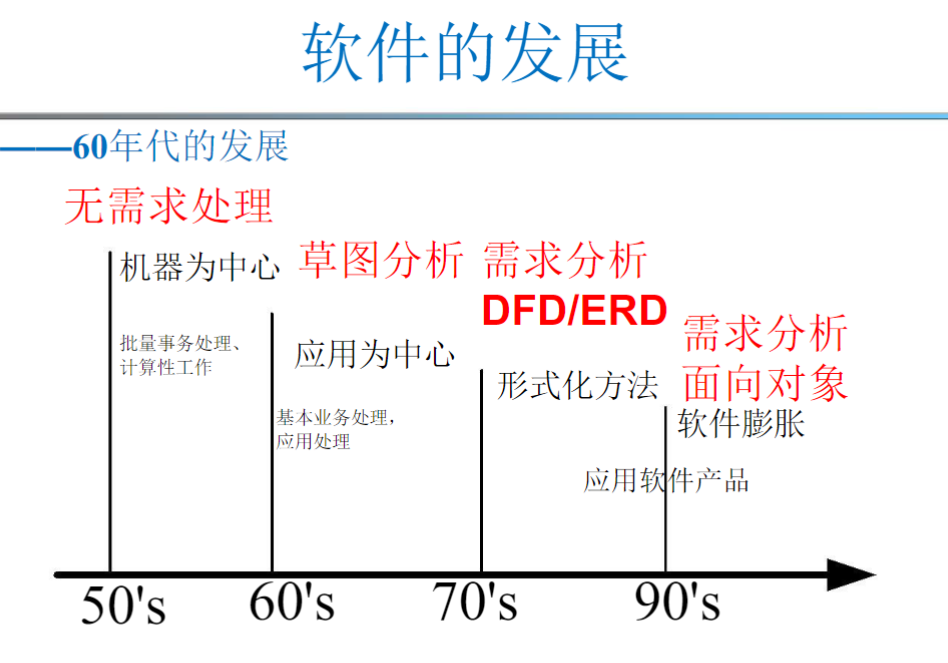
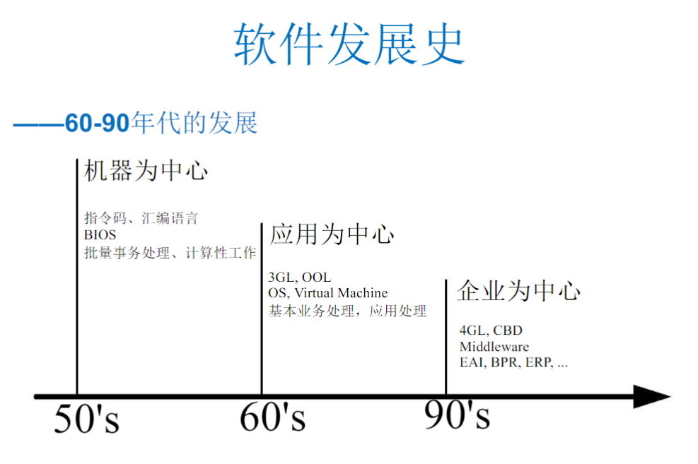

:::details AI总结

# 笔记总结与重点分析

## 总结
该笔记系统梳理了软件的定义、分类及其发展历程。核心内容包括：软件由程序、文档和数据构成，分为通用产品和定制产品；软件发展史划分为开拓时代（1955-1965）、成长时代（1965-1975）和微时代（1980至今），各阶段分别对应硬件迭代、制度化和计算普及的特征。两张发展史图表辅助呈现关键时间节点。

## 重点分析
### 重点1：软件定义与分类
- **内容概述**：软件包含程序、文档和数据三要素，软件系统进一步涵盖配置文件、架构文档等。产品类型分为通用型（如文字处理软件）和定制型（单一用户专用）。
- **重要性分析**：明确定义是理解软件工程的基础，分类体系直接影响产品开发模式和市场策略。
- **关联性分析**：该部分为发展史的讨论提供概念框架，解释不同时代软件产品的形态差异。
- **应用场景/研究方向**：可研究定制软件向SaaS模式的转型路径，或文档自动化生成技术的开发。

### 重点2：开拓时代特征
- **内容概述**：1955-1965年间硬件快速迭代，软件免费且复用率低，依赖穿孔卡片等物理介质操作。
- **重要性分析**：揭示了早期软件开发与硬件强耦合的特性，解释软件工程学科尚未形成的历史原因。
- **关联性分析**：与成长时代形成对比，说明软件从附属品到独立产品的转变基础。
- **应用场景/研究方向**：可考察早期编程范式对现代嵌入式系统开发的影响。

### 重点3：微时代变革
- **内容概述**：1980年后计算成本骤降，个人计算机普及彻底改变软件开发环境。
- **重要性分析**：标志着软件产业规模化发展的开端，直接催生开源运动和个人开发者生态。
- **关联性分析**：与成长时代的"程序员短缺"形成呼应，展现技术民主化进程。
- **应用场景/研究方向**：可探究云计算时代开发模式的演进，或低代码平台对传统编程的冲击。

## 结论
该笔记通过定义-分类-发展史的三层结构，完整呈现软件从硬件附属到独立产业的演进逻辑。微时代的技术民主化与早期开拓时代的物理限制形成强烈对比，这种历史视角为理解现代软件工程实践提供了重要参照系。图表中的时间线信息（虽未展示）应着重关注关键技术创新节点。
（我还没有掌握有关知识，此回答为大模型自动生成）

:::
# 软件的发展史

## 什么是软件？

### 软件的定义

**软件**包括
- 程序
- 相关文档
- 数据

更具体的来说，**软件系统**由以下组成：
- 独立的程序
- 程序的配置文件
- 系统的详细架构文档
- 描述如何使用的用户文档

### 软件产品分类

软件产品分类
- 一般产品
- 独立系统
- 在开放市场上卖给所有人的产品，如：
  - 文字处理软件
  - 数据库
  - 画图软件
- 定制产品
  - 为了单一用户特制的软件产品

## 软件的发展史

### 开拓时代(1955-1965)
- 电脑更迭很快
- 常常重写
- 通过注册机器时间或让操作人员来操作  
- 将穿孔卡片输入机器的读卡器，等待结果返回打印机  
- 由于软件是免费的，用户们通常会放弃复用

### 成长时代(1965-1975)
- 整个工作模式已经**制度化**
- 花时间**编写**新软件而不是重写旧软件。
- 程序员的**需求量**超过了**供应量**。
- 软件的稳定性导致了60年代后期学术计算学科的出现，但软件工程学科还不存在。

### 微时代(1980-现在)
- 计算的成本急剧下降，使得计算无处不在成为可能。现在每个程序员都可以在办公桌上放一台电脑。

