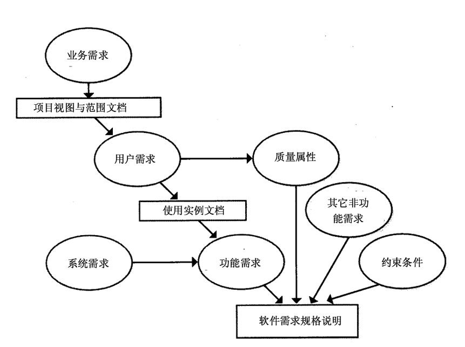

:::details AI总结

# 笔记总结与重点分析
## 笔记总结
本笔记系统阐述了软件需求工程的核心概念，涵盖软件项目目标要素、需求特征、需求工程目的、软件危机影响、不合格需求成因等核心知识点。重点强调需求在软件开发中的根本性作用，详细解析了需求工程师所需的多维度知识技能体系，包括技术能力、分析能力和软技能等。

## 重点/易考点分析 (名词解释)

### 软件项目目标的三个要素是什么？
1. 功能 & 性能
2. 约束
3. 质量属性

### 好的需求特征有哪些？
- 可靠性
- 可移植性
- 可维护性
- 可配置（少编程）等特征

### 需求工程的目的是什么？
- 解决目标系统的"做什么"的问题
- 准确地定义未来系统的目标，确定为了满足用户的需求，系统必须做什么
- 《需求规格说明书》规范的形式准确地表达用户的需求

### 软件危机&错误需求的代价有哪些？
- 错误的需求浪费了人力、物力，浪费了金钱，总之，浪费资源
- 影响软件项目的成功，加大软件项目的风险
- 影响项目组及开发方形象，对用户满意度埋下"祸根"
- 增加开发的成本

### 产生不合格需求的原因有哪些？
- 无足够用户参与
- 用户需求的不断增加，无法控制
- 许多模棱两可的需求
- 过于精简的规格说明
- 忽略了用户分类

### 需求工程师的知识要求包含哪些方面？
- 软件技术
- 认知心理学和社会学
- 哲学知识（认识论、现象学）
- 专业技能（需求工程相关知识）
- 分析技能（抽象能力、整合能力、系统化思想）
- 交流技能（交谈提问技巧、倾听技巧）
- 观察技能
- 建模技能
- 写作技能（文档组织、语言驾驭）
- 创新技能（发现潜在需求）
- 协调能力
（我还没有掌握有关知识，此回答为大模型自动生成）

:::
# 软件需求工程概述

1. **软件的发展史**
2. **软件工程生命周期和过程模型**
3. 软件危机
4. 需求在软件开发中的重要性
5. **软件需求工程概述**
6. 需求工程的特性
7. 需求工程师的知识要求

## 重要知识点

### 软件项目目标的三个要素是什么？

1. 功能 & 性能
2. 约束
3. 质量属性

- 需求是根本

### 好的需求特征有哪些？

- 可靠性
- 可移植性
- 可维护性
- 可配置（少编程）等特征。

### 需求工程的目的是什么？

- 解决目标系统的“做什么”的问题
- 准确地定义未来系统的目标，确定为了满足用户的需求，系统必须做什么。
- 《需求规格说明书》规范的形式准确地表达用户的需求。

### 软件危机&错误需求的代价有哪些？

- 错误的需求浪费了人力、物力，浪费了金钱，总之，浪费资源。
- 影响软件项目的成功，加大软件项目的风险。
- 影响项目组及开发方形象，对用户满意度埋下“祸根”
- 增加开发的成本。

### 产生不合格需求的原因有哪些？

- 无足够用户参与。
- 用户需求的不断增加，无法控制。
- 许多模棱两可的需求。
- 过于精简的规格说明。
- 忽略了用户分类。

### 需求层次的构成？

### 需求工程师的知识要求？

- 软件技术
- 认知心理学和社会学
- 哲学知识
  - 认识论
  - 现象学
- 专业技能
  - 需求工程的相关知识
- 分析技能
  - 抽象能力
  - 整合能力
  - 系统化思想
- 交流技能
  - 交谈和提问的技巧
  - 倾听的技巧
- 观察技能
- 建模技能
- 写作技能
  - 文档组织能力
  - 语言驾驭能力
- 创新技能
  - 发现用户潜在需求
- 协调能力
