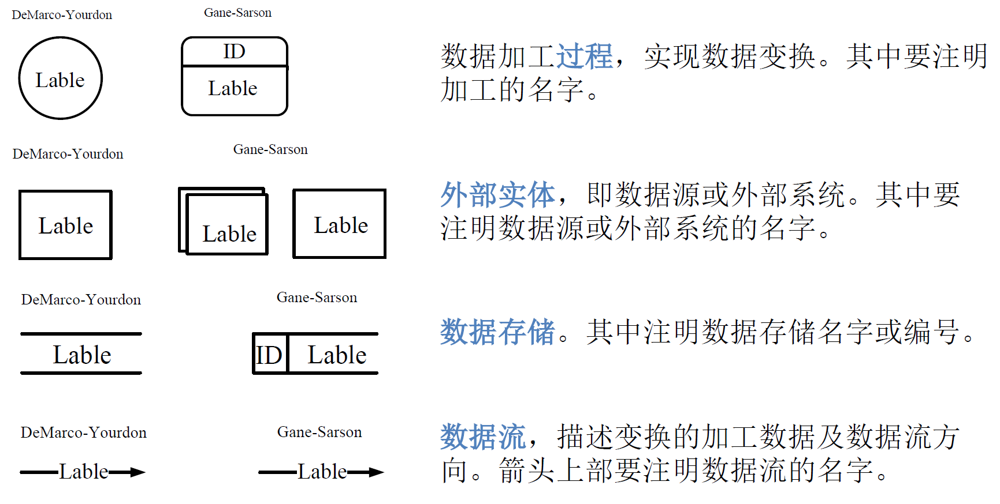
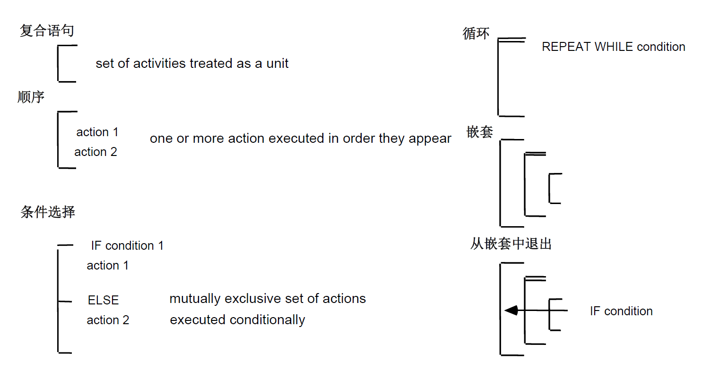
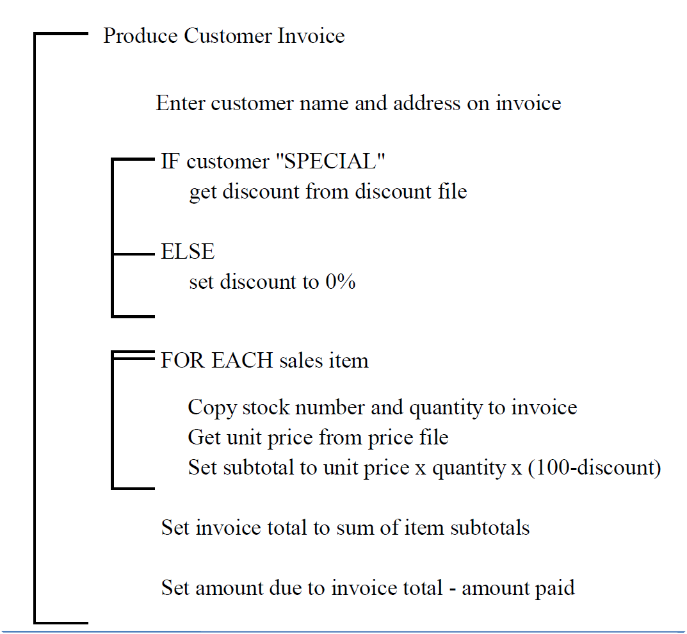
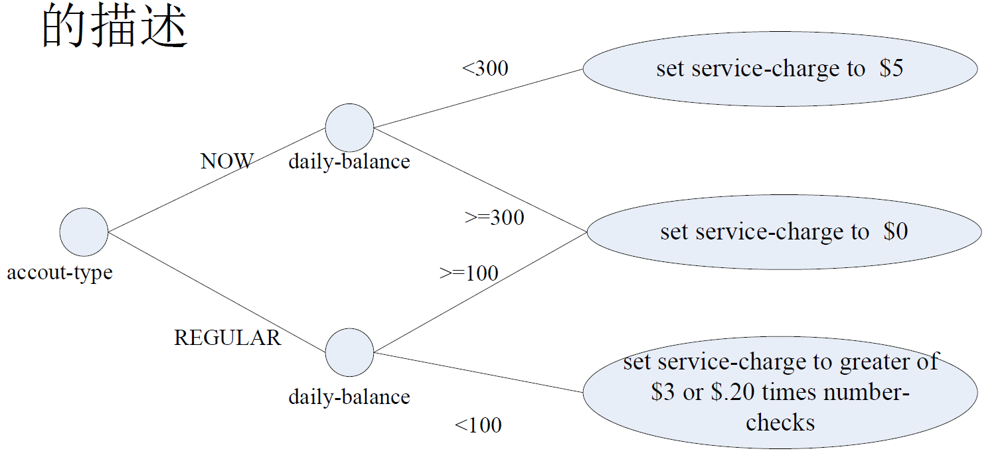

:::details AI总结


# 笔记总结与重点分析
## 笔记总结
本笔记系统阐述了过程建模的核心方法，重点解析了数据流图（DFD）的四大元素（数据加工过程、外部实体、数据流、数据存储）及其构建规则。详细说明了DFD的层次结构体系（上下文图/0层图/N层图）的建立方法与验证标准，并介绍了微规格说明的四种实现方式：结构化英语/伪码、行为图、决策表和决策树，最后通过数据字典的词条描述和定义式规范了数据元素的描述标准。

## 重点/易考点分析 (名词解释)

### 什么是数据加工过程？
过程是指施加于数据的动作或者行为，它们使得数据发生变化，包括被转换（transformed）、被存储（stored）或者被分布（distributed）。可能是由软件系统控制的，也可能是由人工执行的，它重在数据发生变化的效果而不是其执行者。可能会表现为不同的抽象层次，其中内容足够细节和具体，能够对其直接进行“编码”处理的过程被称为原始过程（Primitive Process，又称为基本过程Elementary Process）。

### 外部实体包含哪些特征？
外部实体是指处于待构建系统之外的人、组织、设备或者其他软件系统，它们不受系统的控制，开发者不能以任何方式操纵它们。需要进行建模的外部实体是那些和待构建的软件系统之间存在着数据交互的外部实体，它们是待构建系统的数据源或者数据目的地。所有的外部实体联合起来构成了软件系统的外部上下文环境。

### 数据流的定义是什么？
数据流是指数据的运动，它是系统与其环境之间或者系统内两个过程之间的通信形式。数据流可以分割和组合。数据字典和实体关系图ERD通常被用来描述DFD的详细内容。

### 上下文图的主要特点有哪些？
上下文图将整个系统看做是一个过程，这个过程实现系统的所有功能，是系统功能的最高抽象。上下文图中存在且仅存在一个过程，表示整个系统。这个单一的过程通常编号为0。上下文图中需要表示出所有和系统交互的外部实体，并描述交互的数据流，包括系统输入和系统输出。上下文图中不会出现数据存储实例，它非常适合于描述系统的应用环境、定义系统的边界。

### 什么是原始DFD图？
原始DFD图是指内容足够细节和具体，能够对其直接进行“编码”处理的过程描述图。对N层图的过程分解后产生的子图称为N+1层图（N>0），过程分解是可以持续进行的，直至最终产生的子图都是原始DFD图。原始DFD图可以进一步展开为微规格说明、数据字典。

### 数据字典的核心作用是什么？
数据字典以结构化方式定义了在建模过程中涉及到的所有数据信息、控制信息。它是当前系统的软件词典，提供用户和软件人员的概念解释，也提供在系统开发过程中各种有关数据和控制的描述信息，使得系统所有的相关人员对信息有共同的、一致的理解。常用方式包括词条描述和定义式。

### 决策表的构成要素有哪些？
决策表包含条件声明（进行决策时需要参考的变量列表）、条件选项（那些变量可能的取值）、动作声明（决策后可能采取的动作）和动作选项（表明那些动作会在怎样的条件下发生）。表格结构分为规则列，每个规则对应特定条件下的动作触发情况。

### 决策树的表示特征是什么？
决策树通常是一颗平放的树，树根在左边，树枝从左向右展开。树枝上是有关条件和行动的描述，用树形结构直观展示不同条件分支下的决策路径。

（我还没有掌握有关知识，此回答为大模型自动生成）
:::
# 过程建模

## 过程建模概述

### 结构化建模
- 过程建模，数据建模

### 过程建模是结构化建模的核心方法
- 系统是过程的集合
- 过程可以被分解为子过程
- 最终的子过程可以被映射为计算实体——函数
- 所有的系统都是由过程构建的
- 用图形的方式建立和描述良好的过程模型

### 主要思想

- 用图形的方式建立和描述良好的过程模型

## 数据流图DFD
### 数据流图的元素



#### 数据加工过程

- 过程是指施加于数据的**动作**或者**行为**，它们使得数据发生变化，包括被**转换**（transformed）、被**存储**（stored）或者被**分布**（distributed）
- 可能是由软件系统控制的，也可能是由人工执行的，它重在数据发生变化的效果而不是其执行者
- 可能会表现为**不同的抽象层次**
  - 内容足够细节和具体，能够对其直接进行“编码”处理的过程被称为原始过程（Primitive Process，又称为基本过程Elementary Process）
#### 外部实体

- 外部实体是指处于**待构建系统之外**的人、组织、设备或者其他软件系统，它们**不受系统的控制**，开发者不能以任何方式操纵它们
- 需要进行建模的外部实体是那些和待构建的软件系统之间存在着**数据交互**的外部实体，它们是待构建系统的**数据源**或者**数据目的地**
- 所有的外部实体联合起来构成了软件系统的**外部上下文环境**

#### 数据流

- 数据流是指数据的运动，它是系统与其环境之间或者系统内两个过程之间的**通信形式**
- 数据流可以**分割**和**组合**
- **数据字典**和**实体关系图ERD**通常被用来描述DFD的**详细内容**

#### 数据存储

- 数据存储是软件系统需要在内部收集、保存，以供日后使用的**数据集合**
- 数据存储的详细内容通常也是用**数据字典**和**ERD**来进行描述的

### 构建规则

- 过程是对数据的处理，必须有**输入**，也必须有**输出**，而且输入数据集和输出数据集应该存在**差异**
- 数据流是**必须**和**过程**产生关联的，它要么是过程的数据**输入**，要么是过程的数据**输出**
- DFD当中所有的对象都应该有一个可以**唯一**标识自己的**名称**
  - 过程使用**动词**
  - 外部实体、数据流和数据存储使用**名词**


### 层次结构

- 依据所含过程的不同抽象程度，DFD可以在不同的抽象层次上进行系统的描述
- 一个比较抽象的过程可以被展开为一个子过程更加具体的DFD图
- DFD的层次结构
  - 上下文图
  - 0层图
  - N层图（N>0）
#### 上下文图

- 将**整个系统**看做是**一个过程**，这个过程实现系统的所有功能 ，是系统功能的**最高抽象**
- 上下文图中**存在且仅存在**一个过程，表示**整个系统**。这个单一的过程通常**编号为0**
- 上下文图中需要表示出所有和系统交互的**外部实体**，并描述交互的**数据流**，包括系统**输入**和系统**输出**
- 上下文图中不会出现**数据存储实例**
- 它非常适合于描述**系统的应用环境**、定义系统的**边界**

#### 0层图(顶层图)

- 位于**上下文图**下面一层，是**上下文图**中单一过程的**细节描述**，是对该单一过程的**第一次功能分解**
- 是整个系统的**功能概图**
- 0层图应该被描述的**简洁、清晰**，需求工程师要根据系统的复杂度掌握0层图中过程的抽象程度

#### N层图

- 对0层图的过程**分解**产生的**子图**称为1层图，对N层图的过程**分解**后产生的**子图**称为N+1层图（N>0） ，过程分解是可以**持续进行**的，直至最终产生的子图都是**原始DFD图**
- 原始DFD图可以进一步展开为
  - 微规格说明
  - 数据字典
  - 在低于0层图的子图上通常不显示外部实体

### 层次结构的建立

1. 创建上下文图
2. 发现并建立DFD片断
3. 根据DFD片断组合产生0层图；
4. 对0层图的过程进行功能分解，产生N层图

### DFD的验证

- 验证DFD的语法
  - 确保DFD中不会发生语法错误
- 验证DFD的结构
  - 验证DFD层次结构之间的一致性
  - 验证DFD层次结构说明的完备性
- 验证DFD的语义
  - 确保DFD所说明内容的正确性和准确性

## 微规格说明

- **目的**：细化原始DFD图
- **方式**
  - 结构化英语/伪码
  - 行为图
  - 决策表
  - 决策树

## 行为图

### 结构化英语/伪码

- 叙述上采用了结构化程序语言的三种控制结构：**顺序**、**条件决策**和**循环**；
- 使用了一些类似于结构化程序语言关键字的词语来表明叙述的逻辑，例如`IF`、`THEN`、`ELSE`、`DO`、`DO WHILE`、`DO UNTIL`等等；
- 在格式上，使用和结构化程序语言相同的缩进方式来表明叙述的结构。
- 简短语句 ，使用名词和动词，避免使用容易产生歧义的形容词和副词


```pascal
READ customer account-type and summary of customer monthly balances
SELECT CASE
  CASE 1 (account-type is NOW)
    BEGIN IF
      IF daily-balance < 300 for any given day
        THEN set service-charge to $5 
        ELSE set service-charge to $0 
    END IF
   CASE 2 (account-type is REGULAR)
    BEGIN IF
      IF daily-balance < 100 for any given day
        THEN set service-charge to greater of $3 or $.20 times number-checks
        ELSE set service-charge to $0
    END IF
  END CASE
END SELECT
```


### 行为图

行为图是结构化英语的一种**特殊表达方式** ，用**特定的图示**来表示过程的**逻辑结构**






### 决策表

- 条件声明是进行决策时需要参考的变量列表
- 条件选项是那些变量可能的取值
- 动作声明是决策后可能采取的动作
- 动作选项表明那些动作会在怎样的条件下发生


#### 决策表规则

| 条件和行动 | 规则 | 
| :---: | :---: | 
| 条件声明（Condition Statement） | 条件选项（Condition Entry） | 
| 行动声明（Action Statement） | 行动选项（Action Entry） | 


#### 决策表示例

<table style="text-align: center;">
  <thead>
    <tr>
      <th>条件和行动</th>
      <th colspan="4">规则</th>
    </tr>
  </thead>
  <tbody>
    <tr>
      <td>account-type</td>
      <td>NOW</td>
      <td>NOW</td>
      <td>REGULAR</td>
      <td>REGULAR</td>
    </tr>
    <tr>
      <td>daily-balance</td>
      <td>< 300</td>
      <td>=300</td>
      <td>< 100</td>
      <td>=100</td>
    </tr>
    <tr>
      <td>set service-charge to $5</td>
      <td>X</td>
      <td> </td>
      <td> </td>
      <td> </td>
    </tr>
    <tr>
      <td>set service-charge to $0</td>
      <td> </td>
      <td>X</td>
      <td> </td>
      <td>X</td>
    </tr>
    <tr>
      <td>set service-charge to greater of $3 or $.20 times number-checks</td>
      <td> </td>
      <td> </td>
      <td>X</td>
      <td> </td>
    </tr>
  </tbody>
</table>

### 决策树

通常是一颗平放的树，树根在**左边**，树枝**从左向右**展开。树枝上是有关**条件**和**行动**的描述





### 数据字典

数据字典以**结构化方式**定义了在建模过程中涉及到的所有**数据信息**、**控制信息**。

它是当前系统的软件词典，提供**用户**和**软件人员**的**概念解释**，也提供在系统开发过程中各种有关**数据**和**控制**的**描述信息**，使得系统所有的相关人员对信息有**共同的**、**一致的**理解。

- 常用方式
  - 词条描述
  - 定义式

#### 词条描述


词条描述为每个**数据元素**组织描述信息


| 属性 | 描述 | 
| :---: | :---: |
| 名称 | 数据元素的原始名称 |
| 别名 | 数据元素的其他名称 |
| 使用地点 | 会使用该数据元素的过程 |
| 使用方法 | 该数据元素扮演的角色（输入流、输出流或者数据存储等） |
| 使用范围 | 该数据元素存在的范围 |
| 描述 | 对数据元素内容的描述 |
| 单位/格式 | 数据元素的数据类型，可能事先设置的取值 |


##### 词条描述示例

| 属性 | 描述 | 
| :---: | :--- |
| 名称 | telephone number |
| 别名 | phone number, number |
| 使用地点和方法 | read-phone-number (input) |
| 描述 | telephone no. = [ local extension \| outside no. \| 0 ] <br> local extension = 3{0-9}3 <br> outside no. = 9 + [ service code \| domestic no. ] <br> service code = [ 110 \| 120 \| …] <br> domestic no. = (area code ) + local number <br> area code = 3{0-9}4 <br> local number= 8{0-9}8 |
| 格式 | alphanumeric data |

#### 定义式

定义式要求对数据元素（尤其是其结构）的描述要**精确、严格和明确**


| 符号 | 含义 | 示例 |
| :---: | :--- | :--- |
| = | 包含，由…构成 | Name=first_name+last_name |
| + | 指明序列结构 | Name=first_name+last_name |
| () | 内容可选 | Phone_No.=(Area_No.)+Local_No. |
| [] | 内容多选一 | Number=[0|1|2|3|4|5|6|7|8|9] |
| | 分割[]内部的多个选项 | Area_No=3{Number}4 |
| n{}m | 循环,最少n次,最多m次 | Area_No=3{Number}4 |
| @ | 数据存储的标识符(关键字) | Student=@ID+Name+... |
| ** | 注释 | Area_No=3{Number}4**区号为3到4位数字 |


| 定义 | 说明 |
| :--- | :--- |
| telephone no. = [ local extension | outside no. | 0 ] | 电话号码可能是内线、外线或者转接主机（拨0） |
| local extension = 3{0-9}3 | 内线号码是3位数字 |
| outside no. = 9 + [ service code \| domestic no. ] | 外线要先拨9，然后再拨特服号码或普通电话号码 |
| service code = [ 110 \| 120 \| …] | 特服号码有110、120、… |
| domestic no. = (area code ) + local number | 普通电话号码为可选的区号加本地号 |
| area code = 3{0-9}4 | 区号是3到4位数字 |
| local number= 8{0-9}8 | 本地号是8位数字 |


