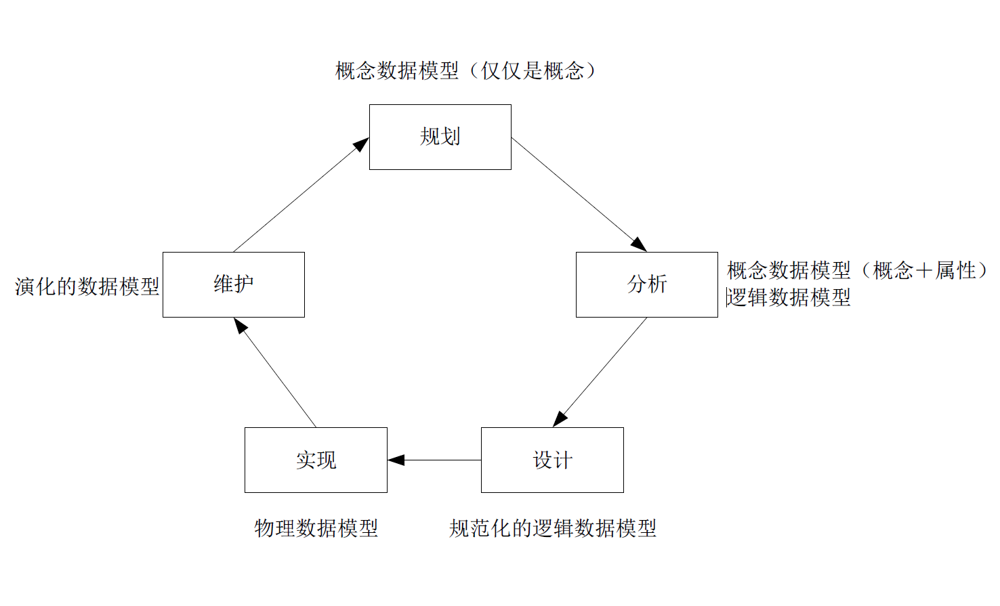
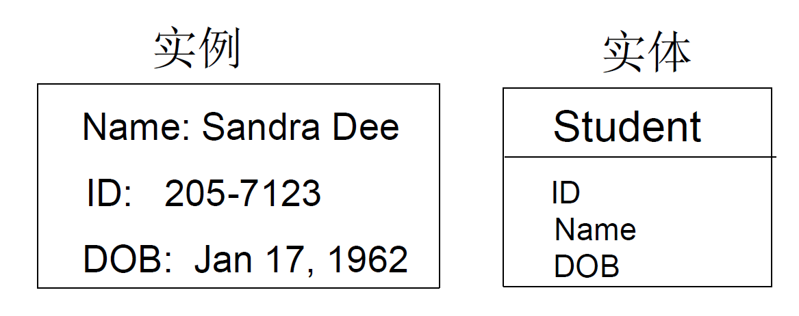
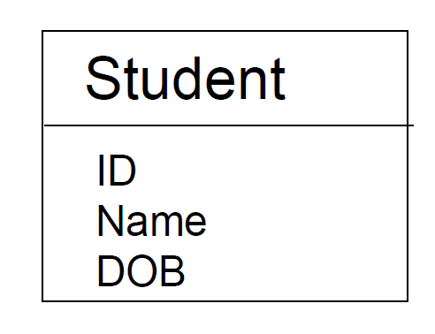
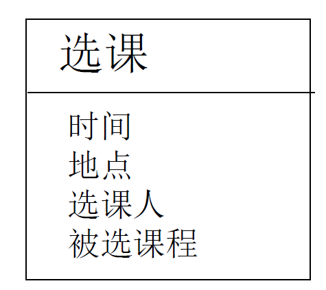
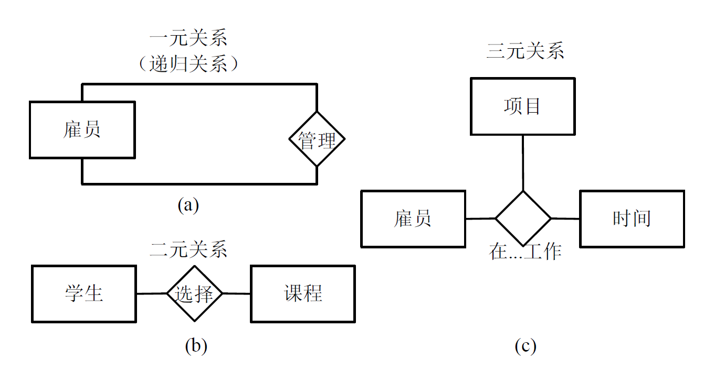

:::details AI总结

# 笔记总结与重点分析
## 笔记总结
本笔记主要讲解数据建模的核心概念，重点阐述数据模型的定义（描述数据定义/结构/关系）、数据建模过程（通过实体关系图建立），以及实体与实例的区分。数据模型能够反映企业核心业务知识，ERD由实体/关系/属性三个基本元素构成。

## 重点/易考点分析 (名词解释)

### 什么是数据模型？
描述数据的定义、结构和关系等特性的模型，说明了问题域和解系统共享的事物及其关系和描述，能够反映企业业务的核心知识。

### 数据建模的定义是什么？
建立数据模型的过程被称为数据建模，主要通过建立实体关系图（ERD）来完成。

### 实体关系图（ERD）的基本元素有哪些？
实体关系图的基本元素包括实体、关系和属性。需要注意的是ERD没有标准的表示法。

### 如何定义实体（Entity）？
实体是具有相同特征和属性的实例集的类别描述，例如学生实体包含ID、NAME、DOB等属性。

### 实例（Instance）的定义是什么？
实例是需要存储在系统中现实世界事物的具体个体，例如某个具体学生的信息记录。

（我还没有掌握有关知识，此回答为大模型自动生成）
:::

# 数据建模

## 数据模型

- 数据模型
  - 描述数据的**定义**、**结构**和**关系**等特性的模型
  - 说明了问题域和解系统共享的事物、对共享事物的描述和共享事物之间的关系
  - 能够反映企业业务的核心知识
- 建立数据模型的过程被称为**数据建模**
  - 实体关系图**ERD**建立
    - 没有标准的表示法
    - 基本**元素**：**实体**、**关系**、**属性**

### 数据模型建立

### 

#### 实体

- 实例（Instance）
  - 需要在系统中收集和存储的现实世界事物
- 实体（Entity）
  - 具有相同特征和属性的实例集的类别描述

##### 概念实体

##### 逻辑实体

##### 进程实体
- 系统需要它们在某些时刻的**快照**或者它们的**运行环境信息**
  - 不是它们所体现出来的功能和达成的效果

#### 属性
- 实体的描述特征
- 以数字、代号、单词、短语、文本乃至声音和图像的形式存在
- 一系列属性的存在集成起来就可以描述一个实体的实例

##### 值

属性是实体的**特征**，不是数据。属性会以一定的**形式**存在，这种存在才是**数据**，被称为属性的**值**（Value）

##### 域

属性的值就应该是一个合法的或者有业务含义的值，这个合法的取值范围称为**域**（Domain）

| 数据类型 | 类型说明 | 域 | 例子 |
| -------- | -------- | -------- | -------- |
| Number | 整数 | ｛最小～最大｝ | 月份的域：｛1～12｝ |
| Real | 实数 | ｛最小～最大｝ | 考试得分：｛0.0～100.0｝ |
| Text | 文本 | TEXT(属性的最大长度) | 电话号码：TEXT（20） |
| Date | 日期 | ｛最早～最晚｝ | 出生日期：｛1900-01-01～今天｝ |
| Time | 时间 | ｛最早～最晚｝ | |
| Boolean | 布尔 | | |
| Enumeration | 枚举 | ｛值1、…、值n｝ | 性别：｛男、女、未知｝ |
| Binary | 二进制 | | |

##### 键

- 标识符，又称为**键**（Key）
- 可以被用来唯一的确定和标识每个实例的属性或者属性组合
- 一个实体可能有多个键 ，都被称为**候选键**（Candidate Key）
  - 人们通常会从多个候选键中选择和使用**固定**的某一个键来进行实例的标识
  - 这个被**选中**的候选键被称为主键（Primary Key）
  - **没有**被选做主键的候选键被称为**替代键**（Alternate Key）

#### 关系
- 存在于一个或多个实体之间的**自然业务联系**
- 所有的关系隐含地都是**双向**的
- 关系表达的不是实体**物理**上的联系（例如车与车轮），而是**逻辑**上的链接（例如整体部分关系）

##### 度数
- 参与关系的实体数量

##### 基数（约束）
- **最大基数**（键约束Key Constraint）
  - 对关系中任意的其他实体实例，该实体可能参与关系的**最大**数量
- **最小基数**（参与约束Participant Constraint）
  - 对关系中任意的其他实体实例，该实体可能参与关系的**最小**数量

#### 关系类型

