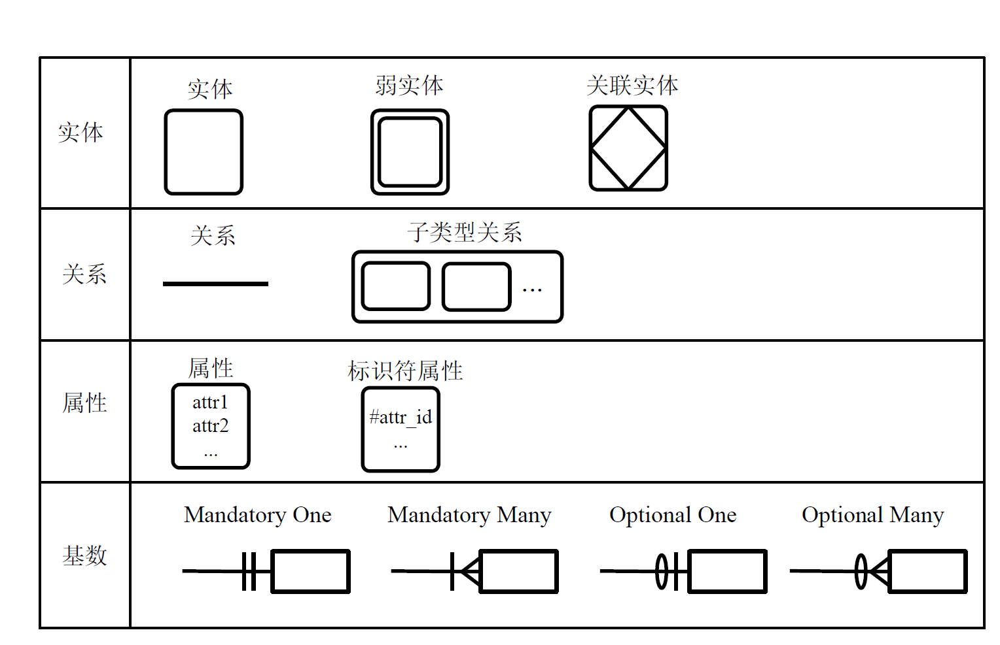

:::details AI总结

# 笔记总结与重点分析
## 笔记总结
本笔记系统阐述了数据建模的核心概念与实体关系图（ERD）的构建方法。主要内容包括：数据模型的定义及其反映企业业务知识的功能，数据建模过程中ERD的建立要素（实体、关系、属性）。详细说明了实体分类（概念/逻辑/进程实体）、属性类型（值、域、键）、关系特征（度数、基数约束类型）以及ERD建模的具体步骤（简单/复杂场景）。特别强调了候选键/主键的区分、基数约束的四种类型（Mandatory/Optional）等核心知识点。

## 重点/易考点分析 (名词解释)

### 什么是数据模型？
描述数据的定义、结构和关系等特性的模型，能够反映企业业务的核心知识，说明问题域和解系统共享的事物及其关系。

### 实体（Entity）与实例（Instance）有何区别？
实例是需要收集和存储的现实世界事物，实体是具有相同特征和属性的实例集的类别描述。

### 属性的域（Domain）是什么？
属性的合法取值范围或有业务含义的值域。例如月份的域是{1～12}，性别的域是{男、女、未知}。

### 候选键（Candidate Key）和主键（Primary Key）的关系？
候选键是能唯一标识实例的属性组合，主键是从候选键中选择的固定标识符，未被选中的称为替代键（Alternate Key）。

### 基数约束中的最大基数是什么？
最大基数（键约束）指关系中任意实体实例可能参与关系的最大数量，例如Mandatory One对应1:1，Optional Many对应0:N。

### 子类型关系的定义？
当多个实体大部分相似时，抽取共性建立公共超类型（Super-type），所有实体作为该超类型的子类型。

### 关系（Relationship）的核心特征？
存在于实体间的自然业务联系，具有隐含双向性，表达逻辑链接而非物理联系（如整体部分关系）。

### 度数（Degree）在ERD中的含义？
指参与关系的实体数量，如二元关系涉及两个实体。

### Mandatory Many基数类型的定义？
一个实体必须与另一个实体有多个关联（对应基数1:N或N:N），例如每个部门必须有多名员工。

### Optional One基数类型的特征？
实体可以有0或1个关联（对应基数0:1），例如员工可选择是否有主管。

（我还没有掌握有关知识，此回答为大模型自动生成）
:::

# 数据建模

## 数据模型

- 数据模型
  - 描述数据的**定义**、**结构**和**关系**等特性的模型
  - 说明了问题域和解系统共享的事物、对共享事物的描述和共享事物之间的关系
  - 能够反映企业业务的核心知识
- 建立数据模型的过程被称为**数据建模**
  - 实体关系图**ERD**建立
    - 没有标准的表示法
    - 基本**元素**：**实体**、**关系**、**属性**

### 数据模型建立

## 实体关系图（ERD）

### 实体

- 实例（Instance）
  - 需要在系统中收集和存储的现实世界事物
- 实体（Entity）
  - 具有相同特征和属性的实例集的类别描述

#### 概念实体

#### 逻辑实体

#### 进程实体
- 系统需要它们在某些时刻的**快照**或者它们的**运行环境信息**
  - 不是它们所体现出来的功能和达成的效果

### 属性
- 实体的描述特征
- 以数字、代号、单词、短语、文本乃至声音和图像的形式存在
- 一系列属性的存在集成起来就可以描述一个实体的实例

#### 值

属性是实体的**特征**，不是数据。属性会以一定的**形式**存在，这种存在才是**数据**，被称为属性的**值**（Value）

#### 域

属性的值就应该是一个合法的或者有业务含义的值，这个合法的取值范围称为**域**（Domain）

| 数据类型 | 类型说明 | 域 | 例子 |
| -------- | -------- | -------- | -------- |
| Number | 整数 | ｛最小～最大｝ | 月份的域：｛1～12｝ |
| Real | 实数 | ｛最小～最大｝ | 考试得分：｛0.0～100.0｝ |
| Text | 文本 | TEXT(属性的最大长度) | 电话号码：TEXT（20） |
| Date | 日期 | ｛最早～最晚｝ | 出生日期：｛1900-01-01～今天｝ |
| Time | 时间 | ｛最早～最晚｝ | |
| Boolean | 布尔 | | |
| Enumeration | 枚举 | ｛值1、…、值n｝ | 性别：｛男、女、未知｝ |
| Binary | 二进制 | | |

#### 键

- 标识符，又称为**键**（Key）
- 可以被用来唯一的确定和标识每个实例的属性或者属性组合
- 一个实体可能有多个键 ，都被称为**候选键**（Candidate Key）
  - 人们通常会从多个候选键中选择和使用**固定**的某一个键来进行实例的标识
  - 这个被**选中**的候选键被称为主键（Primary Key）
  - **没有**被选做主键的候选键被称为**替代键**（Alternate Key）

### 关系
- 存在于一个或多个实体之间的**自然业务联系**
- 所有的关系隐含地都是**双向**的
- 关系表达的不是实体**物理**上的联系（例如车与车轮），而是**逻辑**上的链接（例如整体部分关系）

#### 度数
- 参与关系的实体数量

#### 基数（约束）
- **最大基数**（键约束Key Constraint）
  - 对关系中任意的其他实体实例，该实体可能参与关系的**最大**数量
- **最小基数**（参与约束Participant Constraint）
  - 对关系中任意的其他实体实例，该实体可能参与关系的**最小**数量

#### 基数的类型

1. Mandatory One
  - **定义**：一个实体必须与另一个实体有一个关联。
  - **对应基数**：1:1
  - **示例**：每个员工必须有一个唯一的工号。
  - **解释**：这里的“Mandatory”表示每个员工都必须有一个工号，不能缺少。
2. Mandatory Many
  - **定义**：一个实体必须与另一个实体有多个关联。
  - **对应基数**：1:N 或 N:N
  - **示例**：每个部门必须有多名员工。
  - **解释**：这里的“Mandatory”表示每个部门至少需要有一名或多名员工，不能为空。
3. Optional One
  - **定义**：一个实体可以与另一个实体有一个关联，也可以没有。
  - **对应基数**：0:1
  - **示例**：每个员工可以选择是否有一个主管。
  - **解释**：这里的“Optional”表示员工可以有主管，也可以没有主管。
4. Optional Many
  - **定义**：一个实体可以与另一个实体有多个关联，也可以没有。
  - **对应基数**：0:N
  - **示例**：每个员工可以选择管理多个项目，也可以不管理任何项目。
  - **解释**：这里的“Optional”表示员工可以管理多个项目，也可以不管理任何项目。

#### 子类型关系
在多个实体大部分相似、少部分不同时，可以从相似的实体当中抽取**共性**，建立一个**公共的超类型**（Super-type），所有实体都是超类型的子类型

#### ERD的表示方法

### 实体关系图（ERD）的建立

#### 简单情况

1. 从描述信息中辨识实体  
  - 可以重点关注描述信息中的名词，看系统是否需要收集其相关的特征
2. 确定实体的标识符
  - 标识符是实体的唯一标识，通常是实体的属性之一  
3. 建立实体间关系
  - 判断各个关系的建立是否会产生新的关联实体或者影响已有的实体特性
4. 添加详细的描述信息
  - 实体的详细属性和关系的基数

#### 硬数据的ERD建模

1. 分析表单内容，确定表单主题
  - 每个主题描述为一个独立的数据实体
2. 建立主题之间的关系
  - 表单主题之间的关系
3. 围绕主题组织表单的项目
  - 表单项目作为实体的属性

#### 复杂情况下的ERD建模
1. 发现系统的概念域
  - 指那些在系统业务中非常重要的概念，如果没有这个概念，组织就可能不会存在或者业务发生重大变化
  - 不能遗漏那些对业务有重大影响的概念，同时概念域的发现也不要太细节
  - 每一个概念域都会以星型发散的方式扩展为多个逻辑实体
2. 建立对概念域的描述 

|概念域 | 同义词 | 定义和描述 | 资源 | 相关的程序功能 | 待确定的问题 |
| -------- | -------- | -------- | -------- | -------- | -------- |
|  |  |  |  |  |  |
|  |  |  |  |  |  |
|  |  |  |  |  |  |
3. 展开概念域
  - 简单情况下的ERD建模
  - 或者进一步细分子域
4. 合并概念域的局部数据模型
  - 消除冗余和冲突

