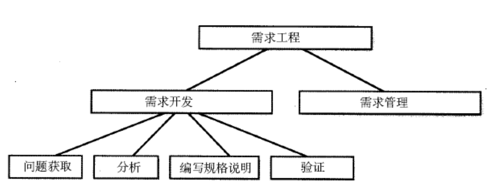
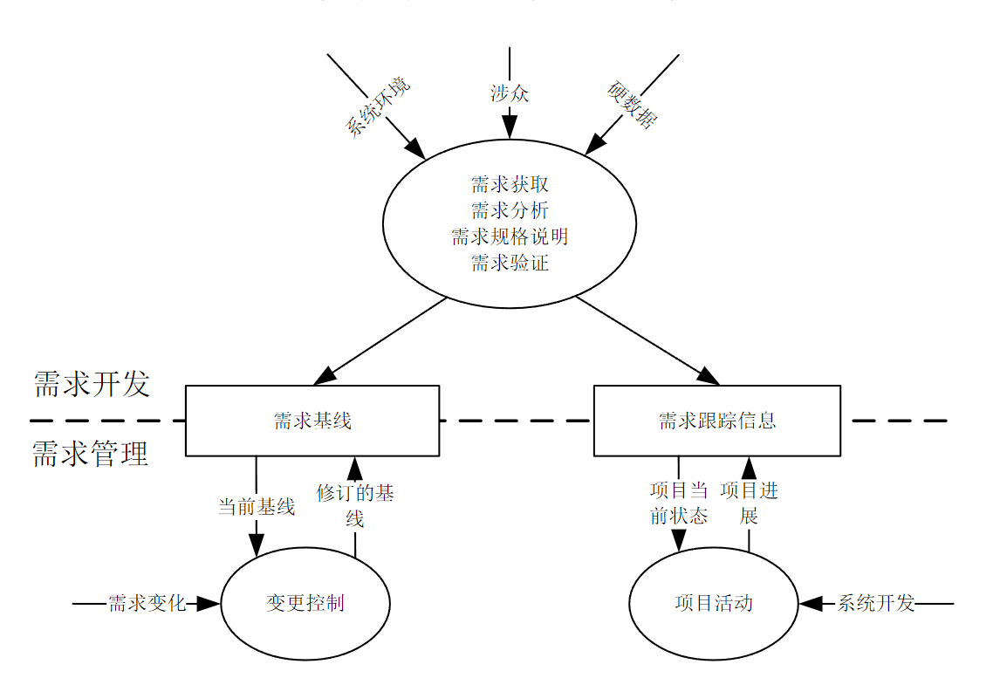

:::details AI总结

# 笔记总结与重点分析
## 笔记总结
本笔记围绕需求工程过程展开，主要阐述了过程的基本定义、需求工程过程的本质特征及其核心目标。重点说明了需求工程过程作为系统开发中需求开发活动的集成，其目标是通过标准化模版生成解决用户业务问题的系统方案。同时指出虽然具体实施过程存在差异，但主要需求工程活动具有稳定性。

## 重点/易考点分析 (名词解释)

### 什么是过程？
过程是一组相关活动的集成，通过这些活动的执行，可以完成一项任务或者达到一个目标

### 需求工程过程的定义是什么？
需求工程过程是系统开发中需求开发活动的集成，它的模版是产生一个能够在用户环境下解决用户业务问题的系统方案

### 需求工程活动的主要特点是什么？
需求工程过程可能会表现出极大的差异，但是除了少数情况之外，主要的需求工程活动是比较固定的
（我还没有掌握有关知识，此回答为大模型自动生成）
:::

# 需求工程过程
- **过程**是一组相关活动的**集成**，通过这些活动的执行，可以**完成一项任务**或者**达到一个目标**
- 需求工程过程是系统开发中**需求开发活动**的集成，它的模版是产生一个能够在用户环境下解决用户业务问题的系统方案
- 需求工程过程可能会表现出极大的差异，但是除了少数情况之外，**主要的需求工程活动是比较固定的**

