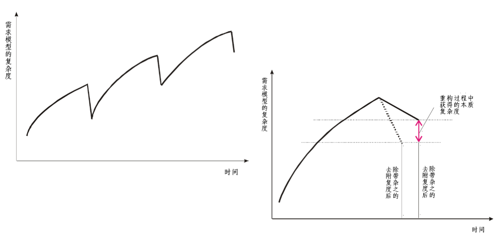
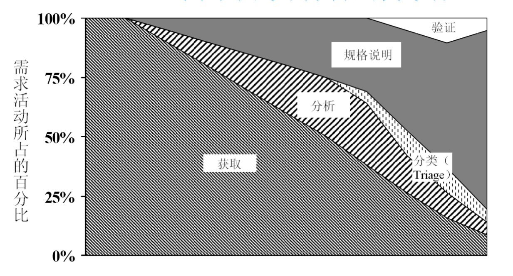
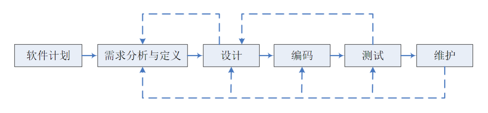
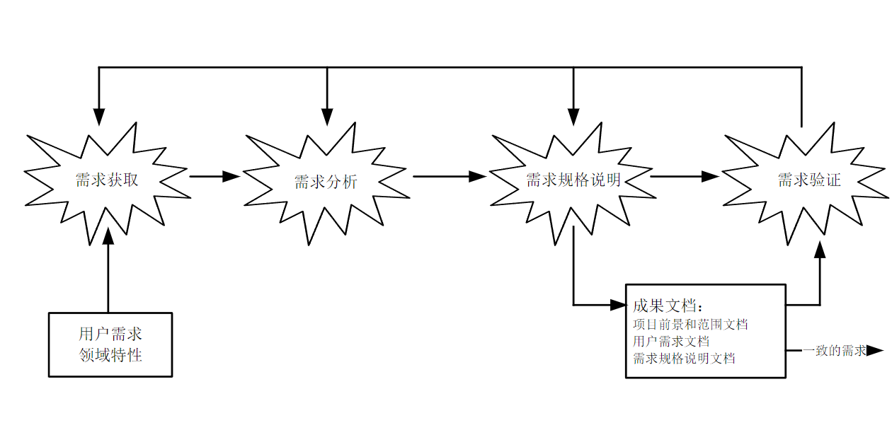
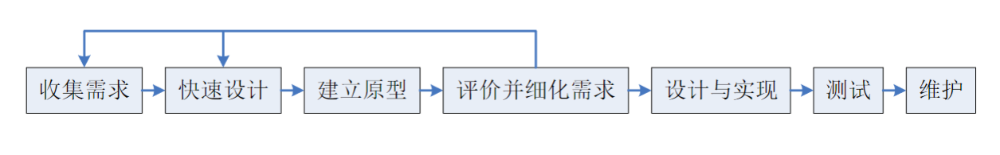
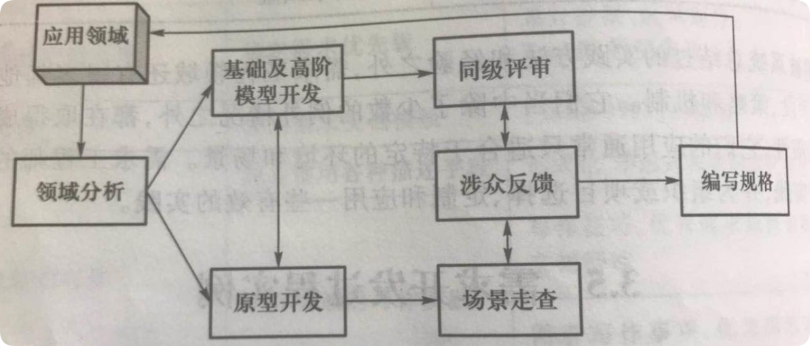
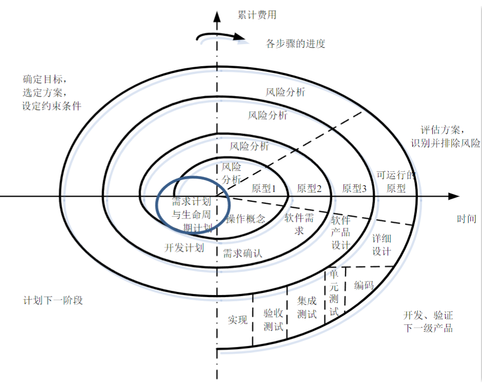
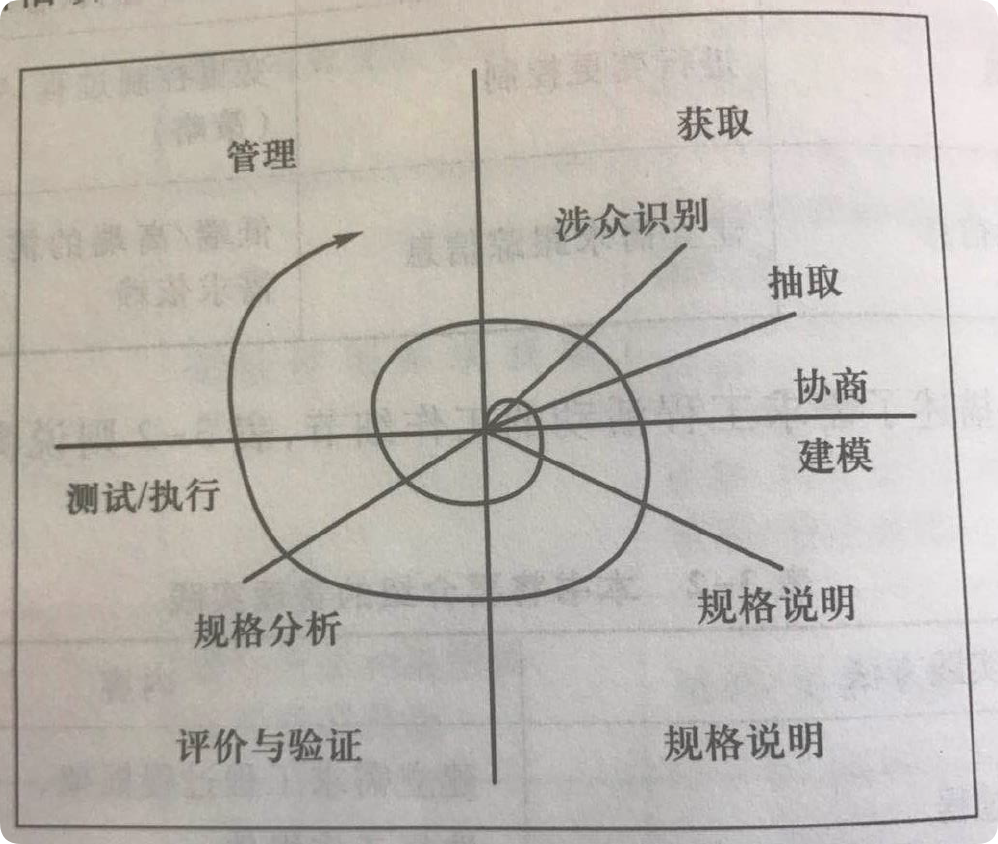

:::details AI总结

# 笔记总结与重点分析
## 笔记总结
本笔记重点阐述了需求工程过程的并发与迭代特性，详细分析了三种软件开发过程模型（瀑布式、快速原型、螺旋式）在需求工程中的体现。内容包括各模型的核心特征、流程示意图及其与需求工程过程的对应关系，特别强调了瀑布式模型的阶段划分、快速原型模型的迭代完善特性以及螺旋式模型的风险分析整合。

## 重点/易考点分析 (名词解释)

### 什么是瀑布式模型？
依据软件生命期提出的开发模型，将开发过程分为六个阶段（每个阶段有明确分工和任务），各阶段紧密相关且后阶段工作基于前阶段结果开展，强调阶段书面成果产出。

### 快速原型模型的核心特点是什么？
通过构建若干功能的可运行模型，不断启发/揭示/完善用户需求，直至完全满足用户需求的开发模型，具有需求迭代完善特性。

### 螺旋式模型的关键组成要素有哪些？
将瀑布式模型与快速原型模型结合，并加入风险分析环节的开发模型，兼具阶段性推进和迭代优化的双重特性。

### 瀑布式模型的阶段特性是什么？
具有明确阶段划分（六个开发阶段）、阶段间紧密关联、各阶段产生书面成果、后阶段依赖前阶段结果的线性推进特征。

### 快速原型模型的工作目标是什么？
通过可运行模型不断修正需求，直到满足用户的全部需求为止，强调通过原型验证实现需求完善。

### 螺旋式模型相比其他模型的创新点是什么？
在瀑布模型和原型模型的基础上，特别强调风险分析环节的整合应用，形成风险驱动的迭代开发模式。
（我还没有掌握有关知识，此回答为大模型自动生成）

:::

# 需求工程过程的并发和迭代性

## 迭代的需求开发过程模型 

## 需求开发中的分析模型复杂度

## 需求开发活动的并发性

## 需求工程过程与软件开发过程模型

介绍了三个软件开发过程模型：**瀑布式模型**、**快速原型模型**、**螺旋式模型**

这三个模型的思想在需求工程过程当中都有体现

### 瀑布式模型
依据**软件生命期**而提出的软件开发模型，将软件的开发过程被分为六个阶段，每个阶段都有**明确的分工和任务**，并产生一定的书面结果。各阶段之间是**紧密相关**的，后一阶段的工作是依据**前一阶段的工作结果**而开展的。

### 快速原型模型

- 若干功能的可运行模型
- 启发、揭示和不断完善用户需求
- 满足用户的全部需求为止

### 螺旋式模型
将**瀑布式模型**与**快速原型模型**结合到一起，并加上**风险分析**。

