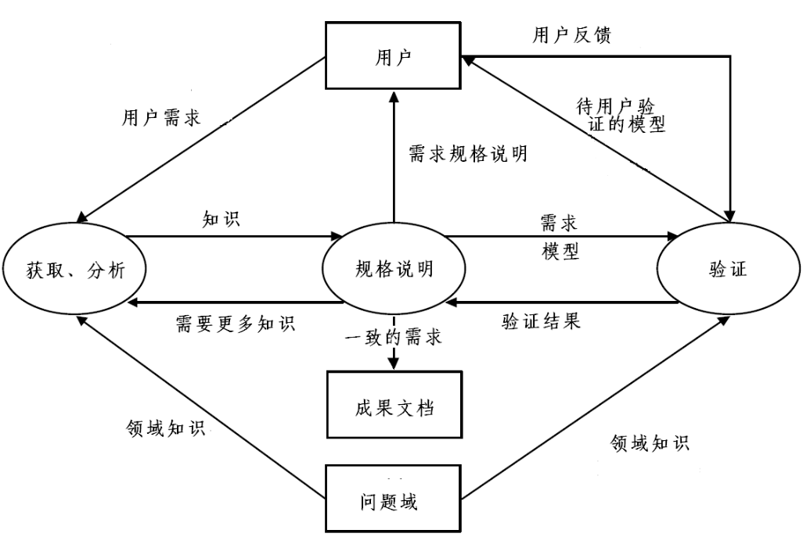

:::details AI总结

# 笔记总结与重点分析
## 笔记总结
本笔记围绕需求工程过程的并发性、迭代性及其与软件开发过程模型的关系展开。重点讲解了瀑布式模型、快速原型模型和螺旋式模型三个软件开发过程模型，分析其在需求工程过程中的应用体现。其中瀑布式模型强调阶段划分与线性推进，快速原型模型侧重需求迭代验证，螺旋式模型结合前两者并加入风险分析要素。各模型均配有对应的需求工程过程示意图。

## 重点/易考点分析 (名词解释)

### 什么是瀑布式模型？
依据软件生命期而提出的软件开发模型，将软件的开发过程分为六个阶段，每个阶段都有明确的分工和任务，并产生一定的书面结果。各阶段之间是紧密相关的，后一阶段的工作是依据前一阶段的工作结果而开展的。

### 快速原型模型的核心特征是什么？
- 若干功能的可运行模型
- 启发、揭示和不断完善用户需求
- 满足用户的全部需求为止

### 螺旋式模型的组成要素有哪些？
将瀑布式模型与快速原型模型结合到一起，并加上风险分析。
（我还没有掌握有关知识，此回答为大模型自动生成）

:::

# 需求工程过程的并发和迭代性

## 迭代的需求开发过程模型 

## 需求开发中的分析模型复杂度

## 需求开发活动的并发性

## 需求工程过程与软件开发过程模型

介绍了三个软件开发过程模型：**瀑布式模型**、**快速原型模型**、**螺旋式模型**

这三个模型的思想在需求工程过程当中都有体现

### 瀑布式模型
依据**软件生命期**而提出的软件开发模型，将软件的开发过程被分为六个阶段，每个阶段都有**明确的分工和任务**，并产生一定的书面结果。各阶段之间是**紧密相关**的，后一阶段的工作是依据**前一阶段的工作结果**而开展的。

### 快速原型模型

- 若干功能的可运行模型
- 启发、揭示和不断完善用户需求
- 满足用户的全部需求为止

### 螺旋式模型
将**瀑布式模型**与**快速原型模型**结合到一起，并加上**风险分析**。

