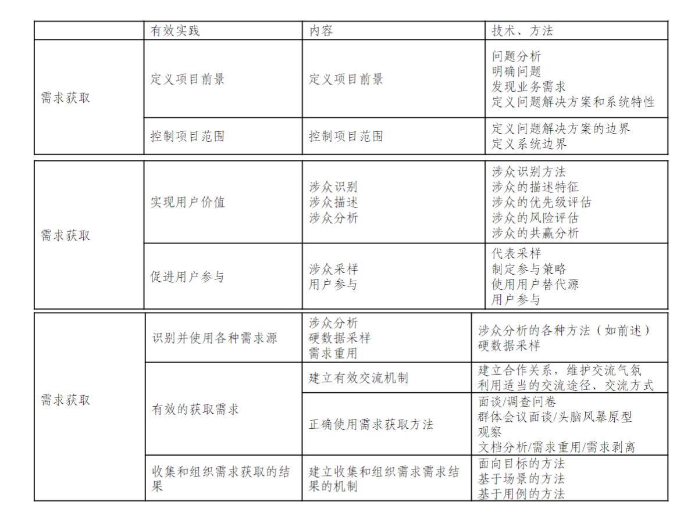

:::details AI总结

# 笔记总结与重点分析
## 笔记总结
该笔记阐述了需求工程过程中实践方法的应用路径（个人才智→实践方法→知识体系），强调需求工程师需根据项目特点选择并应用有效方法。重点列举了需求工程过程的四大核心实践环节：需求获取、需求分析、需求规格说明、需求验证，并配有相关示例图示。

## 重点/易考点分析 (名词解释)

### 需求工程过程的实践方法包括哪些部分？
需求工程过程的实践方法包括需求获取、需求分析、需求规格说明、需求验证四个核心环节。

（我还没有掌握有关知识，此回答为大模型自动生成）
:::

# 实践方法的应用

- 个人才智$\rightarrow$实践方法$\rightarrow$知识体系
- 需求工程师需要为组织或项目选择、定制和应用一些有效的实践方法

- 需求获取
- 需求分析
- 需求规格说明
- 需求验证
