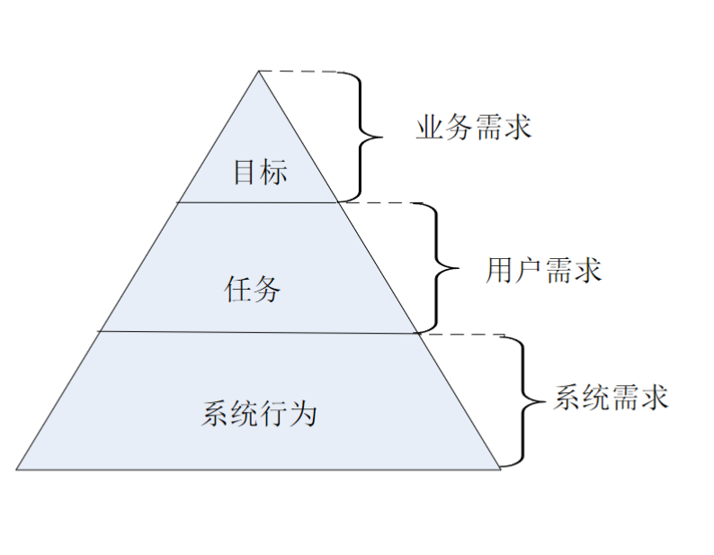
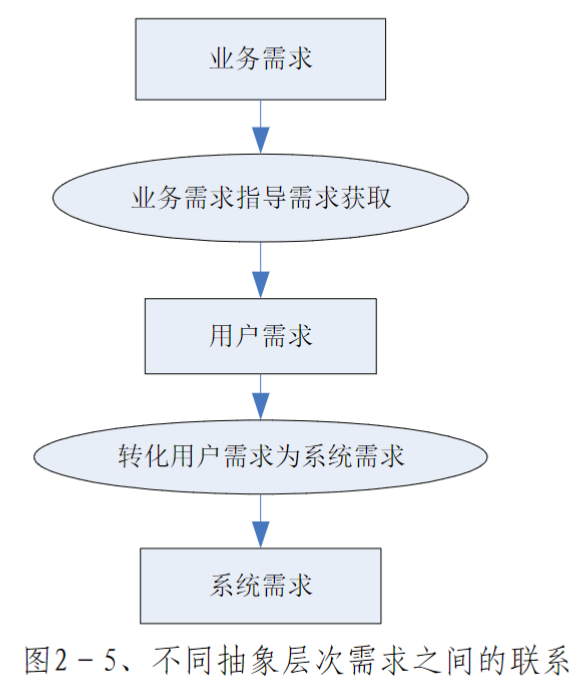
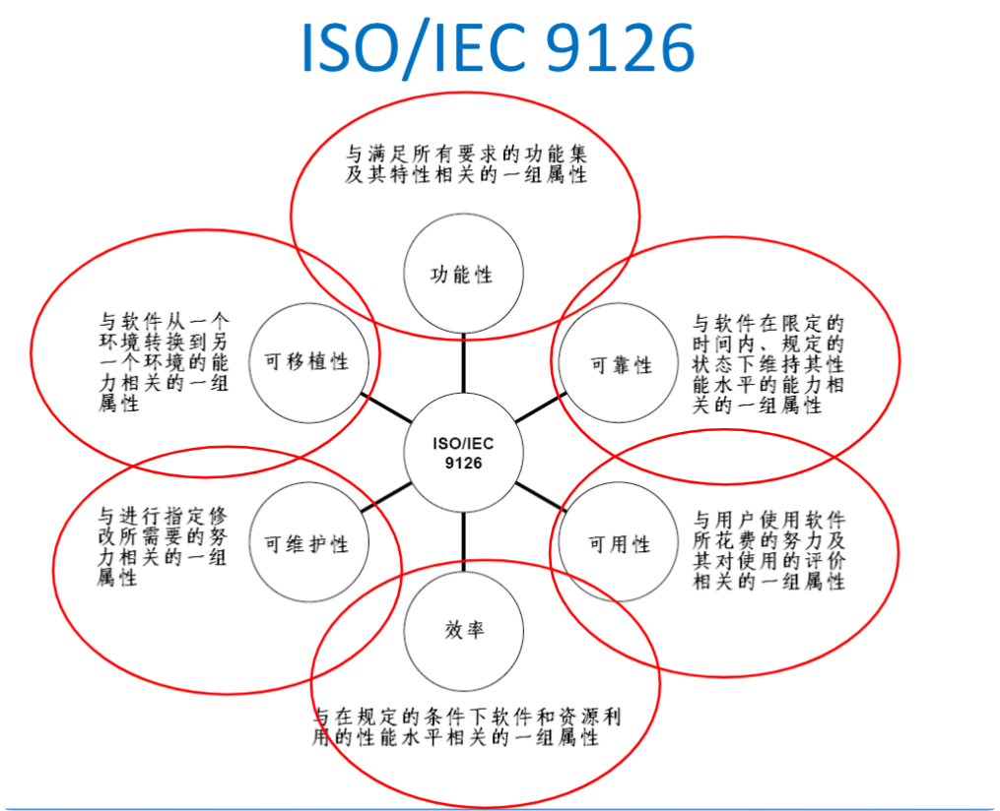
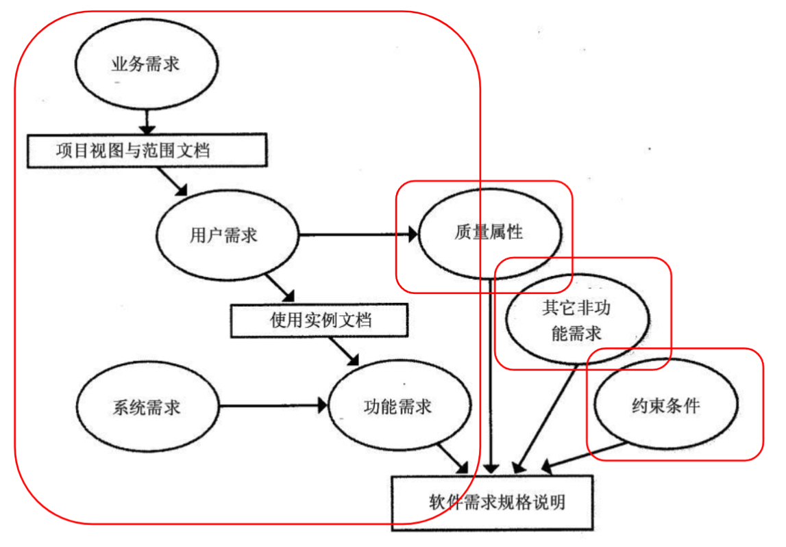

# 需求的分类

1. **功能需求**（Functional Requirement）：
 - 和**系统主要工作**相关的需求，即在不考虑物理约束的情况下，用户希望系统所能够执行的活动，这些活动可以帮助用户完成任务。功能需求主要表现为系统和环境之间的行为交互。
2. **性能需求**（Performance Requirement）：
 - 系统整体或系统组成部分应该拥有的**性能特征**，例如CPU使用率、内存使用率等。
3. **质量属性**（Quality Attribute）：
 - 系统完成工作的质量，即系统需要在一个“**好的程度**”上实现功能需求，例如可靠性程度、可维护性程度等。
4. **对外接口**（External Interface）：
 - 系统和环境中**其他系统**之间需要建立的接口，包括硬件接口、软件接口、数据库接口等等。
5. **约束**（Constraint）：
 - 进行系统构造时需要遵守的**约束**，例如编程语言、硬件设施等
6. **系统需求**（System Requirement）： 
 - 硬件需求（Hardware Requirement），
 - 软件需求（Software Requirement）
 - 其他需求

## 功能需求

### 功能需求的层次性

#### 业务需求
- 系统建立的战略出发点，表现为**高层次的目标（Objective）**，它描述了组织为什么要开发系统
- 为了满足用户的业务需求，需求工程师需要描述系统高层次的解决方案，定义系统应该**具备的特性（Feature）**
- 参与各方必须要对高层次的解决方案达成一致，以建立一个**共同的前景（Vision）**
- 特性说明了系统为用户提供的各项功能，它限定了**系统的范围（Scope）**

**需要采取的规则：**
- **目标性功能：**具体，必要的条件限定和执行过程
- **无二义性：**陈述的问题有且仅有一种解释

#### 用户需求
- 执行实际工作的用户对系统所能完成的**具体任务**的期望，描述了系统能够帮助用户做些什么
  - 直接用户
  - 间接用户
- 对所有的用户需求，都应该有充分的**问题域知识**作为背景支持（即，使用用户的语言描述需求）
- 特性
  - 模糊、不清晰
  - 多特性混杂
  - 多逻辑混杂

#### 系统需求

- 用户对**系统行为**的期望，一系列的系统行为联系在一起可以帮助用户完成任务，满足业务需求
- 系统需求可以直接映射为系统行为，定义了系统中**需要实现的功能**，描述了开发人员**需要实现什么**

将**用户需求**转化为**系统需求**的过程是一个复杂的过程
- 首先需要分析**问题领域及其特性**，从中发现问题域和计算机系统的**共享知识**，建立系统的知识模型；
- 然后将用户需求部署到**系统模型**当中，即定义系列的**系统行为**，让它们联合起来实现**用户需求**，每一个系统行为即为一个**系统需求**。
- 该过程就是需求工程当中**最为重要的需求分析**活动，又称**建模与分析**活动。

#### 从功能需求的层次性看需求过程

## 性能需求
- **速度（Speed）**
  - 系统的响应时间，例如PR2.3.3-1。
  - 所有的用户查询都必须在10秒内完成。
- **容量（Capacity）**
  - 系统所能存储的数据量，例如PR2.3.3-2。
  - 系统应该能够存储至少10万条销售记录。
- **吞吐量（Throughput）**
  - 系统在连续的时间内完成的事务数量，例如PR2.3.3-3。
  - 解释器每分钟应该至少解析5000条没有错误的语句。
- **负载（Load）**
  - 系统可以承载的并发工作量，例如PR2.3.3-4。
  - 系统应该允许200个用户同时进行正常的工作。
- **实时性（Time-Critical）**
  - 严格的实时要求，例如PR2.3.3-5。
  - 监测到病人异常后，监控器必须在0.5秒内发出警报。

## 质量属性

### 质量属性分类

- 系统为了满足规定的及隐含的所有要求而**需要具备的要素**称为**质量**
- **质量属性**是为了**度量质量要素**而选用的特征
- **质量模型**就是能够为质量需求的**描述和评价**提供工作基础的**特征集及特征之间的联系**
- 质量属性的重要性
  - 对设计的影响很大
  - 对**越复杂**的系统越为重要
- \[Robert19901\]：真实的现实系统中，在决定系统的成功或失败的因素中，满足非功能属性往往被满足功能性需求更为重要。

### ISO/IEC 9126

<table>
  <thead>
    <tr>
      <th>特征</th>
      <th>子特征</th>
      <th>简要描述</th>
    </tr>
  </thead>
  <tbody>
    <tr>
      <td rowspan="5">功能性</td>
      <td>精确性</td>
      <td>软件准确依照规定条款程度，规定确定了权利、协议的结果或者协议的效果</td>
    </tr>
    <tr>
      <td>依从性</td>
      <td>软件符合法定的相关标准、协定、规则或其他类似规定的程度</td>
    </tr>
    <tr>
      <td>互操作性</td>
      <td>软件和指定系统进行交互的能力</td>
    </tr>
    <tr>
      <td>安全性</td>
      <td>软件阻止对其程序和数据进行未授权访问的能力，未授权的访问可能是有意，也可能是无意的</td>
    </tr>
    <tr>
      <td>适合性</td>
      <td>指定任务的相应功能是否存以及功能的适合程度</td>
    </tr>
    <tr>
      <td rowspan="5">易用性</td>
      <td>可理解性</td>
      <td>用户认可软件的逻辑概念和其适用性需要花费的精力</td>
    </tr>
    <tr>
      <td>可学习性</td>
      <td>用户为了学会使用软件需要花费的精力</td>
    </tr>
    <tr>
      <td>可操作性</td>
      <td>用户执行软件操作和控制软件操作需要花费的精力</td>
    </tr>
    <tr>
      <td>吸引性</td>
      <td>软件吸引用户的能力</td>
    </tr>
    <tr>
      <td>依从性</td>
      <td>同上</td>
    </tr>
    <tr>
      <td rowspan="4">可靠性</td>
      <td>成熟性</td>
      <td>因软件缺陷而导致的故障频率程度</td>
    </tr>
    <tr>
      <td>容错性</td>
      <td>软件在故障或者外界违反其指定接口的情况下维持其指定性能水平的能力</td>
    </tr>
    <tr>
      <td>可恢复性</td>
      <td>软件在故障后重建其性能水平、恢复其受影响数据的能力、时间和精力</td>
    </tr>
    <tr>
      <td>依从性</td>
      <td>同上</td>
    </tr>
    <tr>
      <td rowspan="3">效率</td>
      <td>时间行为</td>
      <td>执行功能时的响应时间、处理时间和吞吐</td>
    </tr>
    <tr>
      <td>资源行为</td>
      <td>执行功能时使用资源的数量和时间</td>
    </tr>
    <tr>
      <td>依从性</td>
      <td>同上</td>
    </tr>
    <tr>
      <td rowspan="5">可维护性</td>
      <td>可分析性</td>
      <td>诊断软件中的缺陷、故障的原因或者识别待修改部分需要花费的精力</td>
    </tr>
    <tr>
      <td>可改变性</td>
      <td>进行功能修改、缺陷剔除或者应付环境改变需要花费的精力</td>
    </tr>
    <tr>
      <td>稳定性</td>
      <td>因修改导致未预料结果的风险程度</td>
    </tr>
    <tr>
      <td>可测试性</td>
      <td>确认已修改软件需要花费的精力</td>
    </tr>
    <tr>
      <td>依从性</td>
      <td>同上</td>
    </tr>
    <tr>
      <td rowspan="5">可移植性</td>
      <td>适应性</td>
      <td>不需采用额外的活动或手段就能适应不同指定环境的能力</td>
    </tr>
    <tr>
      <td>可安装性</td>
      <td>在指定的环境中安装软件需要花费的精力</td>
    </tr>
    <tr>
      <td>共存性</td>
      <td>在公共环境中同分享公共资源的其他独立软件共存的能力</td>
    </tr>
    <tr>
      <td>可替换性</td>
      <td>在另一个指定软件的环境下，替换该指定软件的能力和需要花费的精力</td>
    </tr>
    <tr>
      <td>依从性</td>
      <td>同上</td>
    </tr>
  </tbody>
</table>

### 质量属性的开发

- 用户**并不能明确**地提出他们对产品质量的期望
  - 并不了解软件系统的开发过程，也就无从判断哪些质量属性会在怎样的程度上给设计带来多大的影响，也**无法将他们对软件系统的质量要求细化成可量化的质量属性**
  - 本章实例：具体表现为无法明确要求各级警员明确并准确地提出对该系统功能期望。
- 需求工程师
  - **质量属性**大都是和**功能需求联系**在一起的，因此需要**对照**软件的质量属性**检查**每一项功能需求，尽力去判断质量属性**存在的可能性**
  - **形容词和副词**通常意味着质量属性的存在
  - 对于一些不和任何功能需求相联系的全局性质量属性，需求工程师要在碰到特定的实例时意识到它们的存在

### 对外接口
- 解系统和其他系统之间的软硬件接口
  - 接口的用途
  - 接口的输入输出
  - 数据格式
  - 命令格式
  - 异常处理要求
- 用户界面
  - 利用专门的人机交互设计文档记录

### 约束
- 总体上限制了开发人员设计和构建系统时
  - 系统开发及运行的环境
    - 包括目标机器、操作系统、网络环境、编程语言、数据库管理系统等。
  - 问题域内的相关标准
    - 包括法律法规、行业协定、企业规章等。
  - 商业规则
    - 用户在任务执行中的一些潜在规则也会限制开发人员设计和构建系统的选择范围。
 

