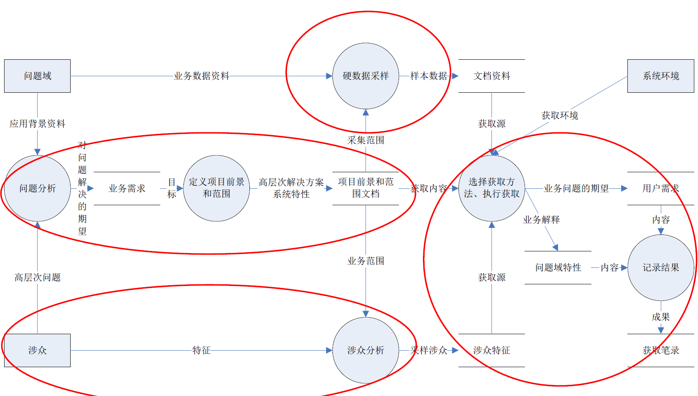

:::details AI总结

# 笔记总结与重点分析
## 笔记总结
本笔记系统阐述了需求获取的核心要素与实践要点，包括需求获取的非平凡性挑战、获取过程涉及的子活动与主要组成部分（内容/来源/方法/结果）、实施过程中的注意事项与终止判断条件。重点分析了实践中常见的问题域特性、涉众参与不足、交流偏差及方法选择依据，并详细列举了传统/集体/认知/上下文四类获取方法体系。

## 重点/易考点分析 (名词解释)

### 什么是默认（Tacit）知识现象？
用户和开发人员因背景不同导致的难以明确表达的知识，这种默认知识的存在使需求交流变得困难。

### 潜在（Latency）知识指什么？
用户存在但尚未被明确认知的需求知识，属于用户认知困境的典型表现。

### 解系统的定义是什么？
为用户创建的解决方案系统，其构建需要获取项目范围内的需求信息和问题域特性。

### 硬数据包括哪些类型？
包含登记表格、单据、报表等定量文档，以及备忘录、日志等定性文档。

### 导出用例的特点是什么？
通过其他用例的结合可以推导出的新用例，属于结束需求获取活动的判断条件之一。

### 涉众的构成包含哪些角色？
包括用户、客户、领域专家、市场人员、销售人员等用户替代源。

### 民族志（Ethnography）属于哪种需求获取方法？
基于上下文的获取方法，通过观察用户实际工作环境进行需求挖掘。

### 获取笔录（Elicitation Notes）可能包含哪些形式？
可以包括文字记录、录音、摄像等各种形式，记录用户需求、问题域知识和约束。

### 项目范围失控的典型表现有哪些？
边界定义不清晰/错误定义边界/未控制已建立边界，导致需求不完备或冗余。

### 交流问题中最严重的障碍是什么？
理解偏差是需求获取过程中最大的交流问题。

（我还没有掌握有关知识，此回答为大模型自动生成）

:::
# 需求获取概述

## 需求获取的非平凡性
- 用户和开发人员的背景不同，立场不同
  - 首先是知识理解的困难。
  - 默认（Tacit）知识现象
- 普通用户缺乏概括性、综合性的表述能力
- 用户存在认知困境
  - 潜在（Latency）知识
- 用户越俎代庖
  - 用户提出的不是需求，而是**解决方案**
  - 用户固执的**坚持某些特征和功能**
- **缺乏用户参与**
### 需求获取的子活动
- 研究应用背景，建立初始的知识框架；
- 根据获取的需要，采用必要的获取方法和技巧；
- 先行确定获取的内容和主题，设定场景；
- 分析用户的高（深）层目标，理解用户的意图；
- 进行涉众分析，针对涉众的特点开展工作。

### 需求获取的活动过程

## 需求获取的几个部分

1. 确定获取信息的内容
2. 确定待获取信息的来源
3. 确定应采用的获取方法
4. 执行获取
5. 获取的结果

### 获取的内容
- 在**项目的范围**之内
- 所有为用户创建**解系统**必须的信息
  - 需求
    - 通常体现为用户的观点、看法、目标或者问题
  - 问题域特性
    - 需要注意的是不要忽略系统的环境和约束
- 获取的内容不是一次得到的，而是**逐步积累**的

### 获取的来源
- 涉众
  - 用户
  - 客户
  - 领域专家
  - 市场人员、销售人员等其他用户替代源
- 相关产品
  - 原有系统
  - 竞争产品
  - 协作产品（和解系统存在接口的其他软件系统）
- 硬数据
  - 登记表格、单据、报表等定量文档
  - 备忘录、日志等定性文档
- 重要文档
  - 原有系统的规格说明
  - 竞争产品的规格说明
  - 协作产品的规格说明
  - 客户的需求文档（委托开发的规格说明、招标书）
- 相关技术标准和法规
  - 相关法律、法规及规章制度
  - 行业规范、行业标准

### 获取的方法
- 传统方法
  - 面谈、问卷调查、硬数据分析、文档检查、需求剥离等
- 集体获取方法
  - 头脑风暴(Brainstorming)
  - 专题讨论会(Workshop)
  - JAD
- 原型
- 认知方法
  - 任务分析(Task Analysis)
  - 协议分析(Protocol Analysis)
- 基于上下文的方法
  - 观察
  - 民族志(Ethnography)
  - 话语分析(Conversation Analysis)

### 获取的过程
#### 注意事项
- 在整体上制定组织方案
  - 确定系统的边界，建立上下文图或系统用例图
- 维护项目的前景和范围
- 引导和控制获取过程
- 接受需求的不稳定性
- 控制探索性工作

#### 防止需求遗漏
- 务必让**所有**的**涉众**都表达出自己的意见。
- 不要以**抽象**和**模糊**的**需求**作为结束。对抽象和模糊的需求，要进行**细化**，让**真正**的**需求**显露出来。
- 使用**多种方法**表达需求信息。利用不同的分析技术为相同的需求进行建模，通过分析不同的关注点，考察需求是否完整。
- 注意检查**边界值**和**布尔逻辑**。

#### 结束获取活动判断条件
- 用户想不出更多的用例；
- 用户想出的新用例都是**导出用例**（通过其他用例的结合可以推导出该用例）；
- 用户只是在**重复**已经讨论过的问题；
- 新提出的特性、需求等都在**项目范围之外**；
- 新提出的需求**优先级都很低**；
- 用户提出的新功能都属于**后继版本**，而非当前版本

### 获取的结果
- 肯定会产生**获取笔录**（Elicitation Notes）
  - 用户需求、问题域知识和约束
  - 可能具有组织差、冗余、遗漏、自相矛盾等诸多问题
  - 可以包括**文字记录**、**录音**、**摄像**等各种形式
- 可能会产生两份定义明确的正式文档
  - 项目前景和范围文档
  - 用例文档

## 需求获取的实践调查情况

### 实践中的需求获取活动主要关注以下几个问题

- 项目目标
  - 项目成功的十大影响因素之一
- 项目范围
- 用户参与
- 交流问题
- 获取方法的使用

### 项目范围
- 项目的边界定义不清晰，或者根本就没有定义项目的边界；
- 定义的项目边界错误，使得最终的需求不完备或者冗余；
- 没有控制已建立的项目边界，使得项目范围失控

### 涉众/用户参与不足
- 没有能够有效的选择参与项目的用户
- 认识不足
- 用户抵制
- 没有明确的用户
- 管理上的障碍

### 交流问题
- 最大的问题就是理解偏差
- 常用的交流方式
  - 非正式的电话交谈
  - 正式的电话交谈（例如客户热线或者远程电话会议）
  - 邮件
  - web反馈表
  - 文档
  - 面对面的交流（例如JAD会议、原型等）
- 面对面的交流方式是最有效，也是最受欢迎的
- 直接交流途径优于间接交流途径

### 获取方法的使用
- 面谈、原型
  - 存在选择问题
- 五个方面的选择依据
  - 需求的目的
  - 知识的类型
  - 知识内化的特性要求
  - 可观察的现象
  - 约束
