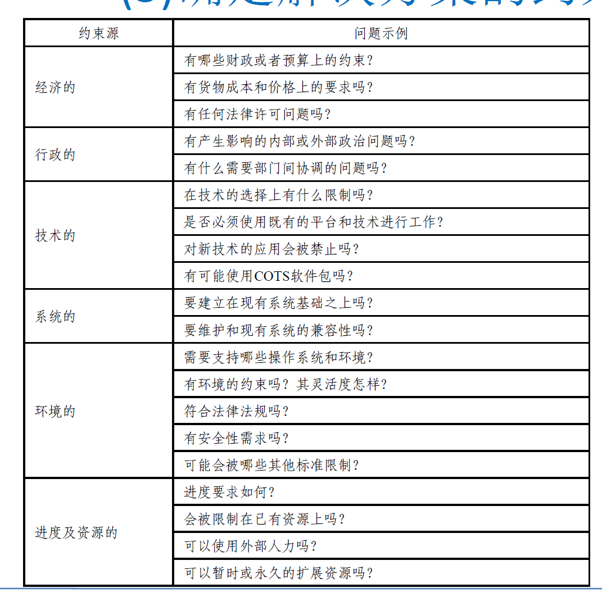
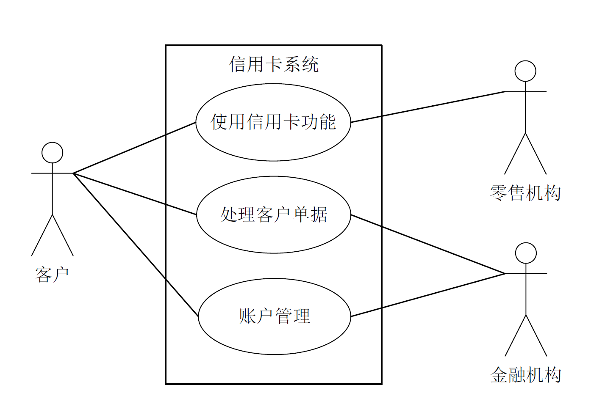
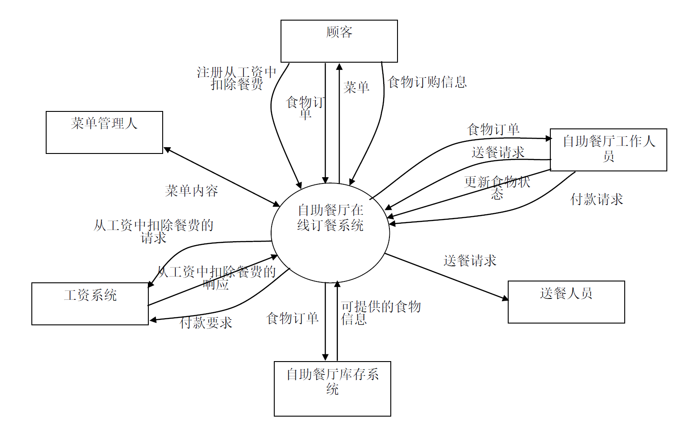

:::details AI总结

# 笔记总结与重点分析
## 笔记总结
本笔记系统阐述了确定项目前景和范围的核心流程与方法。重点包含问题分析的四个步骤（明确问题、判断明确性、发现问题根源、定义业务需求）、高层次解决方案的选择标准、系统边界的建立技术（用例图与上下文图），以及前景与范围文档的组成要素。强调通过结构化分析确保业务需求与解决方案的一致性。

## 重点/易考点分析 (名词解释)

### 什么是项目前景？
项目前景是指所有涉众共同认同的，用于理解和描述问题域及需求的出发点。

### 项目范围包含哪些内容？
项目范围包含描述目标时需要考虑的"事物"和"事件"，是解决方案需要覆盖的具体领域。

### 业务需求的构成要素有哪些？
业务需求包含业务目标/目的、高层业务功能、高层业务功能关联的高层数据、相关项目涉众等内容，需要解决不同需求间的冲突。

### 系统用例图的作用是什么？
系统用例图用于描述解系统的整体解决方案，帮助从总体理解业务静态结构和动态行为，确保不同问题的涉众在系统总体上达成一致。

### 上下文图的核心功能是什么？
上下文图描述解系统与外部实体之间的信息流输入/输出关系，包括信息提供者、使用者、控制者和影响者等交互要素。

### 高层次解决方案的要素包含哪些内容？
包含ID（解决方案编号）、方案描述（概要说明）、业务优势（带来的好处）和代价（所需花费的成本）四个核心要素。

### 问题描述表包含哪些结构化元素？
由ID（问题编号）、问题描述、涉众（受影响者）、影响（对业务活动的后果）和解决（可能方案及优点）五个要素构成表格。

### 系统边界建立的挑战是什么？
随着问题数量增加，解决方案复杂性上升，需要整合分散方案并建立整体解系统，确保各问题涉众在系统层面达成共识。

:::

# 确定项目的前景和范围

## 确定项目前景和范围的活动

### 为什么需要确定项目的前景和范围

世界是复杂的，所以：
- 定义**项目前景**
  - 所有的涉众都从共同认同的项目前景出发，理解和描述**问题域**及**需求**
- 定义**项目范围**
  - 范围内的**事物**和**事件**是描述的目标

### 关键点
- 定义**业务需求**和能够**满足需求**的**高层解决方案**，包括:
  - 业务目标/目的
  - 高层业务功能
  - 每个高层业务功能所关联的高层数据
  - 每个功能相关的项目涉众
  - 等等
- 如果存在不同业务需求之间的**冲突**，那么在确定项目前景和范围阶段**必须予以解决**

## 问题分析

### 明确问题
从问题域出发
- 对问题达成共识
- 收集背景资料，判断问题的明确性
- 分析不明确问题，发现问题背后的问题

#### 对问题达成共识
- 描述问题，在涉众之间取得认同

| 元素  |               内容               |
| :---: | :------------------------------: |
|  ID   |             问题编号             |
| 问题  |             问题描述             |
| 涉众  |      受问题影响的风险承担人      |
| 影响  | 问题对风险承担人和业务活动的影响 |
| 解决  |   指出可能的解决方案及主要优点   |

#### 判断问题的明确性
问题的明确性要求它们具备一下两点：
- 易于理解
- 能指明解决的方向

##### 示例

|               ❌                |                         ✔️                          |
| :----------------------------: | :------------------------------------------------: |
| 图书管理员：图书总是无法上架。 |  图书管理员：图书的内容分类不合适，无法分类上架。  |
|                                | 图书管理员：图书上架的工作太繁杂，导致来不及上架。 |
|                                |  图书管理员：图书的借阅不遵守章程，不能保证上架。  |

#### 发现问题背后的问题
对于不明确的问题
- 直接咨询涉众是第一选择
- 利用收集的资料和业务数据是第二选择
- 必要时需要使用一些简单的问题分析技巧

### 发现业务需求

每一个明确、一致的问题都意味着涉众存在一些相应的期望目标，即业务需求。
- **问题：**生产的废品过多
- **需求：**提供销售订单的准确性，在系统使用后3个月内，减少50%因此而产生的废品。

### 定义解决方案及系统特性

#### 确定高层次的解决方案

发现**各种可行**的高层次解决方案，分析不同方案的业务优势和代价，然后通过和涉众的**协商**，选定其中一个

<table>
  <thead>
    <tr>
      <th colspan="2">要素</th>
      <th>内容</th>
    </tr>
  </thead>
  <tbody>
    <tr>
      <td colspan="2">ID</td>
      <td>解决方案编号</td>
    </tr>
    <tr>
      <td rowspan="3">解决方案</td>
      <td>方案描述</td>
      <td>概要描述解决方案</td>
    </tr>
    <tr>
      <td>业务优势</td>
      <td>该解决方案所能带来的业务优势</td>
    </tr>
    <tr>
      <td>代价</td>
      <td>该解决方案将花费的代价</td> 
    </tr> 
  </tbody>
</table>

#### 确定问题解决边界
- 明确该解决方案需要具备的功能特征，即系统特性
- 分析解决方案需**要和周围环境形成的交互作用**，定义解决方案的边界
  - 尤其是**信息流的输入/输出关系**
    - 它需要的信息由谁提供？
    - 它产生的信息由谁使用？
    - 谁控制它的执行？
    - 谁会影响它的执行？
#### 确定解决方案的约束

## 建立系统边界

**挑战**：随着问题数量的增加，系统的问题解决方案的复杂性也会增加，这就需要讲各个分散的问题解决方案整合起来，建立解系统的整体解决方案
- 可以从总体上来理解系统中的业务静态结构和动态行为
- 确保不同问题的涉众在系统总体上也能达成一致
  - 问题分析仅仅是确保了涉众在具体问题上达成一致
将**所有问题**的解决方案进行综合，就可以得到**整个解系统**的功能和边界
系统边界的常用技术描述手段是**系统用例图**和**上下文图**

### 系统用例图

### 上下文图

## 前景和范围文档
- **业务需求**、**高层次解决方案**和**系统特性**都应该被定义到**项目前景与范围文档**之中
- **前景与范围文档**主要由**需求工程师**来完成，但文档的负责人一般是项目的**投资负责人**、**执行主管**或其他类似角色
- 文档中记录的应该是清晰、明确的**业务需求**、**高层次解决方案**和**系统特性**
- 项目合约或抽象的**业务用例文档**也可以实现类似目的
