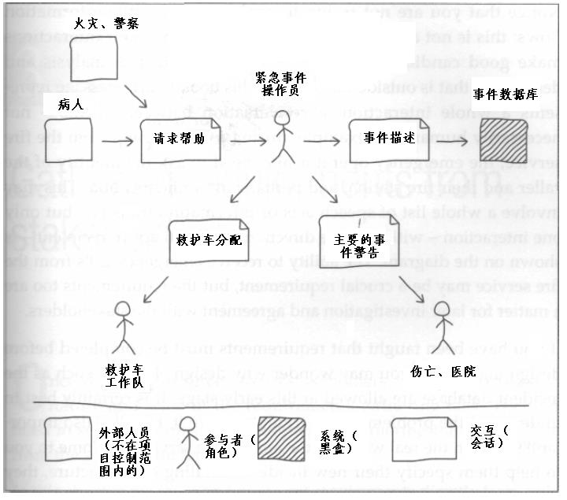
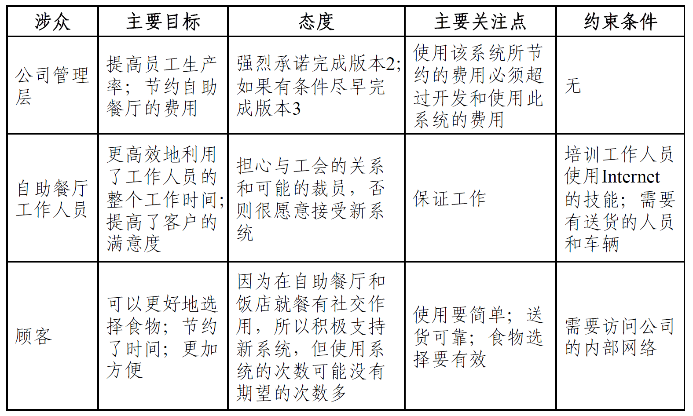

:::details AI总结

# 笔记总结与重点分析
## 笔记总结
本笔记系统阐述了涉众分析与硬数据采样的核心内容。涉众分析包含定义涉众群体、分类特征（用户/客户/开发者等）、分析四类信息系统（小型/组织级/战略/组织间系统）的涉众特征，以及实施涉众识别、描述、评估、选择的完整流程。硬数据采样部分则明确了定量与定性数据的分类标准（格式化文档vs自然语言文本），并给出了样本量计算公式与两种抽样方法（随机/分层）。

## 重点/易考点分析 (名词解释)

### 什么是涉众？
所有能够影响软件系统的实现，或者会被实现后的软件系统所影响的个人和团体。

### 定量硬数据包括哪些类型？
指经过仔细设计、具有严格规范要求的格式化文档，包括数据收集表格（反映组织信息流）和统计报表（反映组织过去主要业务和业务目标）。

### 定性硬数据包含哪些具体形式？
使用自然语言进行描述的文本资料，包括组织结构图、门户网站内容、业务指导文档（工作指南、规章手册）和业务备忘。

### 组织间系统（Inter-Organizational Systems）的涉众特征是什么？
通过系统实施建立或增强组织间合作关系，决定权不受单个组织控制，涉众比组织内系统更加难以寻找和选择，需考虑组织间合作关系与利益分配方案。

### 战略信息系统（Strategic Information System）的核心特点是什么？
作为组织战略决策开发的系统，无法根据现有业务和技术状况确定未来应用效果，影响范围难以确定，涉众数量更多且难以确定，需通过业务环境分析发现潜在涉众。

### 代表采样的核心要求有哪些？
完整采样（每种涉众类别都有代表）、态度积极（愿意提供帮助）、数量适中（太少导致个人看法倾轧群体意见，太多难以达成一致，通常6-10人）。

### 涉众分析的定义是什么？
为软件系统寻找并理解关键涉众的过程，包括分析他们的赢利条件以实现共赢，持续关注涉众群体变化。
（我还没有掌握有关知识，此回答为大模型自动生成）

:::
# 涉众分析与硬数据采样

## 涉众分析的必要性

### 需求获取的源头
- 两种类型
  - 人脑内知识
  - 人脑外知识
### 涉众
所有能够影响软件系统的实现，或者会被实现后的软件系统所影响的**个人和团体**。

#### 涉众类别

- **用户**：最终使用和操作产品的人
  - 关注软件功能
- **客户**：为软件系统的开发付费的人
  - 关注经济上的成本、收益
- **开发者**：负责实现软件系统的人
  - 关注技术上的成本和收益
- **管理者**：参与软件系统开发事务管理的人
  - 投资方管理者、执行负责人、项目管理者
  - 关注系统的开发进程
- **领域专家**：在问题域中具有丰富知识的专家
  - 关注软件中的知识
- **政府力量**：法律法规、长远规划、政策意向等
  - 起约束和指导作用
- **市场力量**：组织中的市场部门人员
  - 关注用户的想法
#### 涉众的特征
- 涉众类别**需要细分**
  - 每一类涉众的所有成员都能够一致、稳定的从相同立场、相同视角来看待相同的软件系统
- 发现比较**关键**的涉众
  - 需要分析他们各自的赢利条件，以在相互妥协中尽力实现一个共赢的结局
- 涉众群体**不是固定不变**的
  - 对涉众的理解不是一个完成之后就可以结束的活动，而是应该在完成之后继续保持适当的关注

**涉众分析**就是为软件系统**寻找**并**理解****关键涉众**的过程

## 涉众分析的主要内容

### 信息系统的四种类型

#### 小型系统（Small System）
- 小型系统是指那些能够支持组织的部分工作，但又不会影响整个组织基础工作的信息系统
- 关注于某个特定问题
- 功能较为固定，界限较为清晰
- **涉众有限且明显**

#### 组织级系统（Organization-Wide System）
- 其功能能够影响整个组织基础工作的系统，它的功能在质量上和小型系统有着明显的差异。
- 它可能会影响用户群体之外的组织内其他群体，甚至改变组织现存的权力结构
- **用户不再有限和明显，而且用户之外的其他群体尤其不明显**
- 发现直接和间接群体，防止抵制

#### 战略信息系统（Strategic Information System）

- 作为组织战略决策而得以开发的系统
- 无法根据现有的业务和技术状况来确定系统将来的应用效果
- 系统的影响范围也难以确定
- **涉众数量更多而且更加难以确定**
- 在业务环境内分析各种可能的机遇和风险，并据此发现可能的涉众，防止抵制

#### 组织间系统（Inter-Organizational Systems）
- 通过系统自身的实施建立或增强组织之间的合作关系
- 系统的很多决定不是单个组织所能控制的
- 在主动参与和抵制系统的问题上有着更多的困难
- **涉众比组织内系统的涉众更加难以寻找和选择**
- 考虑组织之间的合作关系和利益分配方案，在组织的大框架下进行涉众的寻找和选择
### 涉众分析/寻找涉众
- **L1**：根据软件系统的功能前景寻找涉众
- **L2**：从涉众对象那里获取需求
- **L3**：分析涉众的输赢条件,实施共赢策略
- **L4**：了解涉众实现、监控和评估软件系统的能力，分析涉众的力量和影响范围；了解涉众实现、监控和评估软件系统的意愿，即分析涉众的关注点和兴趣取向。
- **L5**：了解涉众的个人特征和工作特征，以便在涉众固定的情况下对软件系统的功能进行合理的调整。

## 涉众分析的过程

- 寻找软件系统的**涉众类别**，辨别关键的涉众类别
- 描述不同涉众类别的**特征**，包括个人特征、工作特征
- 分析不同涉众类别的**输赢条件**和**受影响程度**
- 描述不同涉众类别的**关注点和兴趣取向**
- 分析不同涉众类别的**重要性和影响力**
- 为每种涉众类别选择**合适的代表**参与项目开发

### 涉众识别

**目的**是**寻找**和**发现**各种**涉众类别**

**基本过程**：从一些比较容易发现的涉众出发，通常包括客户、管理者和相关的投资者
1. 由初始涉众集体讨论，列出一个**涉众类别列表**
2. 对上一步产生的涉众类别列表进行分析，缩减为一个**关键涉众类别列表**
3. 由上一步的各个关键涉众类别选择代表，集中讨论，列出**新的涉众类别列表**
   - 如果涉众类别列表**趋于稳定**，就**结束**涉众识别过程，否则转向第2步

### 涉众描述

**目的**是**描述**涉众的**特征**，包括个人特征、工作特征，以及对项目的**期望目标**。

- 对项目的**关注点**和**兴趣**所在，态度是反对还是赞同；
- 对项目的**期望**，成为项目赢家的条件；
- 可能**受到**的项目的影响，影响的具体内容及影响程度；
- 可以对项目**施加**的影响，力量的施加点及其强度。

### 涉众评估

**目的**是**评估**涉众的**重要性**和**影响力**

**优先级评估**
- 涉众并不是**完全平等**的，有些涉众比其他涉众更为重要
- 优先考虑涉众的**基本特征**，尤其是**任务特征**

### 涉众选择

#### 代表采样
- **完整采样**：**每种涉众类别**都有自己的代表
- **态度积极**：愿意提供帮助
- **数量适中**
  - 太少：个人看法倾轧群体共同看法
  - 太多：达成一致困难
- 代表数量的准确数字要视项目的上下文环境来确定, 一般6-10

#### 用户替代源
- **因为业务关系而和用户频繁接触**的人，能够代替他们发表看法
  - 市场人员
  - 服务咨询人员
  - 技术支持人员
  - 领域专家

### 硬数据采样
**硬数据**：人们在实际工作中产生的各种各样的表格和文档资料

#### 硬数据类型
常见硬数据分为定量硬数据和定性硬数据两种类型

##### 定量硬数据

**定量硬数据**：指经过仔细设计、具有严格规范要求的格式化文档

- **数据收集表格**
  - 反映了组织的信息流
  - 收集正在使用的每张空白表格表格、填写和分发说明
  - 对比填写好的表格
    - 表格中是否有从来都不填写的数据项；
    - 应该收到表格的人是否真的收到了；
    - 他们是否按照正常程序使用、存储和丢弃表格
    - 等等
- **统计报表**
  - 反映了组织过去的主要业务和业务目标
  - 统计规则也是一种丰富的知识，统计项分解为细节业务数据的过程往往也就是组织目标分解到具体业务的过程
  - 根据实际工作填写过的统计报表，就可以发现组织实际的业务执行状况，从中发现组织面临的具体问题

##### 定性硬数据

**定性硬数据**：使用自然语言进行描述的文本资料

- **整个组织的描述文档**
  - 组织结构图：帮助发现项目的关键涉众
- **门户网站**
  - 反映组织的业务开展状况
- **业务指导文档**
  - 工作指南和规章手册：解释业务的详细执行过程，反映业务的具体细节
- **业务备忘**
  - 反映业务的实际执行情况
  - 形成对组织工作过程的清晰理解

#### 采样方法

##### 采样数量

$$
样本大小 = p \times (1 - p) \times \frac{确定性因子}{可接受的错误}^2
$$

$p$ 是差异样本比例，未知的情况下设为0.25

##### 采样方式

随机抽样
- 随机地采样数据
分层抽样
- 考虑系统的分层，从每一层中随机抽取一个样本

#### 采样过程

1. 确定采样目标
2. 确定采样方法
3. 确定采样数量
4. 进行采样
5. 分析采样结果
