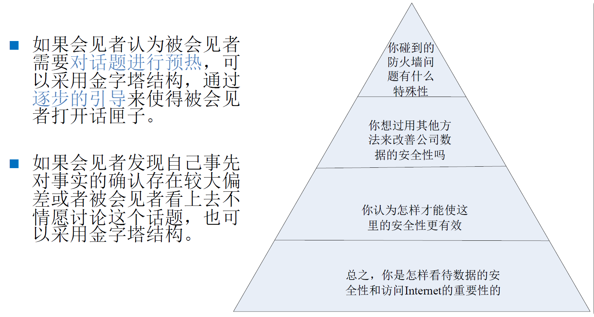
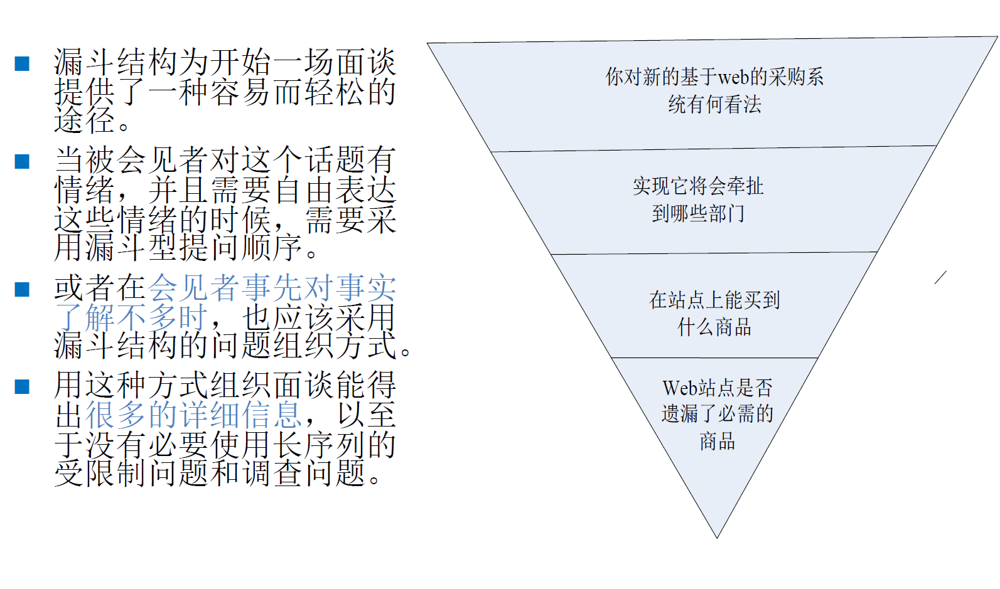
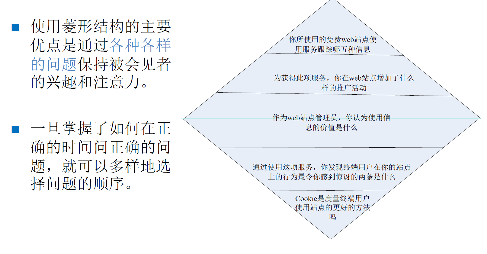

:::details AI总结

# 笔记总结与重点分析
## 笔记总结
该笔记系统阐述了面谈方法在需求获取中的应用，主要包括面谈的问题类型（开放式/封闭式）、组织方式（金字塔/漏斗/菱形结构）、实施过程（准备/主持/结果处理）、分类（结构化/半结构化/非结构化）及其优缺点。同时拓展了群体面谈、调查问卷和头脑风暴等关联方法，详细说明了各类方法的适用场景、实施流程和注意事项。

## 重点/易考点分析 (名词解释)

### 什么是开放式问题？
开放式问题指被会见者对答复的选择不受限制，可能回答两词或两段话。适用于获取具有深度和广度的信息，其优点包括让被会见者感到自在、收集丰富细节，缺点是可能产生不相干细节且耗时较长。

### 什么是封闭式问题？
封闭式问题的答案形式受限，被会见者只能在限定范围内作答。优点为节省时间且切中要点，缺点是可能使被会见者厌烦且无法获取丰富细节。

### 结构化面谈和非结构化面谈的主要区别是什么？
结构化面谈严格按照预先设定的问题和结构执行，控制程度高但灵活性小；非结构化面谈无预定议程，允许广泛主题讨论或深入特殊主题探讨，灵活性大但控制程度低。二者在内容精度、时间成本、培训需求等方面均有显著差异。

### 群体面谈的主要流程包括哪些步骤？
群体面谈流程分为计划面谈（确定参与人员/时间/地点/内容）、主持面谈（建立规则/控制主题/保持参与）和分析结果三个阶段，涉及涉众集中讨论需求获取。

### 头脑包含哪两个阶段？
头脑风暴包括想法产生阶段（自由产生大量创意）和想法精减阶段（筛选/分类/评估想法），前者重在数量，后者通过投票等方式确定优先级。

### 面谈的三种基础组织结构是什么？
面谈的三种基础组织结构为金字塔型、漏斗型和菱形，分别对应不同的问题展开方式（具体结构需结合图示理解）。

### 调查问卷适用于哪些场景？
调查问卷适用于涉众地理分布广、需统计倾向分析、探索性研究需求及为面谈建立基础框架的情况，以文档为交流媒介。

（我还没有掌握有关知识，此回答为大模型自动生成）
:::
# 面谈

- 面对面的会见（face-to-face meeting）被认为是**最具丰富内容的交流方法**
- 实践当中应用最为**广泛**的需求获取方法之一
- 可以获得的信息内容包括
  - 事实和问题
  - 被会见者的观点
  - 被会见者的感受
  - 组织和个人的目标

## 面谈中的问题

### 问题的类型

- 问题基本上可以分为两种类型：开放式问题和封闭式问题
  - 开放式问题（Open-Ended）
  - 封闭式问题（Closed）

#### 开放式问题

- 被会见者对答复的选择可以是开放和不受限制的，他们可能答复两个词，也可能答复两段话。
- 在希望得到丰富（具有一定深度和广度）信息时，开放式问题比较合适

**例子**:
- “你觉得把所有的经理都置于一个内联网内怎么样？”
- “请解释你是如何做进度决策的？”
- “对公司中企业对企业电子商务的当前状态有何看法？”

**优点**：

- 让被会见者感到自在；
- 会见者可以收集被会见者使用的词汇，这能反应他的教育、价值标准、态度和信念；
- 提供丰富的细节；
- 对没采用的进一步的提问有启迪作用；
- 让被会见者更感兴趣；
- 容许更多的自发性；
- 会见者可以在没有太多准备的情况下进行面谈。

**缺点**：

- 提此类问题可能会产生太多不相干的细节；
- 面谈可能失控；
- 开放式的回答会花费大量的时间才能获得有用的信息量；
- 可能会使会见者看上去没有准备。

#### 封闭式问题

答案有基本的形式，被会见者的回答是**受到限制**的

**例子**:
- “项目存储库每个星期更新多少次？”
- “电话中心一个月平均收到多少个电话？”
- “下列信息中哪个对你最有用：（1）填好的客户投诉单；（2）访问web站点的客户的电子邮件投诉；（3）与客户面对面的交流；（4）退回的货物。”

**优点**：

- 节省时间；
- 切中要点；
- 保持对面谈的控制；
- 快速探讨大范围问题；
- 得到贴切的数据

**缺点**：

- 使得被会见者厌烦；
- 得不到丰富的细节；
- 出于上述原因，失去主要思想；
- 不能建立和面谈者的友好关系。

#### 开放式问题和封闭式问题的对比

| 特点 | 开放式问题 | 封闭式问题 |
| :---: | :----------: | :----------: |
| 数据的可靠性 | 低 | 高 |
| 使用时间的效率 | 低 | 高 |
| 数据的精度 | 低 | 高 |
| 广度和深度 | 广 | 窄 |
| 需要的面谈技能 | 多 | 少 |
| 分析的难易度 | 难 | 易 |

#### 其他的类型

##### 探究式问题

- 为什么？
- 你能举个例子吗？
- 你能详细描述一下吗？

##### 诱导性问题

- “你和其他经理一样，都同意把财产管理计算机化，是吗”

##### 双重问题

- “每天你通常会做什么决策，你是怎样做的”

##### 元问题

- 我的问题看起来相关吗？
- 你的回答正式吗？
- 你是回答这些问题的最佳人选吗？
- 我问了太多的问题吗？
- 我还应该见什么人？
  
##### 总结和反馈

- 你能不能总结一下系统的功能？
- 你能不能总结一下一个成功系统的必备特征？
- 在使用的时候，你希望能够从系统当中得到什么类型的信息反馈？

##### 重复和改述

- 能不能再说一次系统的哪些特征是重要的？
- 你能不能详细的重新叙述一下使用系统的步骤？
- 在使用系统的时候你会做出什么决定？

##### 建立场景和细节描述

- 有什么是你现在能做，却在新系统中不能做的？
- 在什么情况下，功能是必需的？
- 设想现在是6个月之后，你需要评估系统的成功状况，你会使用哪些标准来做出评价？

##### 抗辩

- 你能不能想出什么不使用系统的理由？
- 你为什么会不想使用系统呢？
- 你能不能想出将来可能导致系统失败或故障的原因？

### 问题的组织

问题的组织也就是面谈结构

三种基础结构:

- 金字塔型
- 漏斗型
- 菱形

#### 金字塔型

#### 漏斗型

#### 菱形

## 面谈的过程

### 准备面谈
1. 阅读背景资料
2. 确定面谈主题和目标
3. 选择被会见者
4. 准备被会见者
5. 确定问题和类型

### 主持面谈

#### 笔录

##### 优点

- 使会见者专心和集中精力；
- 帮助回忆重要的问题；
- 表现会见者对面谈的兴趣；
- 表明会见者是有准备的。

##### 缺点

- 丢失很多被会见者在谈话中表现出来的语调、停顿等语音信息；
- 做笔记时，会让被会见者说话犹豫；
- 造成对事实注意过多，而对感觉及观点注意过少。

#### 录音和摄像

##### 优点

- 记录了更多的信息；
- 会见者能轻松地倾听并更快速地做出响应；
- 可以完整的重现面谈过程。

##### 缺点

- 被会见者可能会紧张，回答不自在；
- 数据采集的代价较高；
- 事后进行信息寻找时难以定位。

### 处理面谈结果

- 复查面谈记录
  - 整理出内容要点，进行分类
- 总结面谈信息
  - 评估面谈中所得到的信息
- 完成面谈报告
  - 应该尽快的复查面谈记录，总结面谈信息，完成面谈报告

## 面谈的类型

### 结构化面谈

- 安全按照**事先的问题**和**结构**来控制面谈

### 半结构化面谈

- 事先**需要**根据面谈内容**准备面谈的问题和面谈结构**，但在面谈过程当中，会见者**可以根据实际情况**采取一些灵活的策略

### 非结构化面谈

- **没有**事先预定的议程安排
- 甚至会在**没有**太多事前**准备**的情况下就直接到访被会见者的工作地，就某个主题开展会谈
- 会见者和被会见者谈话的主题可能非常**广泛**，而且每个主题都不会非常**深入**
- 也可能在非结构面谈中仅就某个**特殊的主题**进行**深入**的讨论

### 非结构化面谈和结构化面谈的对比

| 特点 | 非结构化面谈 | 结构化面谈 |
| :---: | :----------: | :----------: |
| 评估获取内容的难度 | 难 | 易 |
| 所需的时间 | 多 | 少 |
| 会见者需要的培训 | 多 | 少 |
| 允许的自发性 | 多 | 少 |
| 对被会见者的洞察力 | 更多机会 | 几乎没有机会 |
| 灵活性 | 大 | 小 |
| 会见者的控制程度 | 低 | 高 |
| 获取内容的精度 | 低 | 高 |
| 获取内容的可信度 | 低 | 高 |
| 获取内容的广度和深度 | 高 | 低 |

## 面谈的优缺点

### 面谈的优点

- 面谈的开展条件较为简单，经济成本较低；
- 能获得包括事实、问题、被会见者观点、被会见者态度和被会见者信仰等各种信息类型在内的广泛内容；
- 通过面谈，需求工程师可以和涉众（尤其是用户）建立相互之间的友好关系；
- 通过参与面谈，被会见者会产生一种主动为项目做出贡献的感觉，提高涉众的项目参与热情。

### 面谈的缺点

- 面谈比较耗时，时间成本较高；
- 在被会见者地理分散的情况下往往难以实现面谈；
- 面谈参与者的记忆和交流能力对结果影响较大，尤其是面谈的成功较高的依赖于需求工程师的人际交流能力；
- 交谈当中常见的概念结构不同、模糊化表述、默认知识、潜在知识和态度偏见等各种问题在面谈中都不可避免，进而影响面谈的效果，导致产生不充分的、不相关的或者错误的数据；
- 在会见者不了解被会见者认知结构的情况下，面谈不可能取得令人满意的效果。

## 相关方法

### 群体面谈

群体面谈的方法是将**所有的涉众**方集中起来，选择一个合适的地点，集中一段时间，召开一个多方共同参与的会议，一起进行**需求**的**讨论**、**分析**和**获取**。

#### 流程

- 计划面谈
  - 确定**参与人员**
    - 涉众、主持人、负责人、分析人员、记录人员、观察员
  - 安排会谈时间
    - 全职的2－4天参与会议
    - 拟定一份议程
  - 选择会谈地点
    - 充足的空间，道具支持，良好的餐饮服务
  - 准备会谈内容
    - 面谈的主题和范围，会议的议程，需求的预期和会谈的目标，各种材料
- **主持面谈**
  - 建立基本规则
    - 按时开始和结束会议；
    - 中途休息（例如午餐）后要尽快进入状态；
    - **一次只讨论一个主题**；
    - 期望每个人都为会议做出**自己的贡献**；
    - 要**关注于问题**，不要有人身批评和攻击；
    - 限制发言时间，不要个人把持会议。
  - 保持会议的气氛
  - 确保每个人都**积极地**参与讨论
  - 控制会议的主题
- 分析结果

#### 需求获取方法

- 联合应用程序设计JAD（Joint Application Design）
- 需求专题讨论会（Requirement Workshop）
- 需求中心小组（Requirement Focus Group）
- 联合需求规划JRP（Joint Requirements Planning）

#### 优点

- 节约时间，有着更低的**时间成本**；
- 在一个集中连续的时间内完成，能够**加速**项目的**开发进度**；
- **涉众方**可以**直接交流**，提高了冲突的**处理能力**和**处理效率**；
- 这可以提高涉众的**项目参与度**；
- 常常会有**创造性**的信息内容产生。

#### 缺点

- 群体面谈要求所有参与方都要在一个集中的时间内抽出**大量时间**和**精力**投入面谈，这往往难以实现；
- 群体面谈获得的信息比一对一面谈要**复杂**的多，因此对它们的**分析**是一个不小的**技术挑战**；
- **主持**群体面谈比主持一对一面谈要**困难**的多。

### 调查问卷

- 面谈方法以口头语言为主要的交流媒介，而调查问卷以文档为主要的交流媒介
- 适用调查问卷的情况
  - 系统的涉众在地理上是分布的；
  - 系统的涉众数量众多，而且了解所有涉众的统计倾向是非常重要的；
  - 需要进行一项探索性的研究，并希望在确定具体方向之前了解当前的总体状况；
  - 为后续的面谈标识问题和主题，建立一个开展工作的基础框架。

#### 调查问卷——格式设计要点

- 提供足够的空白空间
- 提供足够的答复空间
- 要求回答者清楚地标出他们的答复
- 使用目标帮助确定格式
- 保持风格一致

#### 调查问卷——问题的设置顺序

- 重要问题优先
- 相似的主题应该聚集在一起
- 考虑问题之间的关联性
- 争议性问题应该位于相应的非争议问题之后

### 头脑风暴

- 它的目的不是发现需求，而是“发明”需求，或者说是发现“潜在”需求
- 它鼓励参与者在无约束的环境下进行某些问题的自由思考和自由讨论，以产生新的想法
- 适用情况
  - 发明并描述以前不存在的全新的业务功能
  - 明确模糊的业务
  - 在信息不充分的情况做出决策

包括两个阶段

- 想法产生阶段
- 想法精减阶段

#### 想法产生阶段

目的是产生出尽可能多的新的想法

- 基本规则
  - 充分发挥想像力，不要有任何的羁绊；
  - 产生尽可能多的想法，想法重在数量而不是质量，不要顾及想法是否荒诞；
  - 自由讨论，目的是产生新的想法，不要争吵和批评；
  - 在自由讨论当中，可以转换和组合所有已提出的想法，以产生新的想法
  - 通常持续1个小时左右，特殊情况下持续2～3个小时

#### 想法精减阶段

第一步是去除那些不值得进一步讨论的想法

- 第二步是把类似的意见进行归类
- 第三步是主持人遍历每一个未被删除的想法，确保所有参与者都对其有共同的理解
- 利用投票或类似方法，评估现有想法的优先级
- 最后，根据评估的数据，从中筛选出符合一定标准的想法作为头脑风暴方法的成果
