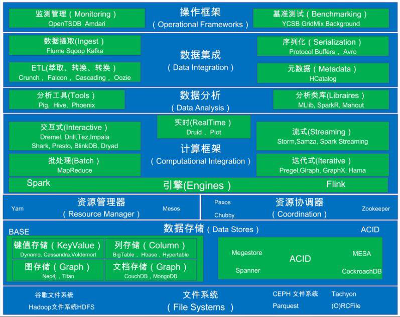
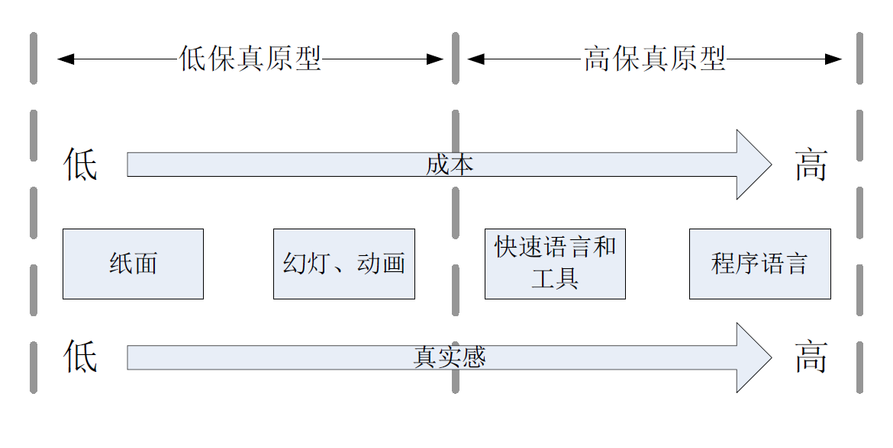
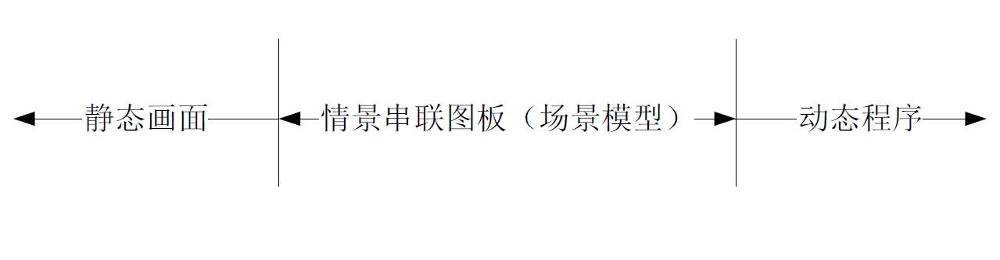
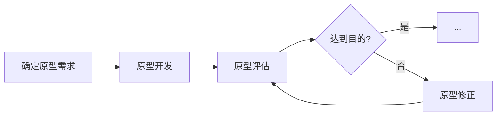
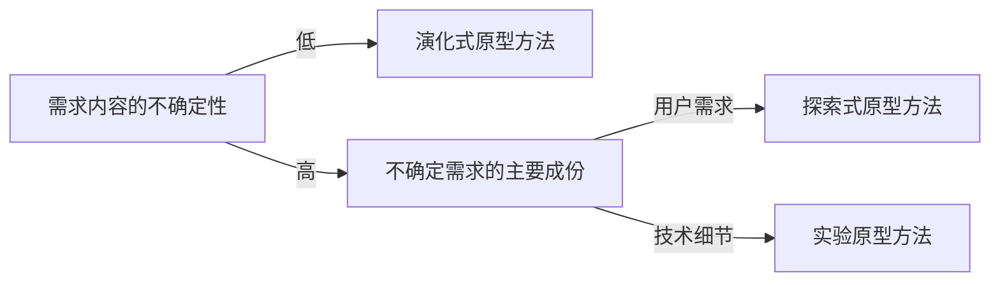

# 原型

## 应用原型的必要性

### 什么是原型

- “原型是一个系统，它内化了（capture）一个更迟系统（later system）的本质特征。原型系统通常被构造为不完整的系统，以在将来进行改进、补充或者替代。”
- 如果在最终的物件（final artifact）产生之前，一个中间物件（mediate artifact）被用来在一定广度和深度范围内表现这个最终物件，那么这个中间物件就被认为是最终物件在该广度和深度上的原型。
- 包括书面描绘、场景叙述、情节串联图板、幻灯演示、动画模拟、屏幕快照和程序代码等在内的各种被用来探索和论证软件系统功能的物件都是软件的原型
- 一个组织会发展出自己独特的原型文化，这些原型文化仅仅将一些限定类型的事物看作是有效的原型

### 为什么要利用原型

- **提高用户在软件开发中的参与程度**；
- 及时、**有力的响应用户需求的变化**；
- 减少返工；
- 减少开发成本，提高经济效益；
- 有效的识别风险和解决风险，帮助进行风险管理；
- **帮助控制不完整需求所带来的风险**；
- 可以将一个大的难以处理的开发过程细分成一些更小更容易处理的步骤；增加开发者之间的交流，帮助确定技术解决方案的可行性；

## 原型的类别

### 按照开发方法分类

#### 探索式（exploratory）

- 以**缺陷需求**开始继而不断**调整**和**修正需求**的原型开发方式称为**探索式**
- 要**尽可能**的**调整**各种设计选项

#### 实验式（experimental）

- 以**清晰的用户需求**和**模糊的实现方法、实现效果、可行性**开始，明确需求的可行性和技术实现方案
- 定义一个对原型的**评估方法**，确定**评估**的**属性**

#### 演化式（evolutionary）

- 以**清晰的原型化需求**和**项目积累下来的原型资产**为开始

#### 抛弃式原型和演化式原型

- 探索式和实验式方法产生的原型产品又被称为**抛弃式原型**
  - 花费最小的代价，争取最快的速度
  - 可能会使用简易的开发工具和不成熟的构造技术
  - 可能会忽略或简化处理原型目的不相关的功能特征
  - 要坚决的抛弃

- 演化式原型方法产生的原型产品被称为**演化式原型**
  - 质量要从一开始就能达到最终系统的要求
  - 要易于进行扩展和频繁改进，因此开发者必须重视演化式原型的设计
  - 仅应该被用于处理清晰的需求、规格说明和技术方案

### 按照构建技术分类

#### 水平原型方法（horizontal prototyping）

- 它仅仅实现选定功能的**某些特定层次**
- 建立的原型产品称为**水平原型**
- 要把注意力集中在概括性需求和流程上

#### 垂直原型方法（vertical prototyping）

- 它会触及到选定功能实现的**所有层次**
- 建立的原型产品称为**垂直原型**
- 要保证真实实现它的**各种功能**

|        |                             废弃型                             |                                演化型                                |
| :----: | :------------------------------------------------------------: | :------------------------------------------------------------------: |
| 水平型 | 阐明并细化用例和功能性需求 识别遗漏功能 研究用户界面方法 | 实现核心用例 根据优先级实现其他用例 使得系统适应快速变化的需要 |
| 垂直型 |                         演示系统可行性                         |      实现并扩充核心功能 实现并扩充核心算法 测试并调整性能      |

### 按照介质分类

### 按照表现分类

## 原型方法过程

### 确定原型需求

- 原型的需求内容可以从三个维度上分析：**角色**（**Role**）、**外观**（**Look and Feel**）和**实现**（**Implementation**）
- **角色**是指原型物件在用户工作中的价值，也就是说它为什么是对用户有用的。
  - 原型物件到底能够帮助用户完成什么样的工作
- **外观**是指用户对原型物件的具体感觉体验，即用户在使用原型物件时会看到什么、听到什么和感觉到什么
- **实现**是指原型物件完成功能的细节技术和方法

### 原型开发

#### 选择原型开发的方法

#### 选择原型的构建技术

<table>
  <thead>
    <tr>
      <th>需求内容纬度</th>
      <th>构建技术</th>
    </tr>
  </thead>
  <tbody>
    <tr>
      <td>外观</td>
      <td rowspan="3">水平</td>
    </tr>
    <tr>
      <td>角色</td>
    </tr>
    <tr>
      <td>实现</td>
    </tr>
    <tr>
      <td>集成</td>
      <td>垂直</td>
    </tr>
  </tbody>
</table>

### 原型评估

- 需要获取的评估者反馈
  - 评估者反应
  - 评估者建议
  - 创新思想
- 可以创建一些脚本来指导评估者的体验活动
- 务必要让合适的人从恰当的角度来评估原型
- 观察评估人员使用原型的过程
- 创造一个无偏见的环境，让评估人员畅所欲言

### 原型修正

一方面要依据评估人员的反馈
另一方面也要考虑事先的原型调整计划

## 原型方法的风险

- 涉众看到了一个正在运行的原型，得出产品几乎已经完成的结论，从而提出快速交付产品的**不当要求**
- 用户可能会被原型所表现出来的非功能特性遮蔽了眼睛，从而忽略了他们更应该重视的功能特性
  - 在澄清需求不确定性的同时也可能会掩盖一些用户的假设，这些假设将会无从发现
- 原型开发工作投入太多的工作，使得开发团队消耗了过多的时间和过大的成本
