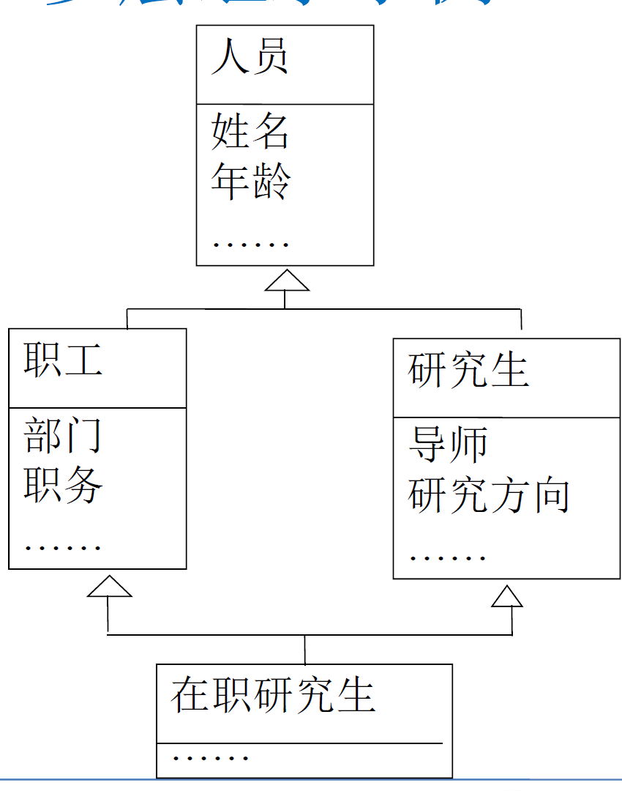
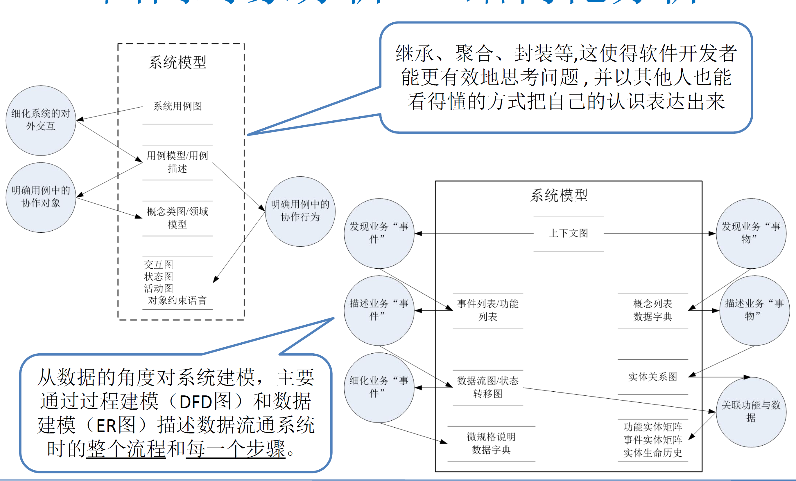

:::details AI总结

# 笔记总结与重点分析
## 笔记总结
本笔记系统阐述了面向对象分析的核心思想与UML建模技术。主要内容包括：1）面向对象分析的五大基本特征和核心概念（类/对象、封装、继承、多态性）；2）通过对象类机制、继承机制和多态动态绑定机制实现高可维护性、可复用性与程序无关性；3）对比结构化分析与面向对象分析在数据管理、耦合性等方面的差异；4）UML作为统一建模语言的特性及其在需求工程中的应用场景。核心关注点在于通过对象抽象和类继承机制提升软件系统的复用性与可维护性。

## 重点/易考点分析 (名词解释)

### 什么是封装？
把类的内部属性和一些操作隐藏起来，只将公共的操作对外可见。避免外界错误和内部修改带来的影响；对象只通过消息来请求其他的对象执行自身的操作。

### 继承包括哪些特性？
1. 子类继承父类的全部属性和操作，可添加自己的属性和操作
2. 具有泛化与特殊的关系
3. 允许多重继承（多于一个父类）
4. 允许多层继承（各层具有传递性）
5. 实现源代码复用

### 动态联编的定义及其作用是什么？
动态联编（滞后联编/动态绑定）指编译时不确定所访问对象的操作地址，在运行时根据操作对象的不同再确定。它使软件应用分布式发展有了重要突破，成为网络信息化、软件体系结构研究的主要支撑技术。

### 什么是多态性？
在继承类结构中允许定义同名操作，同一个消息的响应可以执行不同的行为，即同一操作的多种形态。更好地体现操作语义的一致性，实现接口封装独立性和信息隐蔽原则。

### UML的全称及其本质是什么？
UML是Unified Modeling Language（统一建模语言），本质是：
1. 一种标准化的建模语言
2. 用于辨识系统环境中的对象及其关系
3. 已成为事实上的行业标准，支持MDA和可执行UML等技术

### 程序无关性的实现机制是什么？
通过类的多态性及动态绑定技术提供独立接口的实现技术，将与机器相关的成分独立出来，使得在任何机器环境和程序语言下编写的程序都能保持逻辑通用性。

### 结构化分析方法的主要缺点是什么？
1. 数据表示为关键实体并与程序分离
2. 数据在各层均可访问
3. 单个数据修改导致系统程序变化
4. 增加程序耦合性

### 数据抽象与过程抽象的区别是什么？
数据抽象：根据施加在数据上的操作定义数据类型
过程抽象：将确定的功能定义为单一实体（由系列操作完成）

### 面向对象分析实现高可维护性的关键机制？
1. 对象类机制：以类作为可构造元素
2. 消息机制：替代过程性功能调用
3. 封装特性：避免外界错误影响
（我还没有掌握有关知识，此回答为大模型自动生成）

:::

# 面向对象分析与UML建模概述

## 面向对象分析概述

### 基本思想

- 从现实世界中客观存在的事物出发，直接以**问题域**中的事物为中心，思考和认识问题。
- 将事物的**本质特征**和**系统责任**，抽象表示为系统的**对象**，作为系统的**基本构成单位**，建立软件系统。
- 强调运用日常逻辑思维经常采用的思想方法和原则，例如：**抽象**、**分类**、**继承**、**聚合**、**封装**和**关联**，并以易懂方式表达。

### 面向对象分析与UML建模的特征

- 一切都是对象
- 对象都是独立的
- 对象具有原子性
- 对象都是可抽象的
- 对象都有层次性

### 基本概念

#### 类和对象

- 类是**抽象**及分类的概念，是人们分析问题的基本方法，分类是**划分共性**的事物为一类。抽象是**忽略事物非本质的特征**；
- **数据抽象**是根据施加在数据上的**操作**来定义数据的类型；
- **过程抽象**是将确定的功能定义为**单一实体**（确定的功能是由一系列操作完成的）；
- 在外部世界中，相同**属性和操作**的对象属于一个类，**对象**是类的一个**实例**；
- 在机器空间中，类是一个**可复用**的模板，而对象是**复用出来**的独立可执行程序块

##### 数据实体抽象

- 数据实体抽象：学生、客户、电子邮件、汽车

##### 无形过程抽象

- 无形过程抽象：轨迹、交易、答辩、课程

#### 封装和消息

- **封装**：把类的内部属性和一些操作隐藏起来，只将公共的操作对外可见。避免**外界错误和内部修改**带来的影响；
  - 对象只通过消息来请求其他的对象执行自身的操作；
- **消息**必须直接发给指定的对象，消息中包括请求执行操作的**必要信息**；
  - 一个对象是消息的**接收执行**者，也可以是消息的**请求发送**者。

#### 继承

- 类可以有子类，子类继承父类的**全部**属性和操作，并允许添加**自己的**属性和操作；
- 继承是**泛化和特殊**的关系；
  - **父类**具有某事物的一般共性；
  - **子类**描述的事物在父类的基础上并比父类更特殊；
- 继承可以有**多重性**，允许**多于一个**父类；
- 继承允许**多层**，各层之间具有**传递性**；
- 继承的重要作用在于**源代码的复用**。

#### 多态性

- 在继承类结构中允许定义**同名操作**，同一个消息的响应可以**执行不同的行为**，即**同一操作**的多种形态；
- 多态性更好地体现了操作语义的**一致性**，实现接口封装独立性和**信息隐蔽**的原则。

- 静态联编：编译时确定所访问对象的操作地址；
- 动态联编（滞后联编 或 动态邦定）：编译时**不确定**所访问对象的操作地址，在运行时根据**操作对象**的不同再确定。
- 动态联编使软件应用分布式发展有了重要突破，成为网络信息化、软件体系结构研究的**主要支撑技术**。

### 目标及实现机制

- 高可维护性
  - 对象类机制
- 可复用性
  - 继承机制
- 程序无关性
  - 多态性动态绑定机制
### 高可维护性

- 寻找可构造的元素（类）作为系统构造的基础，回避在不稳定基础上建造系统，使系统成为**可构造**和**高可维**。
  - 类是封装了操作的一个“**代码级复用**”程序模板，类的对象是系统的**可构造元素**
  - 采用**消息机制**执行对象的操作，**回避了**功能调用的**过程性**

### 可复用性

- 对象语义一致性
  - 功能的复用依赖于对功能的理解，对功能的描述是复杂和多义的，相比对象语义来说不容易复用。
- 全方位复用
  - 功能复用是**代码级**的，软件复用不但需要代码级的，还应该有**源程序级**的复用。
  - 继承机制是**源程序级**的复用。

### 程序无关性
在任何机器环境下，使用任意程序语言，所编的程序都应该是**逻辑通用**的
  - 与机器相关的成分应该与处理逻辑**无关**。
  - 类的**多态性**以及**动态绑定**技术提供了**独立接口**的实现技术
  - 这样可以将与机器相关的成分**独立**出来，为程序无关性奠定了基础。

## 面向对象分析 VS 结构化分析

你们知道吗？

| 分析方法         | 优点                                                                                                                                                                                                    | 缺点                                                                                                                                                                          |
| ---------------- | ------------------------------------------------------------------------------------------------------------------------------------------------------------------------------------------------------- | ----------------------------------------------------------------------------------------------------------------------------------------------------------------------------- |
| 结构化分析方法   | 1. 建立的模型比较直观、简单、可读性好 2. 利于沟通，有效提高软件质量                                                                                                                                  | 1. 数据为最关键的实体，表示为数据结构 2. 数据是与程序（算法）分离 3. 数据在系统的各层都可以被访问 4. 单个数据的修改会导致整个系统程序的变化 5. 程序的耦合性的增加 |
| 面向对象分析方法 | 1. 高可重用/重构/变更性 2. 封装：数据不再贯穿整个程序，而是成为各个模块的私有属性 3. 数据不和算法分离，更符合现实情况 4. 大大降低了系统模块间的耦合性 5. 继承和多态，体现了现实世界的多样性 | 1. 一个类的内部更为复杂&UML模型更为复杂 2. 需要掌握更复杂的建模知识                                                                                                        |

## UML模型概述

UML是一种统一的、标准化的建模语言

**面向对象建模**：一种用于**辨识**系统环境中的**对象**及这些对象之间**关系**的技术

### 特性与发展现状

- UML是一种Language（语言）
- UML是一种Modeling（建模）Language
- UML是Unified（统一）Modeling Language

已进入全面应用阶段的事实标准
- 应用领域正在逐渐扩展，包括嵌入式系统建模、业务建模、流程建模等多个领域
- 成为“产生式编程”的重要支持技术：MDA、可执行UML等

### 软件需求工程中的UML

- 需求获取
  - 对捕获的需求进行整理和分析的工具，辅助开发人员与用户进行沟通
- 需求分析
  - 包含高层设计（架构模型）和详细设计模型，用于统一开发人员、沟通设计信息
