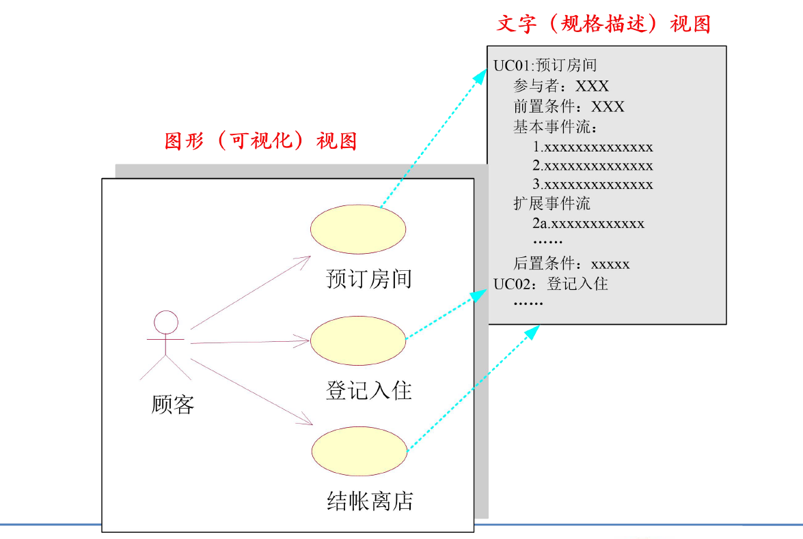
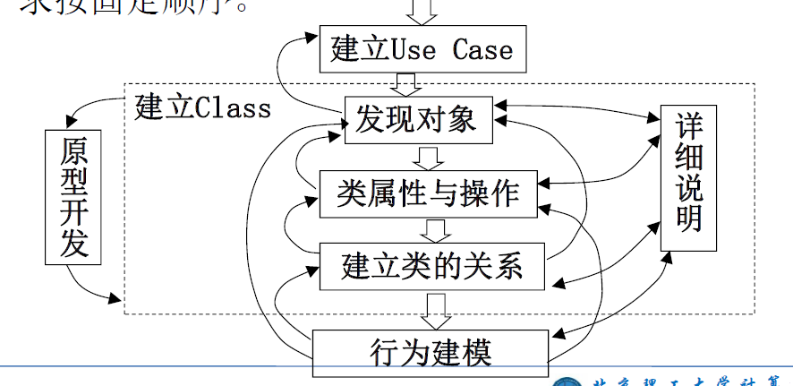

:::details AI总结

# 笔记总结与重点分析
## 笔记总结
本笔记系统阐述了UML的组成要素、模型体系及建模过程。UML由基本构造块（结构/行为/分组/注释事物）、规则（命名/范围/可见性）和公共机制（构造型/标记值/约束）构成，重点解析了类图、用例图等13种图形工具的应用场景。动态模型部分强调顺序图、状态机等交互描述，静态模型突出类图的三层结构。建模过程强调需求优先、模型交替迭代的灵活方法。

## 重点/易考点分析 (名词解释)

### 什么是结构事物？
结构事物是UML中的名词，它是模型的静态部分，描述概念或物理元素，包括类、接口、用例、构件等七种具体类型。

### 主动类的定义是什么？
主动类是指其对象至少拥有一个进程或线程，能够启动控制活动的类，属于结构事物中的特殊类别。

### 协作包括哪些要素？
协作定义了一个交互，由一组共同工作以提供某协作行为的角色和其他元素构成的群体，用于实现特定用例。

### 构件的特点是什么？
构件是系统设计的模块化部分，隐藏内部实现并对外提供接口，满足相同接口的组件可自由替换。

### 节点是什么？
节点是运行时存在的物理元素，表示可计算资源（如PC机、服务器），具有存储空间和处理能力。

### 交互的表示方法是什么？
交互是在特定语境中共同完成任务的一组对象间交换的信息集合，用带操作名的有向直线表示。

### 包的作用是什么？
包是分组事物，将模型元素组织成分层结构，用于管理大型系统中的类等元素。

### 聚合与组合的区别？
聚合表示整体与部分关系，组合强调部分完全依赖整体存在，两者都是关联关系的特殊形式。

### 实现关系的定义？
实现关系规定接口与实现类/组件之间的关系，接口定义操作集合作为服务规范。

### UML的扩展机制有哪些？
包括构造型（领域特定构造块）、标记值（{标记信息}形式的新特性）和约束（花括号括起的新语义规则）。

### 类图的三层结构指什么？
包含对象层（系统实体）、特征层（实体特性）、关系层（类间固有关系），构成系统静态结构基础。

### 顺序图的功能是什么？
顺序图描述按时间顺序排列的对象交互，重点强调消息传递的时间次序。

### 部署图的作用？
部署图描述系统中计算节点的拓扑结构，用于分析分布式系统部署方案，一个系统只对应一个部署图。

### 可见性规则中package可见性的标识符是什么？
package可见性使用波浪线"~"表示，只有同包内元素可见。

### 构造型的应用场景是什么？
构造型用于定义特定领域或系统的专用建模元素，扩展UML标准元素集。

（我还没有掌握有关知识，此回答为大模型自动生成）

:::

# UML总体说明

## UML组成要素

- 基本构造块：也就是建模元素，是模型的主体
- UML规则：也就是支配基本构造块如何放在一起的规则
- 公共机制：运用于整个UML模型中的公共机制、扩展机制

### 基本构造块

#### 事物构造块

- 事物构造块是对模型中最具有代表性的成分的抽象
- **结构事物**：UML中的**名词**，它是模型的**静态部分**，描述概念或物理元素。
- **行为事物**：UML中的**动词**，它是模型中的**动态部分**，是一种**跨越时间、空间**的行为。
- **分组事物**：UML中的**容器**，用来组织模型，使模型更加的**结构化**。
- **注释事物**：UML中的**解释部分**，和代码中的**注释**语句一样，是用来**描述**模型的。

##### 结构事物

###### 类（class）和对象（object）

- 类是对一组具有相同**属性**、相同**操作**、相同**关系**和相同**语义**的对象的抽象
- UML中类是用一个矩形表示的，它包含三个区域，最上面是类名、中间是类的属性、最下面是类的方法
- 对象则是类的一个实例

###### 接口（interface）
- 接口是描述某个**类**或**构件**的一个**服务操作集**

###### 主动类（active class）

- 主动类实际上是一种特殊的类。引用它的原因，实际上是在开发中需要有一些类能够起到启动控制活动的作用
- 主动类是指其对象至少拥有一个进程或线程，能够**启动控制活动**的类

###### 用例（use case）与协作（collaboration）

- 用例实例是在系统中执行的一系列动作，这些动作将生成特定执行者可见的**价值结果**
  - 一个**用例**定义一组**用例实例**
- 协作定义了一个交互，它是由一组共同工作以提供某协作行为的角色和其他元素构成的一个群体。
  - 对于某个**用例**的**实现**就可以表示为一个**协作**

###### 构件（component）

- 在实际的软件系统中，有许多要比"类"更大的实体，例如一个COM组件、一个DLL文件、一个JavaBeans、一个执行文件等等。为了更好地对在UML模型中对它们进行表示，就引入了构件（也译为组件）
- 构件是系统设计的一个模块化部分，它隐藏了内部的实现，对外提供了一组外部接口。在系统中满足相同接口的组件可以自由地替换

###### 节点（node）

- 为了能够有效地对部署的结构进行建模，UML引入了节点这一概念，它可以用来描述实际的PC机、打印机、服务器等软件运行的基础硬件
- 节点是运行时存在的物理元素，它表示了一种可计算的资源，通常至少有存储空间和处理能力

##### 行为事物

###### 交互（interaction）

- 交互是在特定语境中，共同完成某个任务的一组对象之间交换的信息集合
- 交互的表示法很简单，就是一条有向直线，并在上面标有操作名

###### 状态机（state machine）

- 状态机是一个对象或交互在生命期内响应事件所经历的状态序列
- 在UML模型中将状态画为一个圆角矩形，并在矩形内写出状态名及其子状态

###### 活动（activity）

- 活动是描述对象或交互的**动态行为**的模型
- 活动是**状态**的**序列**

#### 分组事物

###### 包（package）

- 对于一个中大型的软件系统而言，通常会包含大量的类，因此也就会存在大量的结构事物、行为事物，为了能够更加有效地对其进行整合，生成或简或繁、或宏观或微观的模型，就需要对其进行分组。在UML中，提供了"包（Package）"来完成这一目标
- 包是**分组事物**，它将模型中的元素组织成一个**分层结构**

#### 注释事物

###### 注释（note）

结构事物是模型的主要构造块，行为事物则是补充了模型的动态部分，分组事物而是用来更好地组织模型，似乎已经很完整了。

而注释事物则是用来锦上添花的，它是用来在UML模型上添加适当的解释部分

### 关系构造块

<table border="1">
  <thead>
  <tr>
    <th>种类</th>
    <th>变种</th>
    <th>表示法</th>
    <th>关键字或符号</th>
    <th>种类</th>
    <th>变种</th>
    <th>表示法</th>
    <th>关键字或符号</th>
  </tr>
  </thead>
  <tbody>
  <tr>
    <td rowspan="5">抽象</td>
    <td>派生</td>
    <td rowspan="2">依赖关系</td>
    <td>《derive》</td>
    <td rowspan="2">导入</td>
    <td>私有</td>
    <td rowspan="5">依赖关系</td>
    <td>《access》</td>
  </tr>
  <tr>
    <td>显现</td>
    <td>《manifest》</td>
    <td>公有</td>
    <td>《import》</td>
  </tr>
  <tr>
    <td>实现</td>
    <td>实现关系</td>
    <td>虚线加空心三角</td>
    <td>信息流</td>
    <td></td>
    <td>《flow》</td>
  </tr>
  <tr>
    <td>精化</td>
    <td rowspan="2">依赖关系</td>
    <td>《refine》</td>
    <td rowspan="1">包含并</td>
    <td></td>
    <td>《merge》</td>
  </tr>
  <tr>
    <td>跟踪</td>
    <td>《trace》</td>
    <td rowspan="1">许可</td>
    <td></td>
    <td>《permit》</td>
  </tr>
  <tr>
    <td>关联</td>
    <td></td>
    <td>关联关系</td>
    <td>实线</td>
    <td>协议符合</td>
    <td></td>
    <td></td>
    <td>未指定</td>
  </tr>
  <tr>
    <td>绑定</td>
    <td></td>
    <td rowspan="3">依赖关系</td>
    <td>《bind》 (参数表)</td>
    <td>替换</td>
    <td></td>
    <td rowspan="5">依赖关系</td>
    <td>《substitute》</td>
  </tr>
  <tr>
    <td>部署</td>
    <td></td>
    <td>《deploy》</td>
    <td rowspan="4">使用</td>
    <td>调用</td>
    <td>《call》</td>
  </tr>
  <tr>
    <td rowspan="2">扩展</td>
    <td>Extend</td>
    <td>《extend》 (扩展点)</td>
    <td>创建</td>
    <td>《create》</td>
  </tr>
  <tr>
    <td>extension</td>
    <td>扩展关系</td>
    <td>实线加实心三角</td>
    <td>实例化</td>
    <td>《instantiate》</td>
  </tr>
  <tr>
    <td>泛化</td>
    <td></td>
    <td>泛化关系</td>
    <td>实线加空间三角</td>
    <td>职责</td>
    <td>《responsibility》</td>
  </tr>
  </tbody>
</table>

#### 关联关系
- 关联（Association）表示两个类之间存在某种语义上的联系。
- 关联关系提供了通信的路径，它是所有关系中最通用、语义最弱的。
- 在UML中，使用一条实线来表示关联关系
- 在关联关系中，有两种比较特殊的关系：聚合和组合
  - **聚合关系**：聚合（Aggregation）是一种特殊形式的关联。聚合表示类之间的关系是**整体**与**部分**的关系
  - 如果发现“部分”类的存在，是完全依赖于“整体”类的，那么就应该使用**组合**关系来描述

#### 泛化
 - 泛化关系描述了一般事物与该事物中的特殊种类之间的关系，也就是**父类**与**子类**之间的关系。

#### 实现
- 实现关系是用来规定接口和实现接口的类或组件之间的关系。接口是操作的集合，这些操作用于规定类或组件的服务。
#### 扩展与依赖
- 扩展表示将一个构造型**附加**到一个元类（metaclass）上，使得元类的定义中**包括这个构造型**。
- 有两个元素X、Y，如果修改元素X的定义可能会引起对另一个元素Y的定义的修改，则称元素Y**依赖**（Dependency）于元素X。

### UML规则
- **命名**：也就是为事物、关系和图起名字。和任何语言一样，名字都是一个标识符
- **范围**：与类的作用域相似，包括所有者作用域（owner scope）和目标作用域（target scope）两类
- **可见性**：

| 可见性 | 规则 | 标识符 |
| --- | --- | --- |
| public | 任一元素，若能访问包容器，就可以访问它 | + |
| package | 只有声明在同一个包中的元素才能够看到该元素 | ~ |
| protected | 只有包容器中的元素或包容器的后代才能够看到它 | # |
| private | 只有包容器中的元素才能够看得到它 | - |

### 公共机制
在图形表示法的每个部分后面都有一个**规格描述**（也称为详述），它用来对构造块的语法和语义进行文字叙述。

这种构思，也就使可视化视图和文字视图的分离：

### 扩展机制

- **构造型**：在实际的建模过程中，可能会需要定义一些**特定于**某个领域或某个系统的构造块
- **标记值**：则是用来为事物添加**新特性**的。标记值的表示方法是用形如“{标记信息}”的字符串
- **约束**：是用来**增加**新的**语义**或**改变**已存在规则的一种机制。
  - 约束的表示法和标记值法类似，都是使用花括号括起来的串来表示，不过它不能够放在元素中的，而是放在相关的元素附近

## UML模型和建模过程
### UML定义的图
| 图名 | 功能 | 备注 |
| --- | --- | --- |
| **类图** | 描述类、类的特性以及类之间的关系 | UML 1原有 |
| **对象图** | 描述一个时间点上系统中各个对象的一个快照 | UML 1非正式图 |
| 复合结构图 | 描述类的运行时刻的分解 | UML 2.0新增 |
| **构件图** | 描述构件的结构与连接 | UML 1原有 |
| **部署图** | 描述在各个节点上的部署 | UML 1原有 |
| **包图** | 描述编译时的层次结构 | UML中非正式图 |
| **用例图** | 描述用户与系统如何交互 | UML 1原有 |
| **活动图** | 描述过程行为与并行行为 | UML 1原有 |
| **状态机图** | 描述事件如何改变对象生命周期 | UML 1原有 |
| **顺序图** | 描述对象之间的交互，重点在强调顺序 | UML 1原有 |
| 通信图 | 描述对象之间的交互，重点在于连接 | UML 1中的协作图 |
| 定时图 | 描述对象之间的交互，重点在于定时 | UML 2.0 新增 |
| 交互概观图 | 是一种顺序图与活动图的混合 | UML 2.0新增 |

### UML模型划分

### 用例模型（Use Case Model）
- 描述使用系统功能的角色和系统相关的功能，是需求建模的重要工具。

### 静态模型（领域模型）
- 类图（class diagram）
  - 类图是系统模型的基础，描述系统的静态结构
  - 对象层：描述系统实体以及承载的系统责任
  - 特征层：描述实体抽象的特征
  - 关系层：实体类的固有关系
- 包图（package diagram）
  - 描述系统的组织模型，为控制表示的复杂性
### 动态模型（行为模型）
- 顺序图（sequence diagram）
  - 描述按时间顺序排列的对象交互。
- 协作图（collaboration diagram）
  - 表示交互对象的行为组织结构。
- 状态转换图（state chart diagram）
  - 描述对象在生命周期内，响应事件的状态转换过程，以及响应事件后所做的反映。
- 活动图（activity diagram）
  - 用来描述任务流程或算法过程，可用来分析系统并发事务流程
### 物理实现
- 部署图（deployment diagram）
  - 用来描述系统中计算结点的拓扑结构，一个系统只有一个部署图，可用来分析分布式系统
- 构件图（component diagram）
  - 描述一组构件以及相互间的关系，是系统实现的物理建模
### UML建模过程
面向对象的建模过程，目前没有统一标准，各种建模方法的建模过程存在着较大差别，但基本原则是统一的。

强调过程中各个步骤的**相对独立**，不要求按固定顺序。

### 建模过程的建议
1. 首先进行需求确定
2. 建立类图的过程可随时切换到其他活动
3. 行为建模与类图交错进行
4. 详细说明分散在各活动中
5. 对详细说明要审查和补充
6. 原型可以反复地进行
7. 规模较小系统可以省略包图
