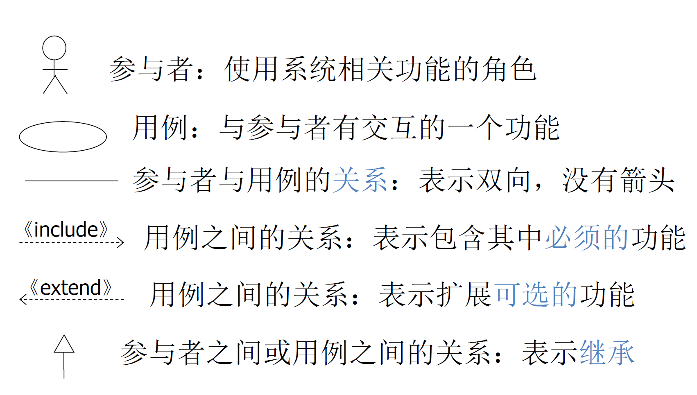
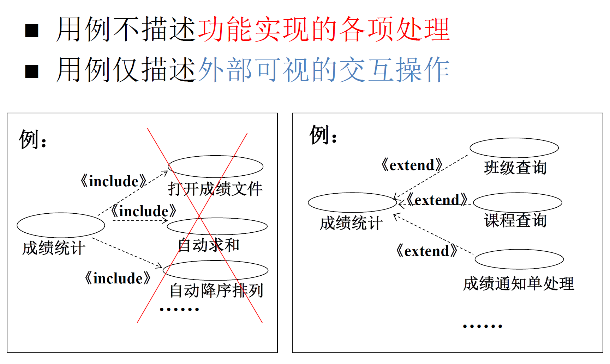
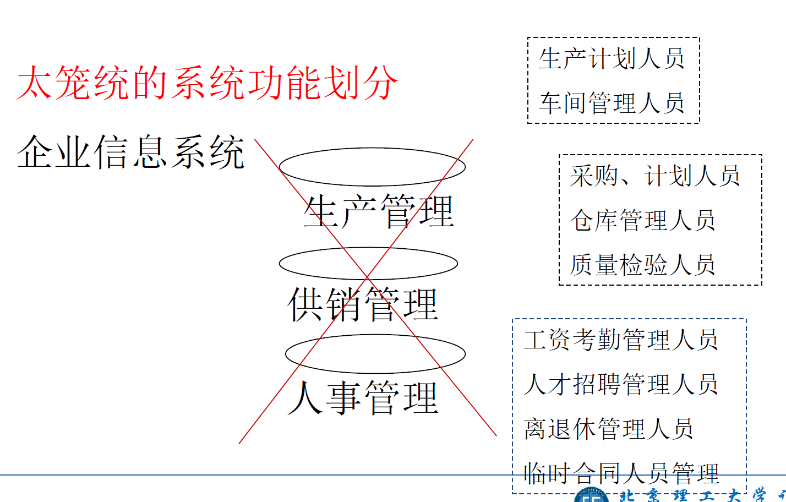
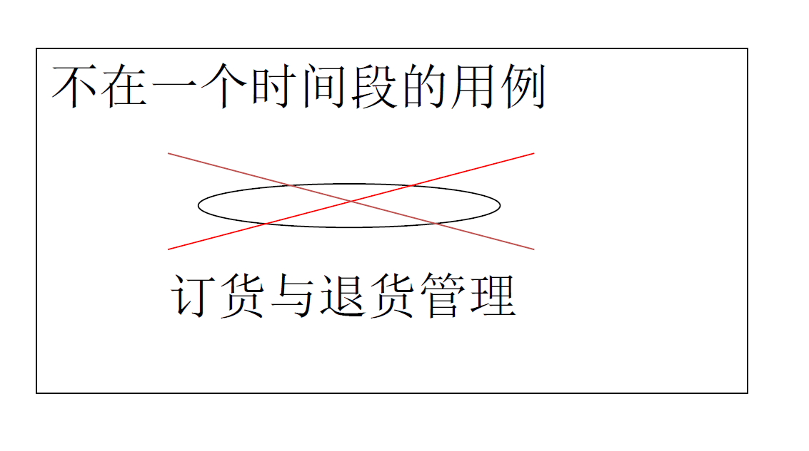
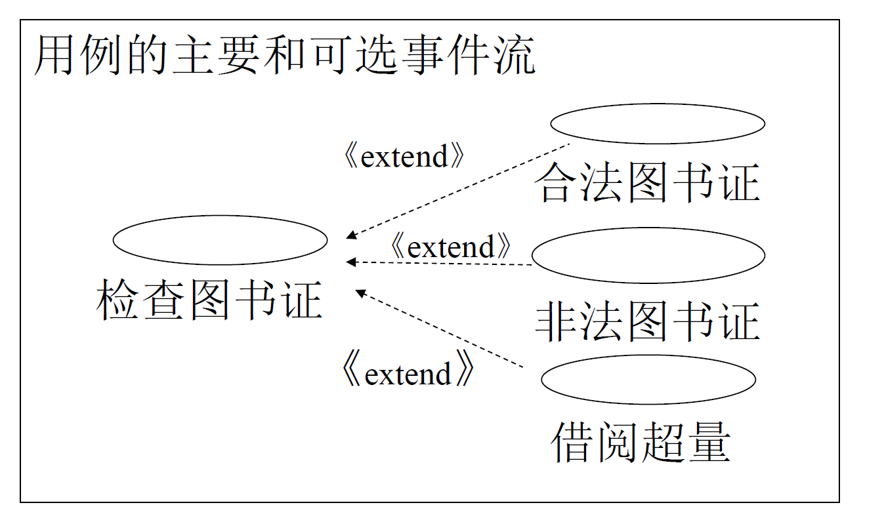
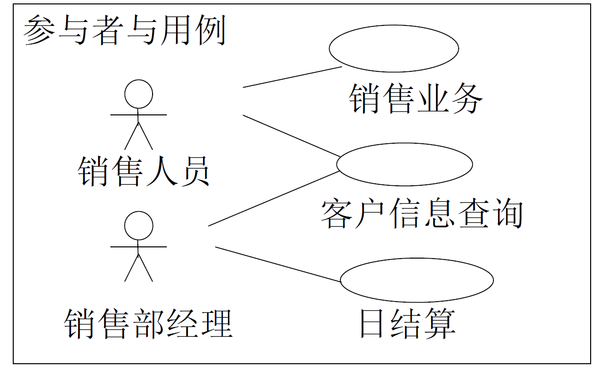
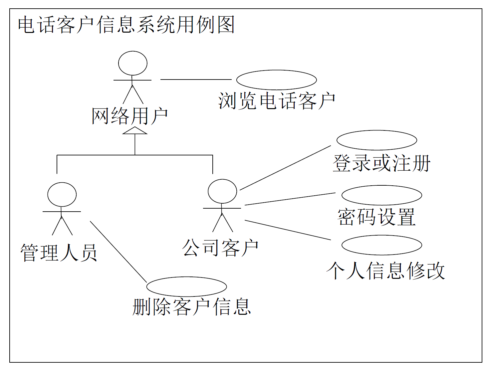
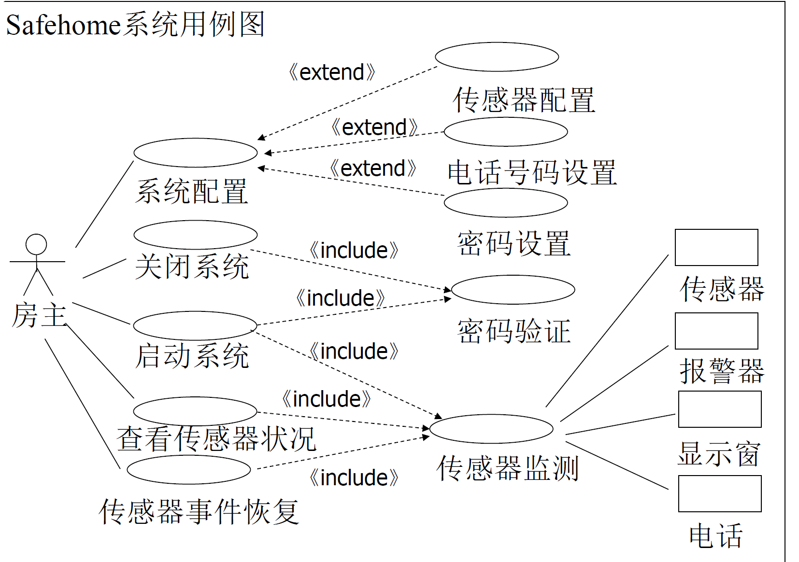

:::details AI总结

# 笔记总结与重点分析
## 笔记总结
本笔记系统介绍了用例模型的核心概念与应用。用例模型通过参与者、用例及其关系描述系统功能需求，用于建立用户与开发者共识。重点解析了用例图三大元素：参与者（系统外部角色）、用例（外部可见功能单元）及包含/扩展/泛化三种交互关系类型。同时总结了捕获用例的四项原则，强调功能粒度控制、时间连贯性、事件流分类和交互关系处理。

## 重点/易考点分析 (名词解释)

### 什么是参与者？
参与者是使用一组密切相关功能的角色，当通过这组功能与系统交互完成事务时即扮演该角色。参与者可向系统提出服务请求，也必须响应系统要求，属于系统外部事物。识别需考虑人员、设备和外部系统，不包括显示器等标准接口设备，典型如传感器、受控马达。

### 什么是用例？
用例描述系统的一项外部可见功能，表现为参与者可视的一组操作序列，每个操作代表一次交互。其要点包括：仅描述功能需求不涉及实现细节，通常由参与者发起（允许系统发起如异常处理），聚焦"做什么"而非"怎么做"。

### 包含关系（\<\<include\>\>）的特点是什么？
包含关系指执行当前用例时同步执行被包含用例，被包含用例是当前用例的必要组成部分，二者存在严格顺序关系。例如支付流程必须包含身份验证环节。

### 扩展关系（\<\<extend\>\>）的特点是什么？
扩展关系指当前用例执行满足特定条件时触发扩展用例，但扩展用例不是当前用例的必要组成部分。二者通过条件语句例如订单支付主流程可能扩展出"使用优惠券"分支。

### 泛化关系的本质是什么？
泛化关系表示用例之间的继承关系，子用例继承父用例的行为结构并扩展/重写特定步骤，类似于面向对象中的类继承机制。
（我还没有掌握有关知识，此回答为大模型自动生成）
:::

# 用例模型

**作用**：Use Case用于对系统的功能及与系统进行交互的外部事物建模

**目的**：通过寻找与系统交互的外部事物，说明他们与系统如何交互，可以使用户和开发者，对系统的理解达成共识

用例图是UML中用于描述用例模型的图，它描述了系统的外部参与者与系统之间的交互关系。

## 图元素

### 参与者

使用一组密切相关功能的角色。当用这组功能与**系统交互**来完成某项事务时，该参与者就扮演了这个的角色

- 参与者可以向系统提出服务请求
- 参与者也必须接受系统的要求并做出响应
- 模型中的参与者属于系统之外的事物

#### 识别参与者
从系统的人员、设备和外部系统三个方面考虑。

注意：设备不包括显示器、键盘、鼠标这类标准接口设备，而是指计算机系统之外的系统使用设备，例如：传感器、受控马达等。

识别参与者的指导性策略：
- 谁是系统的操作者？
- 怎样使用系统？
- 系统的责任有哪些？
- 哪些参与者具有共同的行为？

### 用例

一个用例描述系统的**一项功能**，该项功能可被描述为参与者可视的**一组操作**，其中的每个操作表示参与者与系统的**一个交互过程**

用例要点：
- 用例描述**系统外部可见的**功能需求
- 只描述做什么，**不描述怎么做**
- 多数是由**参与者**发起的动作
- 也允许**系统**发起的动作，例如：异常情况处理

### 关系
- 包含关系\<\<include\>\>
  - 如果一个用例“包含”另一个用例，则执行当前用例的同时执行被包含用例
  - 被包含用例的执行是当前用例执行的一部分
  - 当前用例和被包含用例之间存在**顺序关系**
- 扩展关系\<\<extend\>\>
  - 如果一个用例“扩展”另一个用例，则一个用例的执行会导致另一个用例的执行
  - 扩展用例的执行不是当前用例执行的一部分
  - 当前用例和扩展用例之间存在**条件关系**
- 泛化关系 generalization：用例之间的继承关系

### 捕获用例原则
1. 一个用例描述一个功能，但用例的功能**不能太笼统**，界定的标准是外部的参与者是否为多个角色。
   
2. 一个用例是在一个相对完整的时间段中发生的，应尽量避免一个用例**涉及多个时间段**。
   
3. 用例分为主要事件流与可选事件流
   
4. 参与者可以对应多个用例，用例也可以对应多个参与者
   

## 示例

