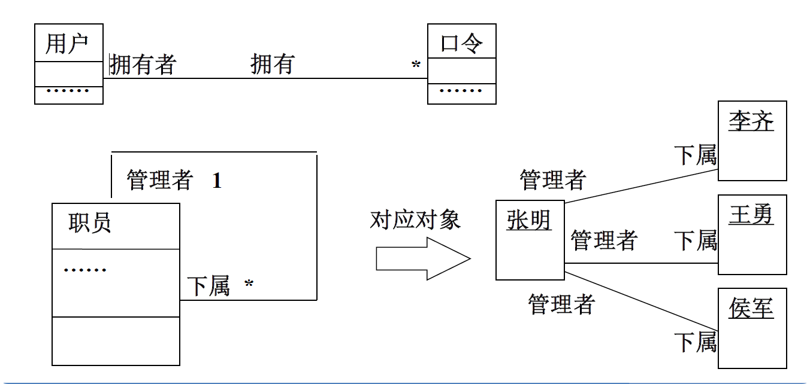
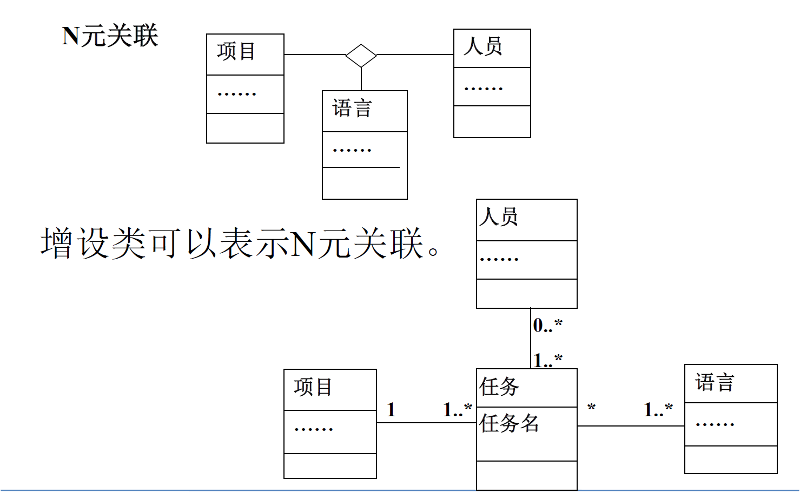

:::details AI总结

# 笔记总结与重点分析
## 笔记总结
本笔记重点阐述了UML建模中的静态模型，主要包括类图和包图两个核心部分。类图部分详细解析了关联关系（普通关联、聚合/组合关联）、关联的重数、对象链、关联类等核心概念，以及接口类的定义和应用。包图部分系统说明了包的定义机制、可见性规则、层次结构、依赖关系类型（引入/访问依赖）以及包的组织划分策略。

## 重点/易考点分析 (名词解释)

### 什么是类图？
类图描述系统中各个对象之间存在的关系，表达系统的静态结构，也叫做"对象建模"，是系统建模过程中最重要的部分。

### 关联的重数定义是什么？
关联端上的重数表示一端的对象需要另一端对象的个数。具体表现为：A端的一个对象需要B端Mb个对象，B端的一个对象需要A端Ma个对象。

### 对象链的定义是什么？
链是关联的实例，是对象间的语义连接。

### 什么是关联类？
关联类是一种同时具有关联和类双重特征的建模元素，可看作具有类性质的关联或具有关联性质的类。在建模中可以通过增设类将其表示为普通类。

### 聚合关联与组合关联的核心区别是什么？
聚合表示部分对象和整体对象可以独立生存；组合表示部分对象与整体对象具有强"属于"关系且生存期一致。

### 依赖关系的定义是什么？
依赖关系是模型元素之间的一种语义关系，目标元素的改变需要根据源元素的改变而变化。

### 接口类的核心作用是什么？
接口类将类的公共可见性操作组织为服务集合，作为类间交互操作的契约。它允许两端类独立变更而保持操作契约不变，并支持多个类通过一个接口呈现整体服务。

### 包的定义及其核心目的？
包是对模型成分分组的机制，其目的是：用包组织系统成分形成整体组织结构；使包作为独立系统成分可被整体利用。包需具有唯一名称且能被独立引用。

### 包的引入依赖与访问依赖有何区别？
引入依赖（<<import>>）允许包中可见元素被另一包直接附加使用；访问依赖（<<access>>）允许包中可见元素被另一包直接使用。

### 包划分的核心策略包括哪些？
1. 将语义接近且需共同变化的成分组织成包
2. 合并包形成嵌套结构（每包内层成分5-7个）
3. 构建树形层次结构
4. 标识成分可见性
5. 建立包间依赖关系
（我还没有掌握有关知识，此回答为大模型自动生成）

:::

# 静态模型

## 面向对象分析

详见 [面向对象分析](1-面向对象分析与UML建模概述#面向对象分析概述)

## 类图

### 类图和对象建模

类图，是系统建模过程中**最重要**的部分，也是花费**精力最大**的活动。类图描述系统中各个对象之间存在的关系，表达系统的**静态结构**，也叫做“对象建模”。

### 类图的基本图元素

#### 类的属性和操作表示

### 建立类的关联

#### 类的关联

如果一个类的对象与另一个类的对象之间有**语义连接关系**，则这两个类之间的**语义关联**就是**关联**。

关联表示对象类之间的**静态关系**。
静态关系表示对象之间**固有的联系**。

两个类之间的关联，实质上是通过**属性**来表示对象之间的联系，即一个类的**对象属性**值是另一个类的**对象实例**（用指针实现）。

静态关联与系统责任相关，如果这些关系是系统**责任目标的必要信息**，则需要表达它们。

#### 关联的重数

重数值的表示：

**重数定义**：关联端上的重数，表示一端的对象需要另一端对象的个数。

**重数的表示**：A端的一个对象需要B端Mb个对象，B端的一个对象需要A端Ma个对象

#### 对象链

链是**关联的实例**，是**对象间**的语义连接

#### 关联角色

关联角色--表示需要明确的一个**角色属性**。在关联的**端点**，可以表示相连接类所扮演的角色，关联角色的名字称为“关联角色名”。

#### 关联类

关联类是一种建模元素，表示**关联本身**也是一个类。

关联类兼有**关联**和**类**的**双重特征**，可把它看作具有**类**性质的**关联**，也可看作是具有**关联**性质的**类**。

关联类的概念在建模中不是必不可少的，可以通过增设类把关联类表示为普通类。

#### N元关联
N元关联是三个或多个类之间的关联。

#### 关联的限定符

关联限定----表示作为查找另一端对象的特征属性，在特定的约束下提供快捷的搜索路径。

#### 聚合关联

聚合关联----表示**整体与部分**的关系。

聚合----部分对象和整体对象可以独立生存

#### 组合关联

组合是聚合的一种形式，其中部分和整体之间具有很强的“**属于**”关系，且它们的生存期是一致的。

组合----部分对象和整体对象生存期一致

#### 类的依赖关系表示
模型元素(或模型元素集合)之间的一种语义关系，**目标元素**的改变需要根据**源元素**的改变而变化。

### 接口

#### 接口类和信号

接口类----把类的公共可见性操作组织在一起，
提供的服务集合。
接口类和信号
- 接口类作为类之间交互操作的契约。
- 接口类两端的类可独立变更，但操作契约不变。
- 多个类可使用一个接口类呈现整体服务。

#### 表示关联上的接口

#### 公共接口的抽象类

## 包图

包图----描述系统中**包**的**静态结构**。

**包定义**：包是对模型成分分组的机制

**目的**：
- 用包组织系统成分，使系统形成整体组织结构
- 包作为独立系统成分，可被整体利用

**要点**：
- 把模型成分组织成为包；
- 模型成分包括类或用况；
- 包有唯一的名称，可以被独立引用。

**包的表示**：

### 元素的可见性

公共的（+）、私有的（-）和受保护的（#）

### 包的层次结构
多个包可以形成严格的树形层次结构，用于描述系统的组织结构。

### 包的嵌套性
一个包可以嵌套在另一个包内，内层的包成分，同时属于内层和外层两个包。

### 包的依赖关系

**引入依赖**---包中可见的元素可以被另一个包引用
\<\<import\>\> （即提供方的元素直接附加到请求方）

**访问依赖**---包中可见的元素可以被另一个包使用
\<\<access\>\> （请求方直接使用提供方的元素）

### 包的组织和划分

**划分包的策略**：
1. 把在**语义**上接近并需要**一起变化**的成分组织成包；
2. 可以组织**合并**包，形成包的**嵌套**结构，每个包的内层成分最多5-7个；
3. 组织包形成**树层次**结构；
4. 标识包中模型成分的**可见性**；
5. 标识包之间的**依赖关系**。

