:::details AI总结


 笔记总结与重点分析
## 笔记总结
本笔记系统阐述了需求分析的核心内容，主要包括：需求分析的根本任务是建立分析模型与创建解决方案；建模方法（抽象/分解/投影）与模型类型（业务模型/计算模型/软件分析模型）；结构化与面向对象分析技术；功能分解图的应用；分析活动包含细化、优先级确定和协商等关键流程。重点强调通过建模实现系统复杂性分解，建立用户与开发者共同理解的解决方案。

## 重点/易考点分析 (名词解释)

### 什么是模型？
模型是对事物的抽象，帮助人们在创建一个事物之前可以有更好的理解。它集中关注问题的计算特性（数据、功能、），是对系统进行思考和推理的一种方式。建模的目标是建立系统的一个表示，这个表示以精确一致的方式描述系统，使得系统的使用更加容易。

### 分解作为建模方法包括哪些核心内容？
分解是将单个复杂和难以理解的问题分解成多个相对更容易的子问题，并掌握各子问题之间的联系。分解的方案往往还能思路，采用"分而治之"的策略。

### 投影建模方法的核心特征是什么？
投影是将问题投影到另一个空间，帮助人们从另一个角度来观察问题。投影的方案往往还能提供问题的解决思路。

### 业务模型的主要特征有哪些？
业务模型使用问题域中的重要概念作为模型的组元，采用业务联系作为组元之间的关系。它具有非形式化特征，能抽取需求信息本质内容但存在不准确、不确定和模糊化缺陷，因此不足以描述有效的软件解决方案。

### 计算模型的核心特点是什么？
计算模型使用软件的构成单位作为组元，基于计算科学建立，具有形式化特征。其信息描述具有明确化、准确化和确定化的特征。

### 软件分析模型的定位是什么？
软件分析模型介于业务模型和计算模型之间，使用计算模型的组元形式，在表现方式上采用业务模型方法。它是半形式化的，比业务模型更严格但不如计算模型严谨。

### 结构化技术包含哪些主要建模方法？
结构化技术包含过程建模（数据流上下文图等）、数据建模（实体关系图）、行为建模（状态转换图）、过程/数据关系建模（功能实体矩阵）以及信息工程方法（功能分解图）。

### 功能分解图的主要结构特征是什么？
功能分解图在一个图内自上至下显示系统功能分解结构：最顶层描述系统使命，下一层是支撑使命的重要功能，底层是不可再细分的基本业务功能。它能直观展示过程层次关系。

### 需求细化的核心任务是什么？
需求细化需要明确用户需求的隐含因素，将问题域角度的用户需求转化为技术角度的系统需求，转化非功能需求为具体表述，并发现新细节需求。细化后的需求需进行完整属性记录。

（我还没有掌握有关知识，此回答为大模型自动生成）
:::
# 需求分析概述

## 需求分析的根本任务
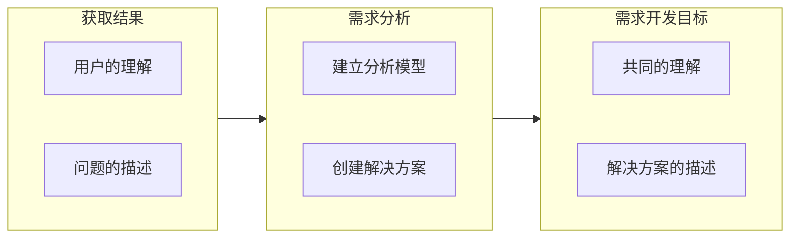
### 建立分析模型
- 将**复杂**的系统分解成为**简单**的部分以及它们之间的**联系**，确定**本质特征**
- 和用户达成对信息内容的**共同理解**
- 分析的活动主要包括**识别**、**定义**和**结构化**，它的目的是获取某个可以转换为**知识**的事物的**信息**

#### 模型

**定义**：模型是对事物的**抽象**，帮助人们在创建一个事物之前可以有更好的理解
- 集中关注问题的**计算特性**（数据、功能、规则等等）
- 它是对系统进行**思考**和**推理**的一种方式
- 建模的**目标**是建立系统的一个**表示**，这个表示以**精确一致**的方式描述系统，使得系统的使用更加**容易**
#### 建模方法

##### 抽象
- 一方面要求人们只关注**重要的信息**，**忽略次要**的内容
- 通过强调**本质**的特征，就减少了问题的**复杂性**
- 另一方面也要求人们将认知保留在**适当的层次**，**屏蔽更深层次**的细节
- 在问题的各元素之间推断出**更广泛**和**更普遍**的关系，帮助人们寻找**解决方案**
##### 分解

**分而治之**

- 将单个复杂和难以理解的问题分解成多个相对更容易的子问题，并**掌握各子问题之间的联系**
- 分解的方案往往还能提供问题的解决思路
##### 投影

- 将问题**投影**到**另一个**空间，帮助人们从**另一个角度**来**观察**问题
- 投影的方案往往还能提供问题的解决思路

#### 建模的类型 

##### 业务模型

- 问题世界与业务模型
  - 使用问题域中的**重要概念**作为**模型的组元**
  - 使用概念之间的**业务联系**作为**组元之间的关系**
- 使用了**业务描述**的方式，具有非形式化特征
  - 可以抽取出需求信息中最重要和最本质的内容
  - 可以达成用户和开发者的共同理解
  - 业务模型元素（即业务概念和业务联系）的选取和定义上具有**不准确、不确定和模糊化**
- 非形式化特征使得它不适合于进行需求建模
  - **不足以描述**一个有效的软件解决方案
    - 不准确、不确定和模糊化

```mermaid
flowchart LR
```

##### 计算模型

- 计算世界与计算模型
  - 使用软件的构成单位作为模型的组元
  - 软件构建单位之间的关系作为模型组元之间的关系
- 基于**计算科学**建立的，具有形式化的特征
  - 信息的描述具有**明确化、准确化和确定化的特征**

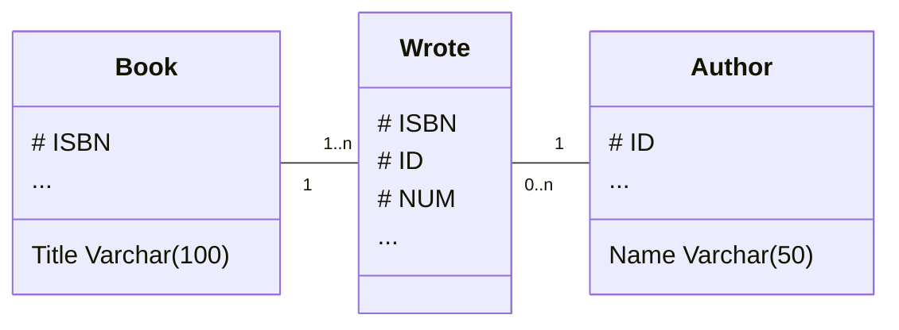

##### 软件分析模型

- 介于**业务模型**和**计算模型**二者之间的模型形式
  - 使用了计算模型的**组元**形式
  - 在组元的表现上采用了**业务模型**的**表现方式**
- 半形式化的
  - 不像**计算模型**那么严谨
  - 比**业务模型**更严格

##### 几种模型

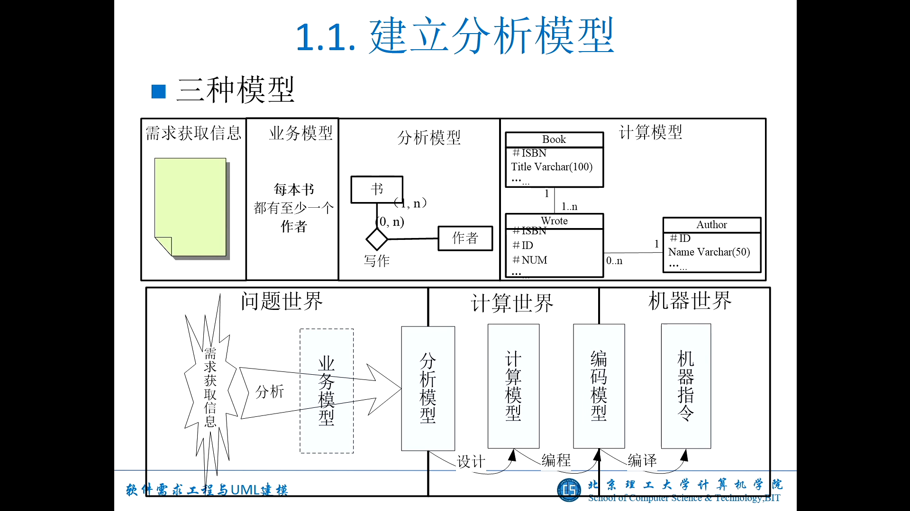


#### 视点

- 模型的描述
- 多视点方法

#### 模型、模型语言与表示法

- DFD
- ERD
- DDL
- 功能分解模型

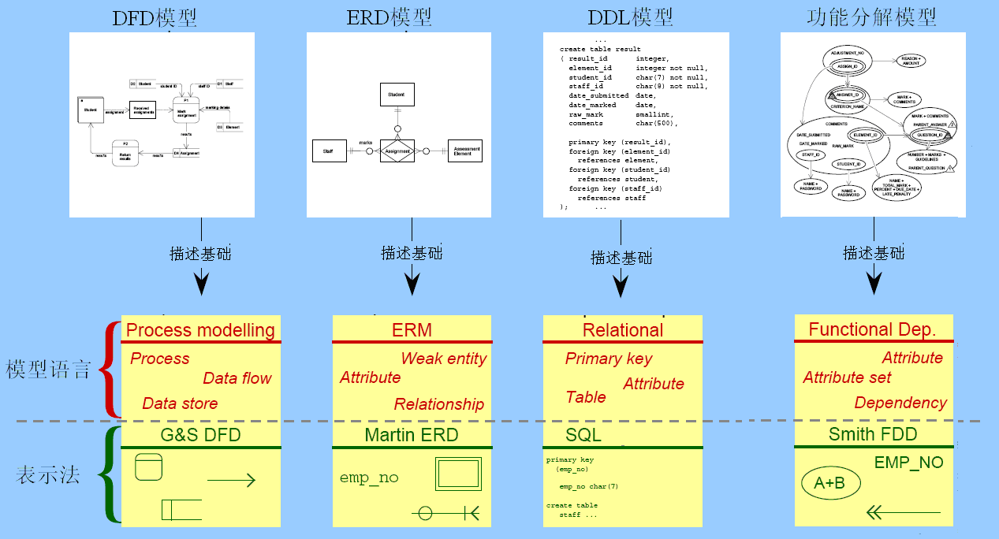

#### 过程

- 需求建模
  - 通常的做法是：
    - 先依据获取的问题域信息建立初步的模型。
    - 然后分析用户需求，对模型进行调整，得到一个中间形式的模型形式。
    - 最后，对调整后的模型进行逻辑推理和验证，如果符合预期的期望，那么它就是最终的解决方案模型。

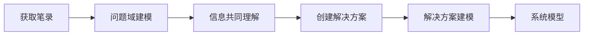

### 建立解决方案

#### 需求分析的目标

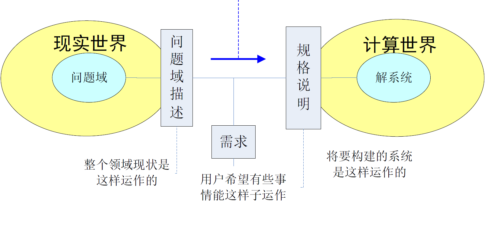

#### 建立解决方案的过程
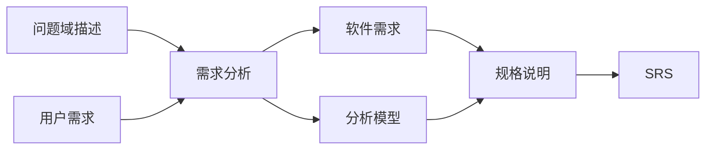

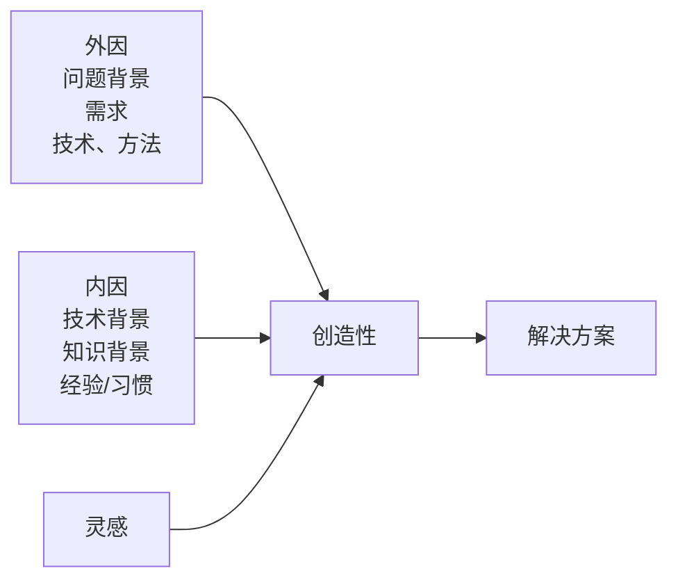

- 将一个问题分解成**独立**的、**更简单**和**易于管理**的**子问题**来帮助寻找解决方案
- 创建解决方案的过程是**创造性**的
- 帮助开发者建立问题的**定义**，并确定被定义的事物之间的**逻辑关系**
  - 这些逻辑关系可以形成**信息的推理**，进而可以被用来验证解决方案的**正确性**

## 需求分析技术

### 常用需求分析技术

#### 结构化技术
- 过程建模
  - 数据流图Data Flow Diagram
  - 上下文图Context Diagram
  - 微规格说明Mini-Specification
  - 数据字典Data Dictionary
- 数据建模
  - 实体关系图Entity Relationship Diagram
- 行为建模
  - 状态(转换)图/矩阵State (Transition) Diagram/Matrix
- 过程/数据关系建模
  - 功能实体矩阵Function/Entity Matrix
- 信息工程方法
  - 功能分解图Function Decomposition Diagram
  - 过程依赖图Process Dependency Diagram
  
#### 面向对象技术
- **UML**
  - 用例图Use-Case Diagram
  - 类图Class Diagram
  - 交互图（顺序图/通信图）Interaction（Sequence / Communication）Diagram
  - 活动图Activity Diagram
  - 对象约束语言Object Constraint Language
  - 状态图State Chart Diagram

#### 技术的综合运用
- 如何为各个视角选择需求分析技术？
  - 每一种需求分析技术都有自己的特点，具有在应用上的独特性
- 如何实现它们之间的配合？
  - 只有通过多种需求分析技术的有机结合与集成才能充分的描述复杂应用

### 需求分析技术的发展过程

#### 传统分析
- 没有方法(1950’s)
  - 依赖个体才智,依据个人习惯
  - 缺乏结构、不可重复、不可测量,冗长、混乱、偏颇、无结构等等

#### 结构化分析
- 传统结构化分析(late 1960’s),现代结构化分析 (late 1970’s)
  - 以数据流动为中心，以DFD为核心技术，辅助ERD,STD…
- 信息工程
  - 以**数据知识结构**为基础，ERD为核心技术，辅助DFD，STD, FDD, PD…

#### 面向对象分析
- 以对象为中心，以**UML**（类图）为核心技术
- 以全面思想革新为理想，以承继结构化技术为现实

## 需求分析方法

### 结构化分析

### 面向对象分析

## 前期需求阶段的建模与分析

### 面向问题与面向解系统

#### 面向问题

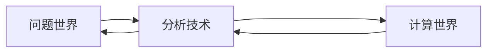

#### 面向解系统

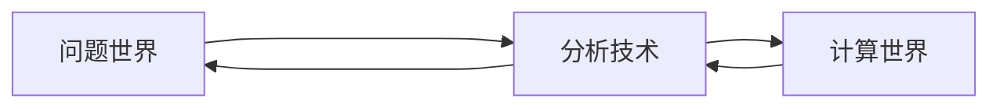

#### 前期需求阶段与后期需求阶段

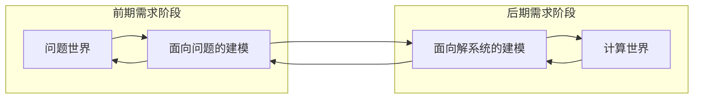
### 面向问题域的分析

- 问题框架
  - 特性
  - 解决
- 基本思路
  - 研究所有可能的问题域，从中发现一些重复出现的简单问题类型
  - 分析每一种问题框架的特性，确定问题的理解和解决方法
  - 将问题框架的建立和分类系统化，以简单的问题框架为基本单位，进行**复杂问题的分解**

### 功能分解图

在一个图内自上至下的集中显示系统的功能分解结构

- **最顶层**的单独功能通常是对整个系统的使命描述，是对系统业务需求的概括
- 系统使命说明的下一层被称为**功能的最顶层**，描述了系统应该具备的一些重要功能，它们支撑着系统使命的实现
- 功能最顶层下面的分支是对最顶层功能执行分解后形成的层次关系
- 最底层的是**基本的业务功能**。这些基本的业务功能是人们所能找到的最基本的、不可再细分的功能或处理

能够更加集中、更加直观的展示大量过程之间的层次关系

#### 功能分解流程

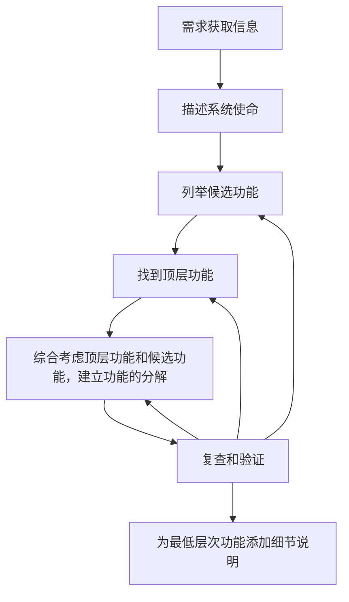

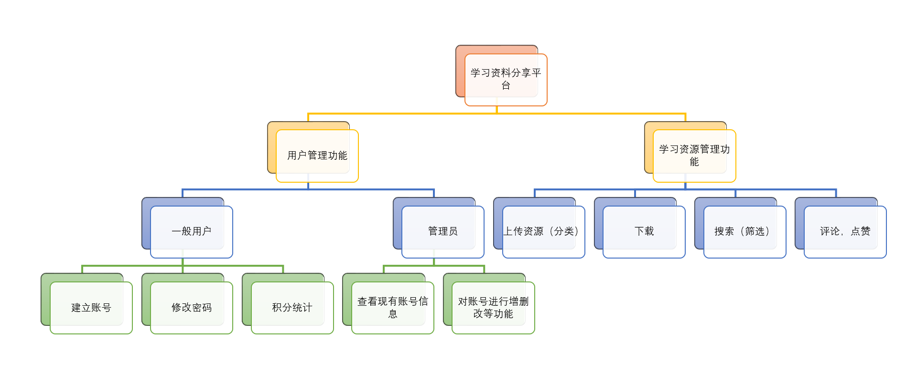

## 需求分析的活动

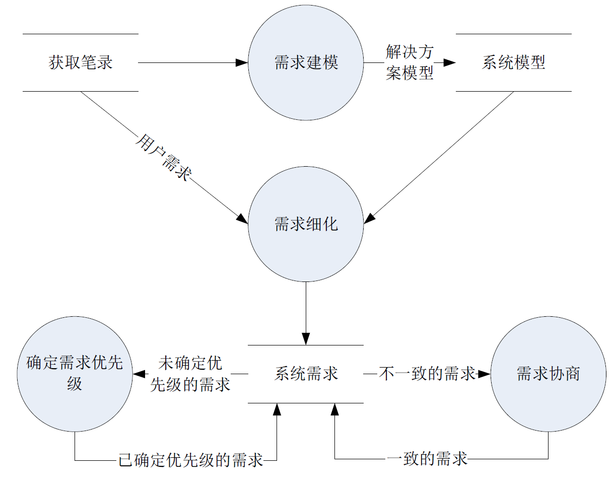

### 需求细化

- 明确用户需求的隐含因素
- 将从问题域和业务的角度表述的用户需求等价的转化为从软件和技术的角度表述的系统需求
- **非功能需求**也需要从**高层次的表述方式**转化为一系列更加**详细**和**具体**的需求表述
- 需求细化也会发现新的细节需求
- 细化后的需求应该被一一的标识和记录下来

#### 需求的记录

- 标识符（ID），每一条需求都应该能够通过ID唯一的标识自己。
- 源头（Source），要能够回溯到需求的源头，例如特定的涉众。
- 理由（Rational），需求被提出的目的。
- 优先级（Priority），详细情况见下一节。
- 成本（Cost），预估的实现成本。
- 风险（Risk），实现该需求的过程中可能带来的风险。
- 可变性（Volatility），将来发生变化的可能性。

### 确定需求优先级

- 累计投票
- 区域划分
  - 重要性：需求的不可或缺程度。
  - 紧急性：需求的时间紧迫程度。
  - 惩罚性：忽略需求会导致的惩罚程度。
  - 成本：实现需求的代价。
  - 风险：需求实现中可能产生的风险程度。
  
| | 重要 | 不重要 |
| :--: | :--: | :--: |
| 紧急 | 高 | 不予处理 |
| 不紧急 | 中 | 低优先级 |

- 数据量化
### 需求协商
