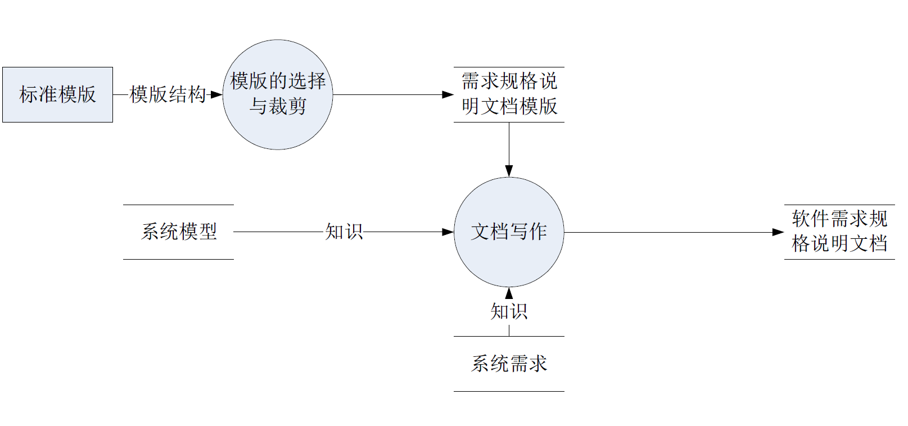

:::details AI总结

# 笔记总结与重点分析
## 笔记总结
本笔记主要阐述了需求工程中的三个核心活动：需求获取的目标是收集用户需求信息；需求分析旨在深入理解用户需求并确定解决方案准则；需求规格说明用于准确定义解决方案。

## 重点/易考点分析 (名词解释)

### 什么是需求获取？
目标是得到用户需求——收集需求信息

### 需求分析的主要目标是什么？
目标是更深刻的理解用户需求——界定能够让用户满意的解决方案准则

### 需求规格说明的定义是什么？
目标是定义用户需求——准确描述需求及其解决方案
还没有掌握有关知识，此回答为大模型自动生成）
:::
# 需求规格说明概述

## 需求获取、分析和规格说明

- 需求获取
  - 目标是**得到**用户需求——**收集需求信息**
- 需求分析
  - 目标是更深刻的**理解**用户需求——界定能够让用户满意的**解决方案**准则
- 需求规格说明
  - 目标是**定义**用户需求——**准确描述需求**及其**解决方案**

## 需求规格说明活动

