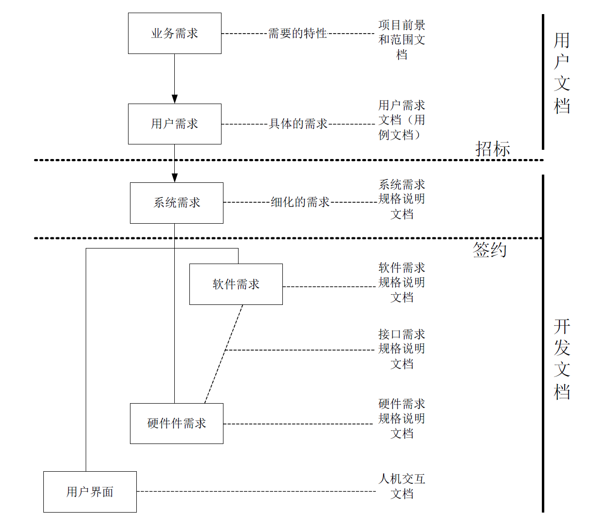
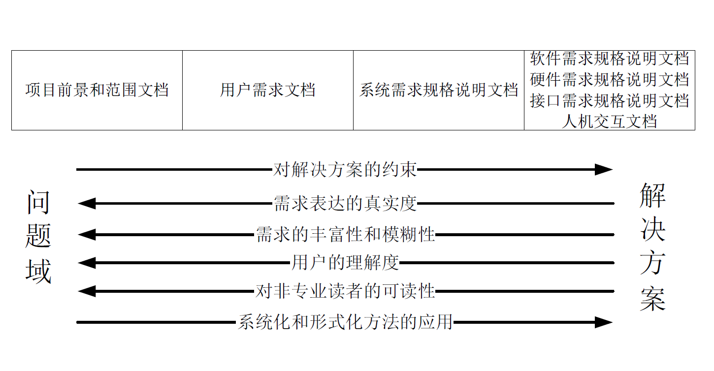
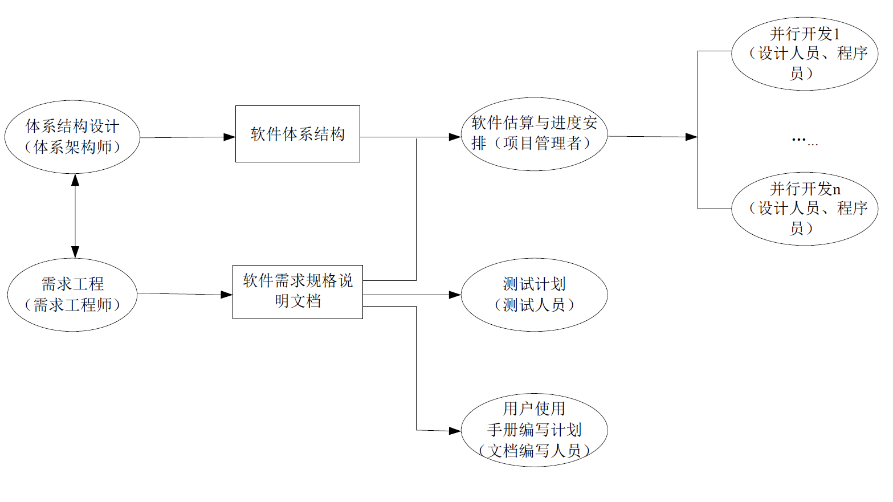

:::details AI总结

# 笔记总结与重点分析
笔记总结
该笔记系统阐述了需求规格说明文档的核心要素，包括其五大作用（需求传递、开发依据、纠错减负、知识拓展、智力资产），四类忽视原因（沟通方式、时间限制、开发模式、敏捷理念），文档结构定位（引言/主体/附录），内容构成（前景范围/问题域/解决方案/需求），参与人员角色（管理者/工程师/写作人员/用户），读者类型以及三类编写手段（非形式化/半形式化/形式化）的具体实现方式。

## 重点/易考点分析 (名词解释)

### 需求规格说明文档的作用有哪些？
1. 传递软件系统需求信息和解决方案给开发者，作为合同协议的重要部分
2. 作为项目开发活动的重要依据
3. 发现和减少需求错误，降低返工成本
4. 拓展知识记忆能力
5. 作为有效的智力资产

### 需求规格说明文档被忽视的主要原因包括哪些？
- 交流途径
- 时间压力
- 迭代式开发
- 敏捷开发方法

### 需求规格说明文档的定位包含哪些组成部分？
- 引言
- 需求规格说明
- 附录

### 需求规格说明文档的主要内容由哪些部分构成？
- 前景和范围
- 问题域信息
- 解决方案
- 需求

### 需求规格说明文档的编写手段有哪些类型？请简要说明
- 非形式化：使用自然语言和限制性文本
- 半形式化：采用结构化文本（伪码/结构化英语）和模型语言（图表）
- 形式化：运用形式化语言和数学语言（如BNF，Z语言）

### 参与需求规格说明文档编写的角色有哪些？
- 项目管理者：负责
- 需求工程师：主导文档编写
- 文档写作人员：辅助内容撰写
- 涉众（用户）：参与文档验证

（我还没有掌握有关知识，此回答为大模型自动生成）
:::
# 需求规格说明文档

## 作用

- 更好的**传递**软件系统的**需求信息**和**解决方案**给所有的开发者作为**合同协议**的**重要部分**
- 作为项目开发活动的一个**重要依据**
- 发现和**减少**可能的需求**错误**，减少项目的返工，降低项目的工作量
- 拓展人们的**知识记忆能力**
- 作为有效的**智力资产**

## 忽视的原因

- 交流途径
- 时间压力
- 迭代式开发
- 敏捷

## 定位

- 引言
- 需求规格说明
- 附录

## 类型

## 内容

- 前景和范围
- 问题域信息
- 解决方案
- 需求

## 作者

- 项目管理者
  - 组织安排、提供条件
- 需求工程师
  - 负责人、主导人
- 文档写作人员
  - 有时会采用，节省需求工程师的时间
- 涉众（用户）
  - 验证人

## 读者

## 手段

- 非形式化
  - 自然语言
  - 限制性文本
- 半形式化
  - 结构化文本
    - 伪码/结构化英语
  - 模型语言
    - 图、表…
- 形式化
  - 形式化语言
  - 数学语言：BNF，Z…

